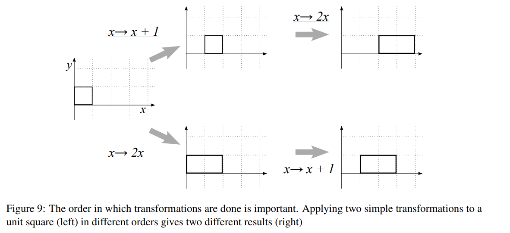

# 3-Dimensional Objects Bounded by Polygonal Faces

1. **Graphical Objects and Planar Faces**:
   - Most graphical scenes and objects are constructed using **planar (flat) faces**.
   - A **face** is formed by connecting an ordered set of **3D vertices** lying on the same plane to create a **closed polygon**.
2. **Required Data to Describe an Object**:
   - Vertex Data: Specifies the 3D coordinates of each vertex.
     - In 3D, each vertex location is represented by three numbers (x, y, z).
     - For N vertices, $3 \times N$ numbers are needed to describe all locations.
   - Topology Data:  Describes how vertices are connected to form polygon faces.
     - Lists the indices of vertices that make up each face in an ordered manner.
3. **Tetrahedron Example**:
   - A tetrahedron is a 3D object with:
     - **4 vertices**: Positions are described by coordinates and indexed (starting from 0).
     - **4 triangular faces**: Each face is defined by the indices of the vertices it uses.
   - Example data:
     - Vertex Data:
       - Index 0: (0,0,0)
       - Index 1: (1,0,0)
       - Index 2: (0,1,0)
       - Index 3: (0,0,1)
     - Face Data:
       - Face 0: Vertices 0,1,3
       - Face 1: Vertices 0,2,1
       - Face 2: Vertices 0,3,2
       - Face 3: Vertices 1,2,3
4. **Applications**:
   - This structured representation of **vertex data** and **face topology** is foundational in 3D graphics and modeling.
   - Used in interactive graphics, 3D rendering, and computational geometry to store and render objects efficiently.
5. **Advantages**:
   - Separates **location** (vertex data) and **connectivity** (topology), making it easier to manipulate or transform objects without redefining connectivity.

This approach of defining 3D objects is widely used in computer graphics for creating and managing complex geometric structures efficiently.

# Projections of Wire-Frame Models

1. **Projection Definition**:
   - A **projection** is a transformation from a higher-dimensional space ($n$-D) to a lower-dimensional space ($m$-D, where $m < n$).
   - Example: A 3D object is projected onto a 2D display surface.
2. **How Projections Work**:
   - A **viewpoint** is chosen, and **projectors** (lines) are drawn from the viewpoint through each vertex of the object.
   - The point where a projector intersects the projection surface is the **projection** of the vertex.
3. **Planar Geometric Projections**:
   - Use a **plane** as the projection surface and **straight lines** as the projectors.
   - After projection, the **edges** of the object are drawn to represent its shape. This is called a **wire-frame representation**.
4. **Projection Surface**:
   - Often standardized to the plane $z=0$, which contains the $x-$ and $y-$ axes.
   - If the required projection plane is not parallel to $z=0$, a **coordinate transformation** can align it with $z = 0$ without loss of generality.
5. **Types of Planar Geometric Projections**:
   - Parallel Projection:
     - All projectors are **parallel**.
     - Simplifies rendering but lacks perspective realism.
   - Perspective Projection:
     - All projectors converge at a single **viewpoint**, providing a realistic sense of depth.
6. **Assumptions**:
   - Objects are in the positive half-space ($z > 0$), so projectors travel in the negative $z$-direction.
7. **Wire-Frame Representation**:
   - The simplest form of rendering after projection.
   - Only the projected edges are drawn, using the **topology** of the object to define which vertices are connected.
8. **Real-World Example**:
   - The arcade game "Battlezone" used a wire-frame representation to render 3D scenes on a 2D display.

### Key Advantages:

- **Standardizing Projection Planes**: Aligning the projection plane with z=0 simplifies calculations without limiting flexibility.
- **Versatility (多功能性)**: By choosing between parallel and perspective projection, different visual effects (e.g., realism or simplicity) can be achieved.

This approach is foundational in computer graphics, enabling 3D scenes to be effectively visualized on 2D surfaces.

# Parallel Projections

1. **Parallel Projection**:

   - In **parallel projection**, all projectors have the **same direction** ($\mathbf{d}$) and the **viewpoint is at infinity**.
   - The projection of a vertex $\mathbf{V} = (V_x, V_y, V_z)^T$ is determined by the parametric line equation: $\mathbf{P} = \mathbf{V} + \mu \mathbf{d}$.

2. **Orthographic Projection**:

   - A **special case of parallel projection** where the projectors are **perpendicular** to the projection plane (typically $z = 0$).

   - For orthographic projection:

     - The direction of the projectors is $\mathbf{d} = \begin{pmatrix} 0 \\ 0 \\ -1 \end{pmatrix}$.

   - The projected coordinates:

     $P_x = V_x, \quad P_y = V_y.$

     - No calculations are required for $P_x$ and $P_y$ because they remain the same as $V_x$ and $V_y$.
     - The z-coordinate of the projected point is always 0 ($P_z = 0$).

3. **Oblique Projection**:

   - In an **oblique projection**, the projectors are **not perpendicular** to the projection plane.
   - The direction of the projectors is a general vector: $\mathbf{d} = \begin{pmatrix} d_x \\ d_y \\ d_z \end{pmatrix}$.
   - The projection is computed by finding the intersection of the projector with the  $z = 0$ plane:
     - Solving for $\mu$: $\mu = -\frac{V_z}{d_z}$.
     - The projected coordinates are then: $P_x = V_x - \frac{d_x V_z}{d_z}, \quad P_y = V_y - \frac{d_y V_z}{d_z}$.
   - **Scaling effect**: The $x$- and $y$-coordinates may appear **scaled or skewed**, depending on $d_x$, $d_y$, and $d_z$.

4. **Practical Use**:

   - **Orthographic Projections**: Commonly used for engineering drawings, CAD, and technical illustrations as they preserve the true dimensions of objects.
   - **Oblique Projections**: Rarely used because they distort dimensions and are less intuitive for representation.

5. **Wireframe Representations**:

   - Projections are often visualized as **wireframe models**, where only the edges of the object are drawn based on the projected points.
   - Examples include projecting a cube to display views of faces, vertices, or a more general skewed perspective.

### Summary

- **Orthographic projection** is simple and retains the original x,yx, y coordinates, making it widely used for accurate representations.
- **Oblique projection** introduces skewing and scaling effects, which may be useful for artistic purposes but are less common in practical applications.

# Perspective Projection

1. **Perspective Projection**:
   - In a **perspective projection**, all projectors (or rays) converge at a single point called the **viewpoint** or **center of projection**.
   - The projection creates an effect where objects farther from the viewpoint appear smaller, mimicking how humans perceive depth in the real world.
2. **Viewpoint Placement**:
   - If the **viewpoint** is on the opposite side of the projection plane relative to the object, the image has the same orientation as the object (e.g., Figure 6).
   - In contrast, in a pinhole camera setup (where the viewpoint is between the projection plane and the object), the image is inverted.
3. **Canonical Perspective Setup**:
   - The **center of projection** is placed at the origin.
   - The **projection plane** is located at $z = f$, where $f$ is the distance of the projection plane from the Viewpoint.
4. **Projection Calculation**:
   - A point in 3D space $V = (V_x, V_y, V_z)$ is projected onto the plane $z = f$ along a ray passing through the origin.
   - The ray equation is: $\mathbf{P} = \mu \mathbf{V}$.
   - The intersection with the plane $z = f$ occurs when: $f = \mu V_z \quad \Rightarrow \quad \mu_p = \frac{f}{V_z}$.
   - The projected coordinates are:$P_x = \mu_p V_x = \frac{f V_x}{V_z}, \quad P_y = \mu_p V_y = \frac{f V_y}{V_z}$.
5. **Foreshortening Factor**:
   - The factor $\mu_p = \frac{f}{V_z}$ is called the **foreshortening factor**.
   - It captures the perspective effect: as $V_z$ (distance from the projection plane) increases, μp\mu_p decreases, making the projected point appear closer to the center, reducing the apparent size of the object.
6. **Key Observations**:
   - **Depth Perception**: Perspective projection creates a sense of depth by making objects farther away appear smaller.
   - **Realistic Rendering**: It is commonly used in computer graphics to render scenes that mimic human perception.

### Summary

- Perspective projection transforms 3D points onto a 2D plane while preserving depth perception through the foreshortening factor.
- Unlike parallel projections, perspective projection creates realistic representations where objects farther away appear smaller. This makes it essential for rendering realistic 3D scenes in computer graphics.

# Space Transformations

1. **Canonical Forms and Flexible Viewing**:
   - Canonical forms (e.g., for perspective or orthographic projection) simplify computations by standardizing the view direction and projection setup.
   - To allow viewing a scene from any chosen viewpoint and direction, the scene's coordinates must be  transformed to align with the canonical form:
     - The **chosen viewpoint $C = (C_x, C_y, C_z)$** becomes the origin.
     - The **chosen view direction $\mathbf{d} = (d_x, d_y, d_z)^T$** aligns with the $z$-axis.
2. **View-Centered Coordinate System**:
   - The transformation creates a view-centered coordinate system:
     - The viewpoint $C$ is translated to the origin.
     - The view direction vector $\mathbf{d}$ becomes the new $z$-axis.
   - This transformation makes it possible to use canonical projection formulas, as shown in **Figure 8**.
3. **Transformations for Special Effects**:
   - Besides setting the view direction, transformations can be used for other effects such as:
     - Rotating objects.
     - Scaling (shrinking or enlarging) objects.
     - Translating objects within the scene.
4. **Transformations Using Matrices**:
   - Simple transformations (e.g., rotation, scaling, translation) can be represented as **matrix multiplications**.
   - To apply a transformation to a scene:
     - Multiply the coordinates of every point by the corresponding **transformation matrix**.
     - This uniform approach is efficient for rendering and manipulating graphical scenes.
5. **Challenges with Translation**:
   - Matrix multiplication in **Cartesian coordinates** cannot directly perform translations because translations involve addition, which cannot be represented purely by multiplication.
   - For example:
     - Rotation and scaling can be easily represented by matrices since they involve linear transformations.
     - Translation requires an additional mechanism to handle constant offsets.
6. **Homogeneous Coordinates**:
   - To overcome the limitation of Cartesian coordinates for translation, we use **homogeneous coordinates**.
   - Homogeneous coordinates introduce an extra dimension (typically denoted as $w$) to represent points in 3D space.
     - A point $(x, y, z)$ in Cartesian coordinates is represented as $(x, y, z, 1)$ in homogeneous coordinates.
   - Using homogeneous coordinates:
     - Transformations, including translations, can be expressed as matrix multiplications.
     - This unifies the representation of all transformations (translation, rotation, scaling) into a consistent framework.

### Advantages of Homogeneous Coordinates:

- **Unified Framework**: Handles all transformations (translation, rotation, scaling) consistently.
- **Efficient Computation**: Allows matrix multiplication to apply transformations efficiently across all points in a scene.
- **Flexibility**: Enables the combination of multiple transformations into a single matrix.

By introducing homogeneous coordinates, graphical systems can efficiently handle complex transformations while maintaining the simplicity of matrix operations. This approach is foundational in modern 3D computer graphics.

# Homogeneous coordinates and transformation matrices

1. **Homogeneous Coordinates**:

   - Introduce a **fourth component** to represent points as $P = (p_x, p_y, p_z, s)$.
   - Conversion to Cartesian coordinates is achieved by dividing each component by $s$: $(p_x/s, p_y/s, p_z/s)$.
   - Typically, $s = 1$, simplifying calculations.

2. **Purpose**:

   - Homogeneous coordinates enable **translation** and other transformations using **matrix multiplication**, which isn't possible in standard Cartesian coordinates.

3. **Translation Example**:

   - To translate a point $P = (p_x, p_y, p_z, 1)$ by a vector $\mathbf{t} = (t_x, t_y, t_z)$, use: $\begin{bmatrix} 1 & 0 & 0 & t_x \\ 0 & 1 & 0 & t_y \\ 0 & 0 & 1 & t_z \\ 0 & 0 & 0 & 1 \end{bmatrix} \begin{bmatrix} p_x \\ p_y \\ p_z \\ 1 \end{bmatrix} = \begin{bmatrix} p_x + t_x \\ p_y + t_y \\ p_z + t_z \\ 1 \end{bmatrix}$.

4. **Scaling Example**:

   - To scale a point $P$ by factors $s_x, s_y, s_z$: $\begin{bmatrix} s_x & 0 & 0 & 0 \\ 0 & s_y & 0 & 0 \\ 0 & 0 & s_z & 0 \\ 0 & 0 & 0 & 1 \end{bmatrix} \begin{bmatrix} p_x \\ p_y \\ p_z \\ 1 \end{bmatrix} = \begin{bmatrix} s_x p_x \\ s_y p_y \\ s_z p_z \\ 1 \end{bmatrix}$.

5. **Order of Transformations**:

   - **Transformations are not commutative** (i.e., order matters).

   - Applying transformations in different orders can result in different outcomes, as illustrated with a square in 

     Figure 9:

     

     - Scaling before translating vs. translating before scaling produces different results.

6. **Rotation Matrices**:

   - Rotation about the Cartesian axes:
     - **X-axis**: $R_x = \begin{bmatrix} 1 & 0 & 0 & 0 \\ 0 & \cos\theta & -\sin\theta & 0 \\ 0 & \sin\theta & \cos\theta & 0 \\ 0 & 0 & 0 & 1 \end{bmatrix}$.
     - **Y-axis**: $R_y = \begin{bmatrix} \cos\theta & 0 & \sin\theta & 0 \\ 0 & 1 & 0 & 0 \\ -\sin\theta & 0 & \cos\theta & 0 \\ 0 & 0 & 0 & 1 \end{bmatrix}$
     - **Z-axis**: $R_z = \begin{bmatrix} \cos\theta & -\sin\theta & 0 & 0 \\ \sin\theta & \cos\theta & 0 & 0 \\ 0 & 0 & 1 & 0 \\ 0 & 0 & 0 & 1 \end{bmatrix}$

7. **Example: Deriving $R_z$**:
   $$
   \begin{align}
   \cos(a+b) &= \cos(a)\cos(b)-\sin(a)\sin(b) \\
   \sin(a+b) &= \sin(a)\cos(b)+\cos(a)\sin(b)
   \end{align}
   $$
   
   $$
   \begin{align}
   \begin{bmatrix}
   x\\y
   \end{bmatrix} &\rightarrow 
   \begin{pmatrix}
   r \cos(\phi+\theta) \\
   r \sin(\phi+\theta)
   \end{pmatrix} \\
   &= \begin{pmatrix}
   r \cos(phi)\cos(\theta)-r\sin(\phi)\sin(\theta)\\
   r \cos(phi)\sin(\theta)-r\sin(\phi)\cos(\theta)
   \end{pmatrix} \\
   &= \begin{pmatrix}
   x\cos\theta-y\sin\theta \\
   x\sin\theta+y\cos\theta
   
   \end{pmatrix} \\
   &= \begin{bmatrix} \cos\theta & -\sin\theta \\ \sin\theta & \cos\theta \end{bmatrix} \begin{bmatrix} x \\ y \end{bmatrix}
   \end{align}
   $$
   

   - Rotate a point $(x, y)$ in the $z = 0$ plane by an angle $\theta$:$\begin{bmatrix} x' \\ y' \end{bmatrix} = \begin{bmatrix} \cos\theta & -\sin\theta \\ \sin\theta & \cos\theta \end{bmatrix} \begin{bmatrix} x \\ y \end{bmatrix}$.
   - This matrix forms the upper-left corner of $R_z$.

8. **Axis System**:

   - Assumes a left-hand coordinate system:
     - Positive $z$-axis goes **into the page**.
     - Matrices represent **anti-clockwise rotation** when looking along the positive axis direction.

### Summary

Homogeneous coordinates simplify 3D transformations, allowing all transformations (translation, rotation, scaling) to be expressed as **matrix multiplications**. This unified approach is essential in computer graphics for efficiency and consistency in rendering and manipulating scenes. However, the **order of transformations** is critical and must be carefully managed to achieve the desired results.

# Inverting transformation matrices

1. **Inversion of Transformation Matrices**:
   - Inverting transformation matrices is straightforward because we can directly reverse the effects of scaling, translation, and rotation by considering their geometric meaning.
   - **No need for complex solving techniques** like Gaussian elimination.
2. **Scaling Matrix Inversion**:
   - The inverse of a scaling matrix is obtained by replacing each scaling factor ($s_x, s_y, s_z$) with its reciprocal(倒数) ($1/s_x, 1/s_y, 1/s_z$).
   - Scaling Matrix: $\begin{bmatrix} s_x & 0 & 0 & 0 \\ 0 & s_y & 0 & 0 \\ 0 & 0 & s_z & 0 \\ 0 & 0 & 0 & 1 \end{bmatrix} \quad \Rightarrow \quad \begin{bmatrix} 1/s_x & 0 & 0 & 0 \\ 0 & 1/s_y & 0 & 0 \\ 0 & 0 & 1/s_z & 0 \\ 0 & 0 & 0 & 1 \end{bmatrix}$.
3. **Translation Matrix Inversion**:
   - The inverse of a translation matrix is achieved by negating the translation values ($t_x, t_y, t_z$).
   - Translation Matrix:$\begin{bmatrix} 1 & 0 & 0 & t_x \\ 0 & 1 & 0 & t_y \\ 0 & 0 & 1 & t_z \\ 0 & 0 & 0 & 1 \end{bmatrix} \quad \Rightarrow \quad \begin{bmatrix} 1 & 0 & 0 & -t_x \\ 0 & 1 & 0 & -t_y \\ 0 & 0 & 1 & -t_z \\ 0 & 0 & 0 & 1 \end{bmatrix}$.
4. **Rotation Matrix Inversion**:
   - The inverse of a rotation matrix corresponds to a rotation by the **negative angle** ($-\theta$).
   - Using trigonometric properties:
     - $\cos(-\theta) = \cos\theta$,
     - $\sin(-\theta) = -\sin\theta$.
   - Example for rotation about the $z$-axis:
     - Rotation Matrix ($\theta$): $\begin{bmatrix} \cos\theta & -\sin\theta & 0 & 0 \\ \sin\theta & \cos\theta & 0 & 0 \\ 0 & 0 & 1 & 0 \\ 0 & 0 & 0 & 1 \end{bmatrix}$.
     - Inverse Rotation Matrix ($-\theta$): $\begin{bmatrix} \cos\theta & \sin\theta & 0 & 0 \\ -\sin\theta & \cos\theta & 0 & 0 \\ 0 & 0 & 1 & 0 \\ 0 & 0 & 0 & 1 \end{bmatrix}$.
5. **General Rule for Rotations**:
   - The inverse of a rotation matrix is its **transpose** because rotation matrices are orthogonal. This is equivalent to reversing the direction of rotation ($-\theta$).

### Summary:

- **Scaling Inversion**: Replace scaling factors with reciprocals.
- **Translation Inversion**: Negate the translation values.
- **Rotation Inversion**: Reverse the angle of rotation ($-\theta$) or use the transpose of the rotation matrix.
- These straightforward rules make inverting transformations efficient and practical, which is essential for many graphics applications.