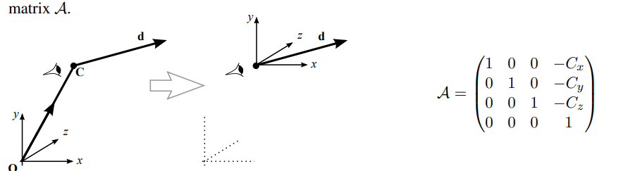

# Flying Sequences

### Explanation of the Scene Transformation Process

To transform a 3D scene for viewer-centered applications (e.g., flight simulators or games), the goal is to align the **viewpoint** with the **origin** and the **view direction** with the **z-axis**. The process involves several steps of transformation:

------

#### **1. Translation to the Viewpoint**:

- The **viewpoint** $C = (C_x, C_y, C_z)$ is translated to the origin using the translation matrix $A$: $A = \begin{bmatrix} 1 & 0 & 0 & -C_x \\ 0 & 1 & 0 & -C_y \\ 0 & 0 & 1 & -C_z \\ 0 & 0 & 0 & 1 \end{bmatrix}$.
- This moves the scene such that C is at the origin.

------

#### **2. Rotation About the Y-Axis**

- To align the direction $d = (d_x, d_y, d_z)$ with the **yz-plane** (making $x = 0$), a rotation is performed about the **y-axis**.
- The **projection** of $d$ onto the $xz$-plane has a magnitude: $v = \sqrt{d_x^2 + d_z^2}$.
- The rotation matrix BB is: $B = \begin{bmatrix} \frac{d_z}{v} & 0 & -\frac{d_x}{v} & 0 \\ 0 & 1 & 0 & 0 \\ \frac{d_x}{v} & 0 & \frac{d_z}{v} & 0 \\ 0 & 0 & 0 & 1 \end{bmatrix}$.
- This ensures that $d$ lies in the **yz-plane**.

------

#### **3. Rotation About the X-Axis**

- To align $d$ fully with the **z-axis**, a rotation about the **x-axis** is applied.
- The magnitude of $d$ is: $|d| = \sqrt{d_x^2 + d_z^2}$.
- The cosine and sine of the rotation angle $\phi$ are: $\cos\phi = \frac{v}{|d|}, \quad \sin\phi = \frac{d_y}{|d|}$.
- The rotation matrix $C$ is: $C = \begin{bmatrix} 1 & 0 & 0 & 0 \\ 0 & \frac{v}{|d|} & -\frac{d_y}{|d|} & 0 \\ 0 & \frac{d_y}{|d|} & \frac{v}{|d|} & 0 \\ 0 & 0 & 0 & 1 \end{bmatrix}$.
- After this step, $d$ is fully aligned with the **z-axis**.

------

#### **4. Combined Transformation Matrix**:

- The transformations are applied in sequence: $\Tau = C \cdot B \cdot A$.
- For any point $P$ in the scene, its transformed coordinates $P_t$ are given by: $P_t = T \cdot P = C \cdot B \cdot A \cdot P$.

------

### Key Takeaways

1. **Translation $A$** moves the viewpoint $C$ to the origin.
2. **Rotation $B$** aligns the view direction $d$ with the **yz-plane**.
3. **Rotation $C$** further aligns $d$ with the **z-axis**.
4. The combined transformation $T$ ensures that the scene is in a "view-centered" coordinate system, allowing for easier projection and rendering.

This process simplifies rendering and ensures that the view direction aligns with the **z-axis**, a standard practice in 3D graphics for canonical projections.

# Problems with verticals

The analysis highlights an important consideration when re-aligning the **view direction** in 3D graphics: the **vertical direction** (often aligned with the y-axis) must also be carefully managed to avoid unintended inversions, such as flipping the scene upside down.

### Key Points

1. **View Direction Alignment**:
   - Re-aligning the view direction $d$ (e.g., $d = (0, 0, -1)^T$) to the **z-axis** is necessary for standard viewing transformations.
   - This re-alignment can be done using rotations, but the choice of rotation axes and sequence affects the final orientation of the scene.
2. **Vertical Direction Consideration**:
   - The **vertical direction** (commonly aligned with the y-axis) must remain consistent after the re-alignment. If improperly handled, the vertical could be inverted, leading to an upside-down view of the scene.
3. **Correct Re-alignment Example**:
   - If the view direction $d$ is initially aligned along $(0, 0, -1)^T$, a rotation about the y-axis can correctly re-align $d$ without affecting the vertical direction.
     - This rotation maintains the correct orientation of the scene.
4. **Incorrect Re-alignment Example**:
   - If instead, a rotation about the x-axis is used to align $d$ with the z-axis, the vertical direction (y-axis) is inverted.
     - This results in the scene being viewed upside down.
5. **Takeaway**:
   - The **order and choice of rotations** are critical when re-aligning the view direction to ensure the **vertical direction** is preserved.
   - In real-world applications, graphical frameworks or libraries often handle these nuances automatically, but understanding the underlying principles is essential for implementing custom transformations.

### Visual Explanation:

- Correct Re-alignment:
  - Rotation about the **y-axis** aligns dd with the z-axis, while the y-axis remains vertical.
- Incorrect Re-alignment:
  - Rotation about the **x-axis** aligns dd with the z-axis, but the y-axis flips, inverting the scene.

### Practical Implication:

When designing 3D graphics systems or transformations:

- Always consider the impact of rotational transformations on the vertical direction.
- Test different viewing scenarios to ensure the vertical is preserved correctly for all viewpoints.

# Animation example: Rotation about a general line

### Key Points

The method of **viewer-centered transformation** can also be applied to animations and transformations of objects within a fixed scene. Here's how the process works for rotating an object about an arbitrary line in 3D Cartesian space and other similar transformations:

------

#### **Rotating an Object About an Arbitrary Line**

1. **Line Description**:
   - The line is represented parametrically as: $L + \mu d$ where:
     - $L = (L_x, L_y, L_z)$: Position vector of any point on the line.
     - $d = (d_x, d_y, d_z)$: Unit direction vector of the line.
2. **Steps for Rotation**:
   - Step 1: Align the line with the z-axis.
     - Translation:
       - Move the origin to the point $L$ on the line using a translation matrix $A$.
     - Rotations:
       - Rotate the scene to align the line's direction vector $d$ with the **z-axis** using matrices $B$ and $C$.
   - Step 2: Rotate about the z-axis.
     - Perform the desired rotation about the **z-axis** using the rotation matrix $R_z$.
   - Step 3: Restore the original coordinate system.
     - Reverse the earlier transformations by applying the inverse matrices $C^{-1}, B^{-1}, A^{-1}$.
3. **Combined Transformation Matrix**:
   - The overall transformation is expressed as: $T = A^{-1} B^{-1} C^{-1} R_z C B A$
   - For each point $P$, the transformed point $P_t$ is calculated as: $P_t = T P$

------

#### **Other Object Transformations**

1. **Scaling Towards a Point**:
   - To shrink or expand an object towards a specific center point:
     - **Step 1**: Translate the origin to the center point using a translation matrix $A$.
     - **Step 2**: Perform the scaling using a scaling matrix $S$.
     - **Step 3**: Restore the original coordinates by applying $A^{-1}$.
   - Combined transformation: $T = A^{-1} S A$
2. **Translation Along a Specific Line**:
   - For translating an object along an arbitrary line:
     - Use a translation matrix $A$ to align the origin to the starting point of the line.
     - Apply the translation vector $t$ along the line's direction.
3. **Complex Transformations**:
   - Combining scaling, rotation, and translation is achieved by multiplying the corresponding matrices in the required sequence, ensuring the **order of transformations** is preserved.

------

### Why This Method Works:

1. Simplifies Complex Transformations:
   - Aligning the transformation axis (e.g., $z$-axis) simplifies the math for operations like rotation and scaling.
2. Reversibility:
   - Using inverse transformations ensures that the scene can be restored to its original configuration after the operation.
3. Generalizability:
   - This method can handle arbitrary axes, points, or directions, making it versatile for a wide range of animations and transformations.

------

### Practical Use Cases:

- **Animation**: Rotating parts of a 3D model (e.g., rotating a robot arm about a joint).
- **Scaling**: Shrinking or expanding objects relative to a specific point (e.g., zoom effects).
- **Physics Simulations**: Transforming objects in response to forces or collisions.

By using these methods, complex transformations can be decomposed into simple, sequential steps, enabling precise control over 3D animations and scene manipulations.

# Projection by Matrix Multiplication

### Using Homogeneous Coordinates for Projection

Homogeneous coordinates allow projections to be computed via matrix multiplication, offering a unified and efficient approach for both **perspective** and **orthographic** projections.

------

### **1. Perspective Projection**

#### **Projection Matrix**:

The perspective projection matrix $M_p$ is:

$M_p = \begin{bmatrix} 1 & 0 & 0 & 0 \\ 0 & 1 & 0 & 0 \\ 0 & 0 & 1 & 0 \\ 0 & 0 & 1/f & 0 \end{bmatrix}$.

#### **Transforming a Point**:

Given a point $V = (x, y, z, 1)^T$, applying $M_p$ yields:

$P = M_p V = \begin{bmatrix} 1 & 0 & 0 & 0 \\ 0 & 1 & 0 & 0 \\ 0 & 0 & 1 & 0 \\ 0 & 0 & 1/f & 0 \end{bmatrix} \begin{bmatrix} x \\ y \\ z \\ 1 \end{bmatrix} = \begin{bmatrix} x \\ y \\ z \\ z/f \end{bmatrix}$.

#### **Normalisation**:

To convert the homogeneous coordinates into Cartesian form, divide the first three components by the fourth:

$P_c = \begin{bmatrix} \frac{xf}{z} \\ \frac{yf}{z} \\ f \\ 1 \end{bmatrix}$.

This is the required Cartesian coordinate after **perspective projection**.

------

### **2. Orthographic Projection**

#### **Projection Matrix**:

The orthographic projection matrix $M_o$ is:

$M_o = \begin{bmatrix} 1 & 0 & 0 & 0 \\ 0 & 1 & 0 & 0 \\ 0 & 0 & 0 & 0 \\ 0 & 0 & 0 & 1 \end{bmatrix}$.

#### **Transforming a Point**:

Given the same point $V = (x, y, z, 1)^T$, applying MoM_o yields:

$P = M_o V = \begin{bmatrix} 1 & 0 & 0 & 0 \\ 0 & 1 & 0 & 0 \\ 0 & 0 & 0 & 0 \\ 0 & 0 & 0 & 1 \end{bmatrix} \begin{bmatrix} x \\ y \\ z \\ 1 \end{bmatrix} = \begin{bmatrix} x \\ y \\ 0 \\ 1 \end{bmatrix}$.

Here, no further normalisation is needed since the $z$-coordinate is explicitly set to 0, and the homogeneous coordinates are already in the desired form.

------

### **3. Singular Nature of Projection Matrices**

#### **Why Projection Matrices Are Singular**:

- Both $M_p$ and $M_o$ have a column of zeros, making them **non-invertible**.
- This reflects the fact that a 3D object cannot be reconstructed from its 2D projection without additional depth information.
  - For example, multiple 3D points can map to the same 2D point in a projection.

------

### **4. Combining Projections with Other Transformations**

Projection matrices can be combined with other transformations (e.g., translation, rotation, scaling) into a single transformation matrix. This allows for:

1. **Simplified computation**: Multiple operations are condensed into a single matrix multiplication.
2. **Pipeline integration**: Efficient handling in rendering pipelines.

------

### **5. Efficiency Comparison**

- Orthographic Projection:
  - Requires fewer calculations since the $z$-row and $z$-column are zero.
  - Commonly used for technical drawings or CAD applications where depth perception isn't required.
- Perspective Projection:
  - Adds complexity because of the need for normalisation of homogeneous coordinates.
  - Essential for realistic rendering as it simulates how objects appear smaller as they move further away.

------

### **Conclusion**

Homogeneous coordinates enable a unified and efficient way to compute projections via matrix multiplication. While perspective projection involves extra steps (normalisation), its ability to simulate depth makes it essential for realistic 3D rendering. Orthographic projection, on the other hand, offers simplicity and efficiency for specific applications where depth cues are unnecessary.

# Homogenous coordinates

### Key Points About Homogeneous Coordinates and Transformation:

1. **Types of Vectors**:

   - Position Vectors:
     - Represent a fixed point in space.
     - Homogeneous coordinate format: $(x, y, z, 1)^T$.
     - Can be normalized to Cartesian coordinates.
   - Direction Vectors:
     - Represent a direction, not tied to any specific point.
     - Homogeneous coordinate format: $(x, y, z, 0)^T$.
     - Cannot be normalized (division by zero is undefined).

2. **Behavior Under Transformations**:

   - Direction Vectors:
     - Are not affected by translations (translation components have no effect on the 0 in the last ordinate).
   - Position Vectors:
     - Are affected by translations and move consistently with the translation.

3. **Vector Addition**:

   - Adding two direction vectors results in another direction vector: $\begin{bmatrix} x_i \\ y_i \\ z_i \\ 0 \end{bmatrix} + \begin{bmatrix} x_j \\ y_j \\ z_j \\ 0 \end{bmatrix} = \begin{bmatrix} x_i + x_j \\ y_i + y_j \\ z_i + z_j \\ 0 \end{bmatrix}$.
   - Adding a direction vector to a position vector results in a position vector: $\begin{bmatrix} X \\ Y \\ Z \\ 1 \end{bmatrix} + \begin{bmatrix} x \\ y \\ z \\ 0 \end{bmatrix} = \begin{bmatrix} X + x \\ Y + y \\ Z + z \\ 1 \end{bmatrix}$.

4. **General Transformation Matrix**:

   - The general transformation matrix has the form:

     $T = \begin{bmatrix} q_x & r_x & s_x & C_x \\ q_y & r_y & s_y & C_y \\ q_z & r_z & s_z & C_z \\ 0   & 0   & 0   & 1 \end{bmatrix}$.

     - Columns represent:
       - $q$: New $x$-axis direction after transformation.
       - $r$: New $y$-axis direction after transformation.
       - $s$: New $z$-axis direction after transformation.
       - $C$: Translation vector (position of the origin after transformation).

5. **Transformations and Their Effects**:

   - On Direction Vectors:
     - Multiplying $T$ with a direction vector $(x, y, z, 0)^T$ results in: $T \cdot \begin{bmatrix} x \\ y \\ z \\ 0 \end{bmatrix} = \begin{bmatrix} q_x x + r_x y + s_x z \\ q_y x + r_y y + s_y z \\ q_z x + r_z y + s_z z \\ 0 \end{bmatrix}$. The direction remains unaffected by translation ($C_x, C_y, C_z$).
   - On Position Vectors:
     - Multiplying $T$ with a position vector $(x, y, z, 1)^T$ results in: $T \cdot \begin{bmatrix} x \\ y \\ z \\ 1 \end{bmatrix} = \begin{bmatrix} q_x x + r_x y + s_x z + C_x \\ q_y x + r_y y + s_y z + C_y \\ q_z x + r_z y + s_z z + C_z \\ 1 \end{bmatrix}$. Translation affects the result, as the origin has shifted.

6. **Orthogonality**:

   - If no shear is applied, the direction vectors $q$, $r$, and $s$ remain orthogonal: $q \cdot r = r \cdot s = q \cdot s = 0$.

7. **Analysis Use Cases**:

   - The transformation matrix analysis tells us how the axes and origin shift after transformation.
   - However, it does not directly provide a way to compute the transformation matrix for a given viewpoint and direction. This requires additional computation (e.g., aligning view direction to the $z$-axis).

------

### Applications:

1. Animation:
   - Used to apply consistent transformations to objects in dynamic scenes.
2. Scene Transformation:
   - Ensures all objects transform correctly relative to a new viewpoint or coordinate system.
3. Rendering:
   - Position and direction vector separation simplifies lighting, reflection, and shadow calculations.

# The dot product

### Key Points About Dot Products and View-Centered Transformation:

1. **Dot Product as a Projection**:
   - The dot product $P \cdot u$ computes the projection of vector $P$ onto a unit vector $u$.
   - In 2D, the dot product provides the component of $P$ along the direction of $u$ (or $v$). $P \cdot u = |P| \cos \theta \quad \text{(when \( u \) is a unit vector)}$.
2. **View-Centered Coordinate System**:
   - In 3D, transforming a point $P$ into the view-centered coordinate system involves:
     - Translating $P$ by subtracting the position vector $C$, which represents the origin of the new coordinate system.
     - Projecting the translated vector $(P - C)$ onto the axes defined by unit vectors $u, v$, and $w$.
3. **Transformation Matrix**:
   - The transformation matrix for converting a point PP to the view-centered coordinate system is: $T = \begin{bmatrix} u_x & u_y & u_z & -C \cdot u \\ v_x & v_y & v_z & -C \cdot v \\ w_x & w_y & w_z & -C \cdot w \\ 0   & 0   & 0   & 1 \end{bmatrix}$.
   - Here:
     - $(u_x, u_y, u_z)$: Components of the unit vector $u$ along the x, y, and z axes.
     - $(v_x, v_y, v_z)$: Components of the unit vector $v$.
     - $(w_x, w_y, w_z)$: Components of the unit vector $w$.
     - $-C \cdot u, -C \cdot v, -C \cdot w$: Translations derived from the dot product of $C$ with each unit vector.
4. **Matrix Multiplication for Transformation**:
   - Transform a point $P$ in the original coordinate system into the view-centered system using: $P_t = \begin{bmatrix} u_x & u_y & u_z & -C \cdot u \\ v_x & v_y & v_z & -C \cdot v \\ w_x & w_y & w_z & -C \cdot w \\ 0   & 0   & 0   & 1 \end{bmatrix} \begin{bmatrix} P_x \\ P_y \\ P_z \\ 1 \end{bmatrix}$.
   - Result: $P_t = \begin{bmatrix} P_t^x \\ P_t^y \\ P_t^z \\ 1 \end{bmatrix}$, where $P_t^x, P_t^y$, and $P_t^z$ are the coordinates of the point in the new coordinate system.
5. **Components in the New Coordinate System**:
   - The transformed components in the new system are: $P_t^x = P \cdot u - C \cdot u, \quad P_t^y = P \cdot v - C \cdot v, \quad P_t^z = P \cdot w - C \cdot w$.
6. **Practical Application**:
   - This transformation process allows seamless control of viewpoint and view direction for animations or interactive graphics.
   - Adjusting $C$, $u$, $v$, and $w$ (e.g., via mouse or joystick input) dynamically updates the transformation matrix, enabling the correct rendering of the scene from any perspective.

By leveraging dot products and the transformation matrix, this method effectively aligns the scene to the view-centered coordinate system, facilitating perspective and orientation adjustments critical for dynamic 3D rendering and animations.

# Deriving the general viewing matrix transformation

To derive the transformation matrix for the **view-centered transformation** when the viewer is at point $C$ and looking in the direction $\mathbf{d}$, we proceed as follows:

------

### **Step 1: Determine the new $w$-axis**

- finding new axis system $u,v,w$

- The viewing direction $\mathbf{d} = (d_x, d_y, d_z)^T$ must align with the $w$-axis of the new coordinate system.
- Normalize $\mathbf{d}$ to obtain $\mathbf{w}$, the unit vector along $w$:

$\mathbf{w} = \frac{\mathbf{d}}{|\mathbf{d}|}, \quad |\mathbf{d}| = \sqrt{d_x^2 + d_y^2 + d_z^2}$.

------

### **Step 2: Determine the new $u$-axis**

- Vector $\mathbf{p} = (p_x, p_y, p_z)^T$ will serve as the new $u$-axis (horizontal axis), with the constraint $p_y = 0$ to preserve horizontality.
- From the cross product relationship $\mathbf{d} = \mathbf{p} \times \mathbf{q}$, solve for $\mathbf{p}$:

$p_x = d_z, \quad p_y = 0, \quad p_z = -d_x$.

Thus:

$\mathbf{p} = (d_z, 0, -d_x)^T$.

- Normalize $\mathbf{p}$ to get the unit vector $\mathbf{u}$:

$\mathbf{u} = \frac{\mathbf{p}}{|\mathbf{p}|}, \quad |\mathbf{p}| = \sqrt{d_z^2 + d_x^2}$.

------

### **Step 3: Determine the new v-axis**

- Vector $\mathbf{q} = (q_x, q_y, q_z)^T$ will serve as the new $v$-axis (vertical axis), with the constraint $q_y = 1$ to preserve verticality.
- From the dot product condition $\mathbf{p} \cdot \mathbf{q} = 0$ (orthogonality):

$\mathbf{p} \cdot \mathbf{q} = p_x q_x + p_y q_y + p_z q_z = 0$.

Substitute $p_x = d_z, p_y = 0, p_z = -d_x$ and $q_y = 1$:

$d_z q_x - d_x q_z = 0 \quad \Rightarrow \quad q_z = \frac{d_z q_x}{d_x}$.

From the cross product relationship $d_y = p_z q_x - p_x q_z$, substitute $p_z = -d_x$ and $p_x = d_z$:

$d_y = -d_x q_x - d_z q_z \quad \Rightarrow \quad q_x = \frac{-d_y d_x}{d_x^2 + d_z^2}, \quad q_z = \frac{d_y d_z}{d_x^2 + d_z^2}$.

Thus:

$\mathbf{q} = \left( \frac{-d_y d_x}{d_x^2 + d_z^2}, 1, \frac{d_y d_z}{d_x^2 + d_z^2} \right)^T$.

- Normalize $\mathbf{q}$ to get the unit vector $\mathbf{v}$:

$\mathbf{v} = \frac{\mathbf{q}}{|\mathbf{q}|}, \quad |\mathbf{q}| = \sqrt{q_x^2 + q_y^2 + q_z^2}$.

------

### **Step 4: Construct the transformation matrix**

- The transformation matrix $T$ is given by:

$T = \begin{bmatrix} u_x & u_y & u_z & -\mathbf{C} \cdot \mathbf{u} \\ v_x & v_y & v_z & -\mathbf{C} \cdot \mathbf{v} \\ w_x & w_y & w_z & -\mathbf{C} \cdot \mathbf{w} \\ 0 & 0 & 0 & 1 \end{bmatrix}$.

Where:

- $\mathbf{u} = (u_x, u_y, u_z)^T$: Unit vector along the new $u$-axis.
- $\mathbf{v} = (v_x, v_y, v_z)^T$: Unit vector along the new $v$-axis.
- $\mathbf{w} = (w_x, w_y, w_z)^T$: Unit vector along the new $w$-axis.
- $\mathbf{C} = (C_x, C_y, C_z)^T$: The viewer's position.

This matrix transforms points from the world coordinate system to the view-centered coordinate system. It accounts for translations and rotations to align the view direction and origin with the desired perspective.
