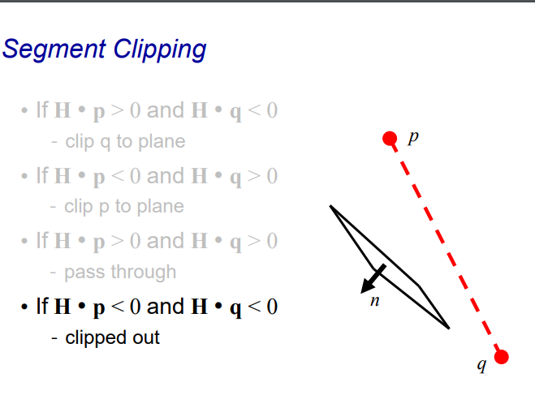

# Clipping

- **Purpose**: Eliminate portions of objects outside the viewing frustum.
- View frustum:
  - Boundaries of the image plane projected in 3D.
  - Includes near and far clipping planes.
- **Additional clipping planes**: Users may define extra clipping planes.

### Why Clipping?

- Avoid degeneracy:
  - Example: Don't draw objects behind the camera.
- Improve efficiency\:
  - Example: Skip processing objects that are not visible.

Here are the bullet points extracted from the slide:

### When to Clip?

1. **Before perspective transform in 3D space**:

   

   - Use the equation of 6 planes.
   - Natural, not too degenerate.

2. **In homogeneous coordinates after perspective transform (clip space)**:

   

   - Before perspective divide (4D space with unique $w$ values).
   - Canonical, independent of the camera.
   - Simplest to implement.

3. **In the transformed 3D screen space after perspective division**:

   

   - A potential issue is that objects lying exactly on the plane of the camera (e.g., near the clipping plane) may create numerical inaccuracies or degenerate geometry.

# Concept of a halfspace

## In 2D

## In 3D

## The Concept of a Halfspace

- Definition:
  - A halfspace is one side of an infinite line or plane where a condition is satisfied.
- In 2D:
  - Infinite line equation: $f(x, y) = 0$ (e.g., $x - y + 1 = 0$).
  - Points are categorized based on the line:
    - $f(x, y) < 0$: Below or one side of the line.
    - $f(x, y) > 0$: Above or the other side of the line.

## The Concept of a Halfspace in 3D

- Definition:
  - Defined by a plane equation: $f(x, y, z) = 0$ or $Ax + By + Cz + D = 0$.
- Classification:
  - Points in space are classified relative to the plane:
    - $f(x, y, z) < 0$: One side of the plane (inside the halfspace).
    - $f(x, y, z) > 0$: Other side of the plane.

This concept is fundamental in graphics for clipping and other spatial operations.

# Homogeneous Coordinates

- **Plane Equation in Homogeneous Coordinates**:

  - The equation $Ax + By + Cz + D = 0$ is represented using a vector $\mathbf{H} = (A, B, C, D)^T$.

  -  **$\mathbf{H}$** (or more precisely, the components $(A,B,C)$ in $\mathbf{H} = (A, B, C, D)^T$ represents a vector that is **perpendicular** (normal) to the plane.

  - In this context, **H** is a **homogeneous coordinate vector** that represents the coefficients of a plane equation in 3D space. Specifically:

    $H = (A, B, C, D)^T$ Where:

    - $A, B, C$: Coefficients defining the orientation of the plane (the plane's normal vector).
    - $D$: The offset term, which determines the plane's position relative to the origin.

  - Purpose of HH:

    - It compactly encodes the equation of a plane: $Ax + By + Cz + D = 0$
    - When extended to homogeneous coordinates, it allows for transformations (like scaling, translation, and projection) in a unified way.

    In homogeneous systems, multiple equivalent representations exist because the coefficients can be scaled by any non-zero factor $s$. For example, $s \cdot H = (sA, sB, sC, sD)$ still represents the same plane.

- **Infinite Equivalent Homogeneous Coordinates**:

  - A point $(x, y, z, w)$ in homogeneous coordinates has an infinite number of equivalent representations:
    - $(sx, sy, sz, sw)$ where $s \neq 0$.

- **Relationship to Plane Equations**:

  - This leads to an infinite number of equivalent plane equations:
    - $sAx + sBy + sCz + sD = 0$, where $\mathbf{H} = (sA, sB, sC, sD)^T$.

Homogeneous coordinates provide flexibility and consistency in representing points and planes in 3D graphics, crucial for transformations and projections.

# Point-to-Plane Distance

1. **Normalization of $H$**:
   - Scale $H = (A, B, C, D)^T$ so that the components $(A, B, C)$ are normalized: $A^2 + B^2 + C^2 = 1$
2. **Distance Calculation**:
   - The distance $d$ from a point $\mathbf{p}$ to the plane is calculated using the dot product: $d = \mathbf{H} \cdot \mathbf{p} = \mathbf{H}^T \mathbf{p}$
   - Note: The dot product is computed in homogeneous coordinates.
3. **Signed Distance**:
   - $d$ represents a signed distance:
     - **Positive $d$**: The point is on the "inside" of the plane (relative to the normal vector).
     - **Negative $d$**: The point is on the "outside" of the plane.

# Which side of the plane is a point on?

### Which Side of the Plane Is a Point On?

- The position of a point relative to a plane can be determined using the dot product 

  $d = \mathbf{H} \cdot \mathbf{p}$, where:

  - $\mathbf{H} = (A, B, C, D)^T$ represents the plane.
  - $\mathbf{p} = (x, y, z, 1)^T$ is the point in homogeneous coordinates.

------

#### Interpretation of $d$:

1. **If $d = \mathbf{H} \cdot \mathbf{p} \geq 0$:**
   - The point is on the "pass-through" side of the plane.
   - This means the point is on the same side as the plane's normal vector or exactly on the plane.
2. **If $d = \mathbf{H} \cdot \mathbf{p} < 0$:**
   - The point is on the opposite side of the plane.
   - This could indicate that the point should be clipped (culled or rejected) in applications like frustum culling in graphics.

------

### Key Notes

- **Normalization of $A, B, C$:**
  - For determining the side of the plane, **normalization is unnecessary** because we are only interested in the **sign** of $d$.
  - The sign directly tells us the relative position of the point to the plane.
- **Applications**
  - This method is widely used in computer graphics for frustum culling, where objects outside the viewing volume are clipped to optimize rendering.

------

This slide emphasizes that determining the side of a plane is a computationally efficient process, leveraging the sign of the dot product without the need for additional operations like normalization.

# Clipping with respect to View Frustum

### Clipping with Respect to View Frustum

1. **Test Against Each of the 6 Planes**:
   - A view frustum is bounded by 6 planes:
     - Left, right, top, bottom, near, and far.
   - Each plane has its own **normal vector** pointing **towards the interior** of the frustum.
   - Each plane is represented by its plane equation and corresponding vector H\mathbf{H}.
2. **Testing a Point $\mathbf{p}$**:
   - For a point $\mathbf{p}$, calculate $d = \mathbf{H} \cdot \mathbf{p}$ for each of the 6 planes.
   - If $d < 0$ for any plane:
     - The point is **outside** the frustum.
     - The point is clipped (culled or rejected).
3. **Goal of Clipping**:
   - Ensure only points or objects within the **view frustum** are rendered.
   - Improves rendering efficiency by eliminating unnecessary computations for objects that are not visible to the camera.

# What are the View Frustum Planes?

### What Are the View Frustum Planes?

1. Definition of the View Frustum:
   - The view frustum is a pyramid-shaped volume defined by 6 **planes** that bound the visible area in 3D space for a camera.
   - The camera is positioned at the **eye point** (O) and looks along the positive $z$-axis ($z+$).

1. The 6 Frustum Planes:

   - Each plane is defined with its corresponding homogeneous vector $\mathbf{H}$:

     - **Near Plane**:

       $\mathbf{H}_{\text{near}} = (0, 0, 1, -\text{near})^T$

       $0 \cdot x + 0 \cdot y + 1 \cdot z + D = 0$

       $z+D = 0, near + D = 0$

       $z = -D, D=-near$

     - **Far Plane**:

       $\mathbf{H}_{\text{far}} = (0, 0, -1, \text{far})^T$
       $$
       \begin{align}
       -1 \cdot z + D  &= 0\\
       z  &= far \\
       D &= far \\
       \end{align}
       $$
       

     - **Bottom Plane**:

       $\mathbf{H}_{\text{bottom}} = (0, \text{near}, -\text{bottom}, 0)^T$
       $$
       \begin{align}
       y \cdot B + z \cdot C &= 0\\
       near \cdot y - bottom \cdot z &= 0\\
       \frac{y}{z} &= \frac{bottom}{near}
       \end{align}
       $$
       

     - **Top Plane**:

       $\mathbf{H}_{\text{top}} = (0, -\text{near}, \text{top}, 0)^T$

     - **Left Plane**:

       $\mathbf{H}_{\text{left}} = (-\text{near}, 0, \text{left}, 0)^T$

     - **Right Plane**:

       $\mathbf{H}_{\text{right}} = (\text{near}, 0, -\text{right}, 0)^T$

1. **Orientation of Normals**:
   - The **normals** of the planes are oriented **toward the interior** of the frustum. This allows testing whether a point is inside or outside the frustum by checking the sign of $\mathbf{H} \cdot \mathbf{p}$.
2. **Eye Point**:
   - The frustum originates at the **eye point** (O), which is at the apex of the pyramid-shaped frustum.

# Line-Plane Intersection

1. Purpose:
   - Finding the intersection between a line (or line segment) and a plane is crucial for operations like **clipping** in 3D graphics.

------

1. Explicit (Parametric) Line Equation:
   - A line segment between two points $\mathbf{p}_0$ and $\mathbf{p}_1$ can be represented parametrically as: $\mathbf{L}(\mu) = \mathbf{p}_0 + \mu (\mathbf{p}_1 - \mathbf{p}_0)$ Or equivalently: $\mathbf{L}(\mu) = \mu \mathbf{p}_1 + (1 - \mu) \mathbf{p}_0$
   - Here:
     - $\mu$ is a parameter that varies between $0$ and $1$.
       - $\mu = 0$: Gives $\mathbf{p}_0$.
       - $\mu = 1$: Gives $\mathbf{p}_1$.
       - $0 < \mu < 1$: Gives points between $\mathbf{p}_0$ and $\mathbf{p}_1$.

------

1. Finding the Intersection:
   - To find the intersection of the line with a plane:
     - Substitute the parametric equation of the line $\mathbf{L}(\mu)$ into the **implicit equation of the plane**: $\mathbf{H} \cdot \mathbf{L}(\mu) = 0$, $\mathbf{H}=Ax+By+Cz+D=0$
     - Solve for $\mu$, which determines the intersection point on the line.
   - The **normal vector** of the plane ($\mathbf{H}$) is used in this calculation.

------

### Summary

- Parametric line equations are used to describe line segments in 3D space.
- Intersections with planes are found by substituting the line equation into the plane equation and solving for the parameter \$\mu$.
- This process is essential for graphics operations like clipping, where parts of geometry outside the view frustum are discarded.

#  Segment Clipping

### Segment Clipping

1. Clipping Line Segments Against a Plane:
   - Line segments $\mathbf{p}$ to $\mathbf{q}$ may partially or completely intersect the plane defined by $\mathbf{H}$.
   - The decision on whether to clip depends on the signs of $\mathbf{H} \cdot \mathbf{p}$ and $\mathbf{H} \cdot \mathbf{q}$, which indicate the positions of $\mathbf{p}$ and $\mathbf{q}$ relative to the plane.

------

1. Cases for Clipping:

   - Case 1: 

     $\mathbf{H} \cdot \mathbf{p} > 0$ and $\mathbf{H} \cdot \mathbf{q} < 0$

     - Clip $\mathbf{q}$ to the plane.

   - Case 2: 

     $\mathbf{H} \cdot \mathbf{p} < 0$ and $\mathbf{H} \cdot \mathbf{q} > 0$

     - Clip $\mathbf{p}$ to the plane.

   - Case 3: 

     $\mathbf{H} \cdot \mathbf{p} > 0$ and $\mathbf{H} \cdot \mathbf{q} > 0$

     - The segment passes through; no clipping is needed.

   - Case 4: $\mathbf{H} \cdot \mathbf{p} < 0$ and $\mathbf{H} \cdot \mathbf{q} < 0$

     - Both endpoints are outside; the segment is **clipped out** entirely.

------

1. How Clipping Works:
   - When $\mathbf{p}$ or $\mathbf{q}$ is clipped to the plane, the intersection point is calculated using the **line-plane intersection formula**: $\mathbf{L}(\mu) = \mathbf{p}_0 + \mu (\mathbf{p}_1 - \mathbf{p}_0)$

------

### Summary

Segment clipping ensures that only the visible portions of a line segment remain after intersecting with a plane. This is fundamental for graphics rendering and frustum culling, where geometry outside the viewing volume must be excluded.

# Clipping and containment

### Clipping and Containment

1. **Clipping Beyond a View Frustum**:
   - Clipping can be applied to **any object**, not just the view frustum.
   - It is a general concept used in 3D graphics for limiting rendering to specific areas or shapes.
2. **Clipping Against Arbitrary Objects**:
   - To clip against arbitrary shapes (e.g., polygons or other geometric objects), you need to determine if a point or part of an object is inside or outside the shape.
3. **Containment Testing**:
   - The primary task is to test for containment:
     - Is a given point **inside** or **outside** the object?
   - This is critical for determining which parts of geometry to retain or discard during clipping.
4. **Types of Objects for Containment Testing**:
   - Convex Objects:
     - Easier to handle.
     - Example: Convex polyhedra, where all points within the shape are bounded by the object's planes.
   - Concave Objects:
     - More complex than convex cases.
     - Special handling is required for objects with inward-facing surfaces or holes.

------

### Summary

Clipping and containment extend the concept of frustum clipping to any arbitrary shape. The process involves determining if points or objects are inside or outside the clipping boundary, with convex shapes being easier to handle than concave ones. This concept is widely used in graphics for optimizing rendering and handling complex geometric scenarios.

# Convex Object

### Convex Objects: Two Definitions

1. **Geometric Definition**:
   - A convex object is one where **a line joining any two points on or inside the boundary lies entirely inside the object**.
   - 如果一个对象是凸的，那么**连接对象边界上的任意两点的直线段都完全位于该对象内部**。
   - This means that no part of the line extends outside the object.
   - 凸对象的任何部分都不会凹陷进去，直线段的任意部分都不会穿过或离开对象的边界。
2. **Halfspace Definition**:
   - A convex object can also be defined as the **intersection of planar halfspaces**.
   - 一个凸对象也可以定义为**若干平面半空间的交集**。
   - A halfspace is the region of space on one side of a plane. The intersection of several halfspaces forms the convex shape.
   - 多个半空间的交集会形成一个凸形状，例如一个多面体（如立方体）

------

### Example

- The image illustrates a convex polyhedron (a box), which satisfies both definitions:
  - Any line connecting two points within or on the surface remains inside the object.
  - It is formed by the intersection of planar halfspaces, each defined by one of its bounding planes.

------

## Testing if an object is convex: Algorithm

## Test containment within a convex object: Algorithm

## Summary

Convex objects have straightforward geometric and mathematical properties that make them easier to process in computer graphics, especially for operations like clipping, collision detection, and containment testing. These definitions provide intuitive and practical ways to understand and represent convexity.

## Vector test for containment

### Vector Test for Containment

To determine whether a test point $P$ lies on the **inside** of a convex face:

1. **Condition**:

   - The point $P$ is on the "inside" of the face if:

     $\cos \theta > 0 \quad \text{or equivalently} \quad \mathbf{n} \cdot (\mathbf{P} - \mathbf{A}) > 0$

     - Explanation:
       - $\mathbf{n}$: The inner normal vector of the face, pointing toward the interior of the convex object.
       - $\mathbf{P} - \mathbf{A}$: The vector from a point $A$ (on the face) to the test point $P$.
       - $\cos \theta > 0$: Indicates the angle $\theta$ is acute, meaning $P$ is in the direction of the normal vector.

2. **Mathematical Basis**:

   - Using the dot product formula:

     $\mathbf{n} \cdot (\mathbf{P} - \mathbf{A}) = \|\mathbf{n}\| \cdot \|\mathbf{P} - \mathbf{A}\| \cdot \cos \theta$

     - If $\cos \theta > 0$, the dot product $\mathbf{n} \cdot (\mathbf{P} - \mathbf{A}) > 0$, confirming that $P$ lies on the "inside" of the face.

------

### Key Concepts

1. **Normal Vector ($\mathbf{n}$)**:

   - Defines the orientation of the face.
   - The inner normal vector points toward the interior of the convex object.

2. **Role of the Dot Product**:

   - The sign of the dot product determines the relative position of $P$

      to the face:

     - $\mathbf{n} \cdot (\mathbf{P} - \mathbf{A}) > 0$: $P$ is on the "inside."
     - $\mathbf{n} \cdot (\mathbf{P} - \mathbf{A}) < 0$: $P$ is on the "outside."

3. **Geometric Interpretation**:

   - If $P$ lies in the same direction as the normal vector, it is inside the face.
   - If $P$ lies in the opposite direction, it is outside.

------

### Summary

By computing the dot product $\mathbf{n} \cdot (\mathbf{P} - \mathbf{A})$, we can determine whether the test point $P$ lies on the inside or outside of a face. This method is efficient and widely used in geometry processing, collision detection, and computer graphics.

# Finding a normal vector

### Finding a Normal Vector

1. Cross Product:
   - A normal vector to a plane can be calculated using the **cross product** of two edge vectors on the plane.
   - Let:
     - $\mathbf{e}_1$: One edge vector on the plane.
     - $\mathbf{e}_2$: Another edge vector on the plane.
   - The normal vector is: $\mathbf{n} = \mathbf{e}_2 \times \mathbf{e}_1$
   - The resulting vector $\mathbf{n}$ is perpendicular to both $\mathbf{e}_1$ and $\mathbf{e}_2$, and thus normal to the plane defined by these edges.

------

### Determining the Orientation (Inward or Outward)

1. **Problem**:
   - The cross product gives a direction, but the resulting normal vector $\mathbf{n}$ could point either **inward** (toward the object) or **outward** (away from the object).
2. **Correct Orientation**:
   - The desired orientation (inward or outward) depends on the specific application:
     - For convex objects:
       - The **inner normal** points toward the object's interior.
       - The **outer normal** points away from the object.
   - To determine the correct direction:
     - Use the **right-hand rule** for the cross product.
     - Verify the orientation by comparing the normal vector's direction to the desired orientation (e.g., checking against a known reference point).

------

### Example (Illustrated in the Slide)

- Top Image:
  - The cross product $\mathbf{e}_2 \times \mathbf{e}_1$ produces a vector that is perpendicular to the plane.
- Bottom Images:
  - One normal vector points **outward**.
  - The other normal vector points **inward**.

------

### Practical Use

- In applications like 3D rendering or geometry processing:
  - The correct normal orientation is essential for determining whether a point lies inside or outside an object.
  - For rendering, outward normals are typically used for lighting calculations.

------

### Summary

- The normal vector is calculated using the cross product of two edge vectors.
- Its orientation (inward or outward) must be verified and adjusted based on the application, using techniques like the right-hand rule or geometric checks.

# Checking normal direction (convex object)

### Checking Normal Direction for a Convex Object

To determine whether a given normal vector $\mathbf{n}$ is the **inner normal**:

1. **Inner Normal Definition**:
   - The inner normal vector $\mathbf{n}$ points **toward the interior** of the convex object.
2. **Testing the Normal Vector**:
   - Take a vector $\mathbf{B} - \mathbf{A}$, where:
     - $\mathbf{A}$ and $\mathbf{B}$ are points on the convex object's face or edge.
   - Compute the dot product: $\mathbf{n} \cdot (\mathbf{B} - \mathbf{A})$
   - Interpret the result:
     - If $\mathbf{n} \cdot (\mathbf{B} - \mathbf{A}) > 0$, $\mathbf{n}$ is pointing **inward**, and it is the **inner normal**.
     - If $\mathbf{n} \cdot (\mathbf{B} - \mathbf{A}) < 0$, $\mathbf{n}$ is pointing **outward**, and it is not the inner normal.

------

### Why This Works

1. The vector $\mathbf{B} - \mathbf{A}$:
   - Represents a direction within the face of the convex object.
   - This vector is tangential to the surface, so its relationship with $\mathbf{n}$ determines whether $\mathbf{n}$ points into or away from the object.
2. The dot product:
   - Measures the alignment between $\mathbf{n}$ and $\mathbf{B} - \mathbf{A}$.
   - A positive result indicates that $\mathbf{n}$ is oriented toward the object's interior.

------

### Summary

To verify if $\mathbf{n}$ is an **inner normal**:

- Calculate $\mathbf{n} \cdot (\mathbf{B} - \mathbf{A})$.
- If the result is positive, $\mathbf{n}$ is the **inner normal**, pointing toward the convex object's interior. This process is critical in 3D geometry for determining containment and rendering properties.

# Concave Object

### Concave Objects

1. **Containment and Clipping**:
   - Containment and clipping can also be performed for **concave objects**, not just convex ones.
   - However, the process is more complex due to the object's inward-facing surfaces or holes.
2. **Algorithms for Containment**:
   - Most algorithms for concave objects use the ray containment test:
     - A ray is projected from a test point, and its interaction with the object's boundaries is analyzed.
     - The number of intersections with the object's surfaces helps determine whether the point is inside or outside:
       - **Odd number of intersections**: The point is inside.
       - **Even number of intersections**: The point is outside.

------

### Challenges with Concave Objects

- Complex Geometry:
  - Concave objects can have irregular shapes, requiring additional computational effort.
- Ambiguity in Normal Vectors:
  - For concave shapes, the direction of the normal vector may vary significantly across different surfaces, complicating containment tests.

------

### Summary

Concave objects require specialized algorithms, such as the ray containment test, for operations like clipping and containment. These methods are essential for handling more complex geometries in applications like computer graphics and computational geometry.

## The Ray Test in two dimentions

# Calculating intersections with rays

### Rays and Their Equation

1. **Definition of a Ray**:

   - A ray is similar to a line but has a **starting point** and extends in only one direction.

   - The equation of a ray starting from a point $\mathbf{T}$ is:

     $\mathbf{R} = \mathbf{T} + \mu \mathbf{d}, \quad \mu > 0$

     - $\mathbf{T}$: The starting point (origin) of the ray.
     - $\mathbf{d}$: The direction vector of the ray.
     - $\mu$: A scalar parameter that controls how far along the ray the point is located.

2. **Direction of the Ray**:

   - The ray moves in the direction specified by $\mathbf{d}$.
   - $\mu > 0$ ensures that the ray only extends forward from $\mathbf{T}$ (not backward).

------

### Choosing a Direction for $\mathbf{d}$

1. **Simple Choices**:

   - For ease of computation, simple directions are often chosen for $\mathbf{d}$

     , such as:

     - $\mathbf{d} = \begin{pmatrix} 1 \\ 0 \end{pmatrix}$: A ray extending horizontally.
     - $\mathbf{d} = \begin{pmatrix} 1 \\ 0 \\ 0 \end{pmatrix}$: A ray extending along the $x$-axis in 3D.

   - These choices simplify intersection calculations in 2D or 3D space.

2. **Reason for Simplicity**:

   - Choosing a simple direction reduces computational complexity when testing ray intersections with objects, particularly for containment or clipping tests.

------

### Summary

- A ray is defined by its origin $\mathbf{T}$ and direction $\mathbf{d}$, with the parameter $\mu > 0$ ensuring it only extends forward.
- Simple direction vectors ($\mathbf{d}$) are chosen for ease of computation, especially in algorithms like ray containment tests for clipping and geometry operations.

# Valide Intersections

### Valid Intersections Between a Line Segment and a Ray

1. **Line Segment Equation**:

   - A line segment between two points $\mathbf{V}_1$ and $\mathbf{V}_2$ is represented parametrically as:

     $\mathbf{P} = \mathbf{V}_2 + \nu (\mathbf{V}_1 - \mathbf{V}_2)$

     - $\nu$: A scalar parameter, where:
       - $0 \leq \nu \leq 1$: Ensures the point $\mathbf{P}$ lies on the segment.

2. **Ray Equation**:

   - A ray starting at $\mathbf{T}$ with direction $\mathbf{d}$ is represented as: $\mathbf{P} = \mathbf{T} + \mu \mathbf{d}$
     - $\mu > 0$: Ensures the point lies in the forward direction of the ray.

3. **Intersection Condition**:

   - For the ray and the line segment to intersect, their parametric equations must satisfy: $\mathbf{T} + \mu \mathbf{d} = \mathbf{V}_2 + \nu (\mathbf{V}_1 - \mathbf{V}_2)$
   - This equation must be solved for both $\nu$ and $\mu$.

------

### Valid Intersection Criteria

1. **For the Ray**:
   - $\mu > 0$: Ensures the intersection point lies along the ray in the forward direction.
2. **For the Line Segment**:
   - $0 \leq \nu \leq 1:$ Ensures the intersection point lies within the bounds of the line segment.

------

### Summary

To find a valid intersection between a ray and a line segment:

- Solve the parametric equations for μ\mu and ν\nu.
- Check the conditions:
  - $\mu > 0$: The intersection is on the ray in the correct direction.
  - $0 \leq \nu \leq 1$: The intersection lies within the line segment.

This ensures the intersection point is geometrically meaningful.

# Extending the ray test to 3D

# 3D Ray Test

### 3D Ray Test for Intersection

The 3D ray test is used to determine whether a point lies inside or outside a 3D object by intersecting a ray with the object's faces.

------

### Two Stages of the 3D Ray Test:

1. **Compute the Intersection of the Ray with the Plane of Each Face**:

   - For each face of the 3D object:

     - Calculate where the ray intersects the **plane** that contains the face.

     - This involves solving the intersection equation for the ray and the plane:

       $\mathbf{R} = \mathbf{T} + \mu \mathbf{d}$

       where:

       - $\mathbf{R}$ is the point of intersection.
       - $\mathbf{T}$ is the origin of the ray.
       - $\mathbf{d}$ is the ray's direction vector.
       - $\mu > 0$: Ensures the intersection lies in the **positive direction** of the ray.

2. **Check if the Intersection Point is Within the Face**:

   - After finding the intersection:
     - Verify that the point lies within the boundaries of the face, **not just within the plane that extends beyond the face**.
     - This ensures the intersection is with the actual polygonal face and not the infinite plane that contains it.

------

### Why Both Stages Are Necessary:

- The first stage identifies **where** the ray intersects the plane.
- The second stage ensures the intersection is **valid**, i.e., within the finite boundaries of the polygonal face.

------

### Summary

The 3D Ray Test involves:

1. Finding intersections of the ray with planes of the object's faces.
2. Validating that the intersection points lie within the boundaries of the polygonal faces.

This two-step process ensures accurate results for operations like point-in-polyhedron testing and geometric containment.

# The plane of a face

### Plane of a Face

1. Challenges with the Plane of a Face:
   - The plane of a face in 3D space **does not generally align** with the Cartesian axes $(x, y, z)$.
   - As a result, determining whether a point lies within the face is **not inherently a 2D problem**—it is a 3D geometric issue.

------

1. Simplification Using Orthographic Projection:
   - **Orthographic Projection**: Projects 3D points onto a 2D plane while preserving relative distances and containment properties.
   - Containment Invariance:
     - Containment of a point within a face is preserved under orthographic projection.
     - This means the problem can be simplified to a **2D containment test** in the plane of the face.

------

### Why Use Orthographic Projection?

- Reduces a complex 3D problem to a simpler 2D problem.
- Easier computational methods are available for determining containment in 2D.

------

### Summary

- While the plane of a face doesn’t align with Cartesian axes in 3D space, the problem of point containment can be simplified.
- Using orthographic projection, the test can be reduced to a 2D problem while preserving correctness. This approach simplifies calculations in geometric processing and computer graphics.

# Clipping to concave volumes

### Clipping to Concave Volumes

1. **Finding Intersections**:
   - Identify every **intersection** of the line to be clipped with the concave volume.
   - These intersections divide the line into one or more **segments**.
2. **Segment Containment**:
   - Select a point on the **first segment** and test it for **containment** within the concave volume.
   - Use techniques like the **ray test** or other containment checks to determine if the segment lies inside the volume.
3. **Behavior of Adjacent Segments**:
   - Adjacent segments will alternate between being **inside** and **outside** the volume.
   - This is due to the nature of concave volumes where a line crossing the boundary enters and exits multiple times.

------

### How This Helps:

- The approach divides a complex clipping operation into manageable segments.
- By determining the containment of one segment, the alternating behavior simplifies containment testing for subsequent segments.

------

### Summary

To clip a line to a concave volume:

1. Find all intersections with the volume's boundary.
2. Divide the line into segments and test one segment for containment.
3. Use the alternating containment property to determine the inside and outside segments.

This method ensures accurate clipping for complex concave geometries in computational graphics and geometry processing.

# Splitting a Concave Volume into Convex Parts

Here’s the explanation of **splitting a volume into convex parts**:

------

### Splitting a Concave Volume into Convex Parts

1. **Why Split?**:
   - Concave volumes are more complex to handle for clipping and containment tests.
   - Splitting a concave volume into **convex parts** simplifies the process because convex parts can use well-established, simpler algorithms.
2. **Process**:
   - The concave volume is divided into smaller convex sub-volumes.
   - Each convex part is analyzed independently.
   - Tests for convex objects (e.g., containment or clipping) are applied to each part.
3. **Method**:
   - Consider each face of the concave volume.
   - Use the plane of the face to divide the volume:
     - If all vertices of the object lie on one side of the plane, proceed to the next face.
     - Otherwise, split the volume along the plane.

------

### Benefits of Splitting:

- Simplified Testing:
  - Convex volumes allow efficient geometric computations like point containment, ray intersections, and clipping.
- Modularity:
  - By breaking the problem into smaller pieces, each part can be handled independently, improving robustness.

------

### Summary

To handle concave volumes, split them into convex parts by analyzing their faces and using planes to divide the geometry. This method simplifies complex operations like clipping and containment testing by leveraging simpler algorithms designed for convex shapes.

