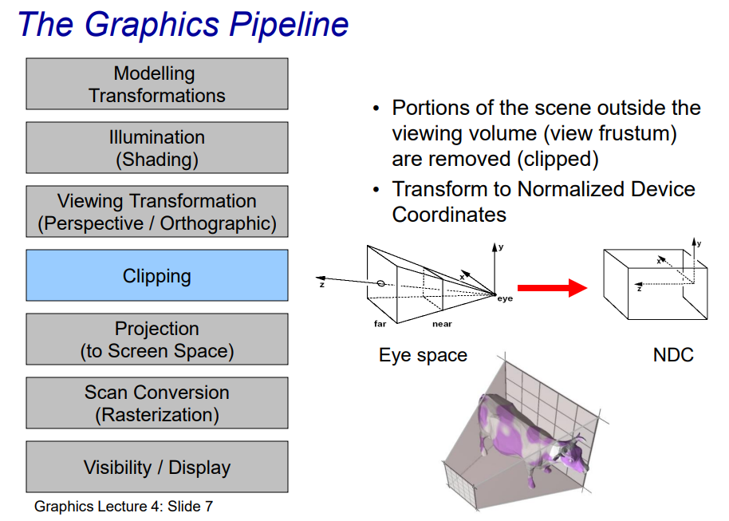
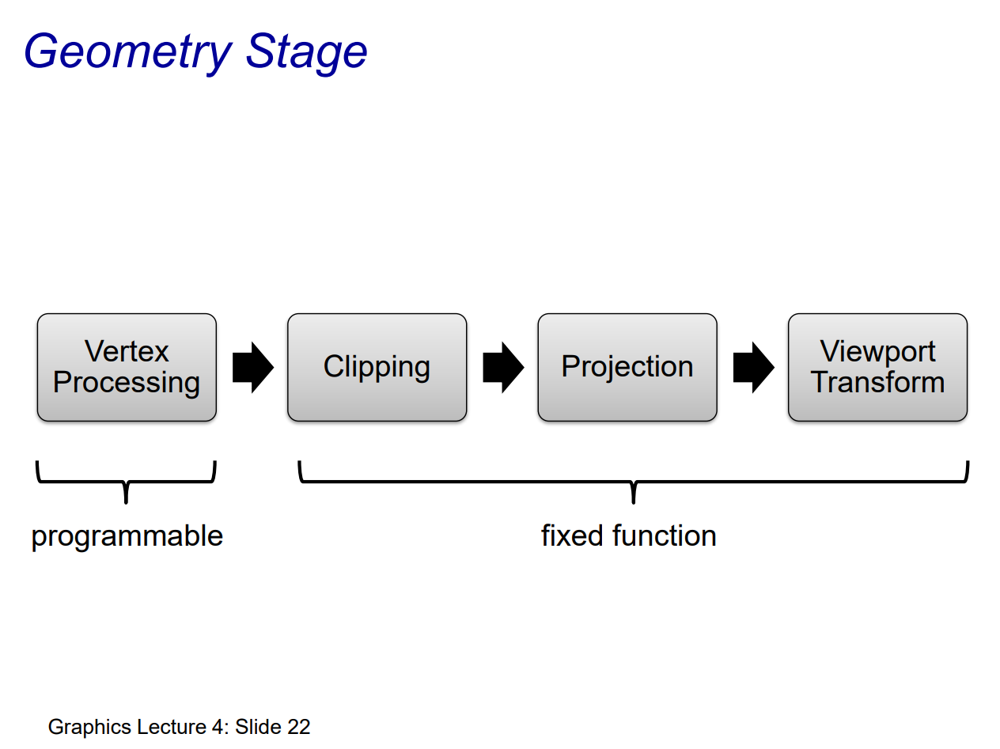
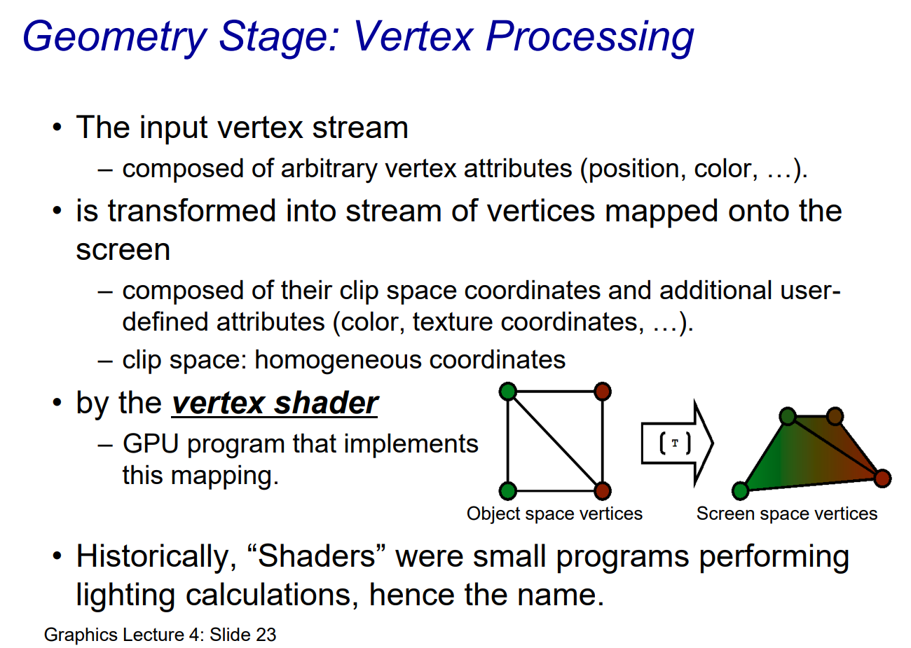
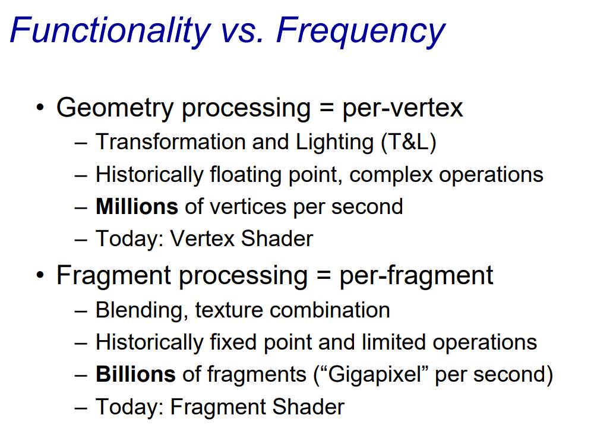

# The Graphics Pipeline: High-level view

------

### 1. **Declarative 声明式 Approach** ("What, not How")

- **Description**: Focuses on defining the "what" of a scene rather than the "how" it is drawn.
- Features:
  - A virtual camera is described with a **scene graph**, where the relationships and properties of all objects in the scene are defined.
  - Each object in the scene may be aware of other objects.
- Examples:
  - **RenderMan**, **Inventor**, **OpenSceneGraph**.
- **Use Case**: High-level abstractions where interactions between objects need to be described.

------

### 2. **Imperative 指令式 Approach** ("How, not What")

- **Description**: Focuses on step-by-step instructions on how to draw objects.
- Features:
  - Emits a sequence of **drawing commands** (e.g., "draw vertex at position (x, y, z)").
  - Objects are drawn **independently** without awareness of other objects.
- Examples:
  - **OpenGL**, **PostScript**.
- **Use Case**: Lower-level control where developers define explicit rendering operations.

------

### Key Insight:

- Declarative pipelines can **build upon** imperative models by abstracting the step-by-step instructions into higher-level descriptions.

# Graphics Pipeline

1. **Application:**
   - Provides the inputs to the pipeline, such as:
     - **Geometric model:** Defines the shapes and positions of objects.
     - **Illumination model:** Describes how light interacts with surfaces.
     - **Camera model:** Specifies the viewpoint and projection method.
     - **Viewport:** Defines the display region on the screen.
2. **Pipeline Stages:**
   - **Modeling Transformations:** Applies transformations like translation, rotation, and scaling to objects in the scene.
   - **Illumination (Shading):** Calculates the color of surfaces based on lighting and material properties.
   - **Viewing Transformation:** Converts the scene from world coordinates to camera coordinates (e.g., perspective or orthographic projection).
   - **Clipping:** Removes parts of the scene outside the viewing frustum.
   - **Projection (to Screen Space):** Maps 3D coordinates to 2D screen coordinates.
   - **Scan Conversion (Rasterization):** Converts geometric primitives (e.g., triangles) into pixels on the screen.
   - **Visibility / Display:** Resolves occlusion (e.g., hidden surface removal) and displays the final 2D image.
3. **Output:**
   - Produces a 2D image ready for display in a framebuffer.

### Why It's Called an Imperative Pipeline:

- Each step is performed in a well-defined sequence, such as "apply transformations," "clip geometry," and "project points."
- The process is highly procedural, with each operation directly affecting the next.

This diagram highlights how the graphics pipeline systematically processes a complex 3D scene to produce a 2D image for display.

# Modelling Transformations

1. **Object Space (Local Coordinates):**

   - Each 3D model is defined in its own coordinate system, also known as object space.
   - For example, a model of a cube might have its center at the origin $(0,0,0)$ in its local coordinate system.

2. **World Space (Global Coordinates):**

   - To assemble a scene, all objects need to be placed relative to a common coordinate frame, called world coordinates.
   - World space defines the positions, orientations, and scales of all objects in a unified 3D environment.

3. **Modeling Transformations:**

   - **Purpose:** Converts models from object space to world space.

   - Operations:

      Involves applying transformations like:

     - **Translation:** To position the object in the world.
     - **Rotation:** To orient the object correctly.
     - **Scaling:** To adjust the object's size relative to others.

   - **Example:** A robot model in its local space might be rotated and translated to appear standing on a ground plane in world space.

This step ensures that all objects are aligned in a global context, enabling further processing such as illumination, viewing transformations, and clipping.

# Illumination (Shading)

1. **Shading:**
   - Shading determines how light interacts with the surface of an object.
   - This process involves calculating the color and brightness at each vertex of the object.
2. **Material Properties:**
   - Each object has material attributes such as:
     - **Diffuse color:** The base color of the surface.
     - **Specular reflection:** How shiny the surface is.
     - **Ambient reflection:** The general light present in the scene.
3. **Surface Properties:**
   - Factors like the normal direction at each point on the surface influence how light interacts with it.
4. **Lighting Models:**
   - A **local lighting model** is used, meaning that shading is based only on the interaction of the surface with light sources, without considering global effects like reflections or shadows.
   - Common local lighting models include:
     - **Phong shading** (interpolated shading).
     - **Gouraud shading** (vertex shading).
5. **Lighting Effects:**
   - The light source positions and intensities determine how the object is lit.
   - The resulting visual effects make objects appear more three-dimensional and realistic.
6. **Output:**
   - The object transitions from a flat, unshaded appearance (left teapot) to a visually rich, shaded version (right teapot) that includes highlights and gradients.

This step prepares the object for the **Viewing Transformation** step, adding realism by simulating how light interacts with surfaces.

# Viewing Transformation (Perspective / Orthographic)

1. **Mapping to Eye Space:**
   - Converts the 3D coordinates from **world space** to **eye space (camera space)**.
   - This transformation aligns the scene with the viewer's perspective or camera position.
2. **Purpose:**
   - The goal is to adjust the scene so that the camera becomes the point of reference.
   - All objects and lights are positioned relative to the camera.
3. **Transformation Details:**
   - **World Space:** The original coordinate system where objects are defined.
   - **Eye Space:** The coordinate system where the camera is at the origin, and the viewing direction is aligned with a specific axis (typically the z-axis).
   - This involves:
     - Translating the camera position to the origin.
     - Rotating the scene to align the camera's viewing direction along the z-axis.
4. **Perspective vs. Orthographic:**
   - Perspective Projection:
     - Simulates real-world viewing by making distant objects appear smaller.
   - Orthographic Projection:
     - Maintains object sizes regardless of distance (commonly used in engineering and architectural drawings).
5. **Matrix Evaluation:**
   - The transformation uses a **view matrix**, which contains translation and rotation components to apply these changes mathematically.
6. **Illustration:**
   - The image shows a 3D scene adjusted to the camera's view, emphasizing the perspective and orientation.

This stage sets up the geometry for subsequent steps like **Clipping** and **Projection**, ensuring the scene is ready for rendering from the viewer's perspective.

# Clipping

### Explanation:

1. **Purpose of Clipping**:
   - Clipping ensures that only the portions of a 3D scene visible within the viewing volume (the **view frustum**) are retained.
   - Any geometry (vertices, edges, polygons) outside the frustum is discarded or clipped.
2. **View Frustum**:
   - The view frustum is the truncated pyramid-shaped region that defines the visible area in the scene.
   - It is bounded by near and far planes, along with the sides of the frustum.
3. **Normalized Device Coordinates (NDC)**:
   - After clipping, the retained parts of the geometry are transformed into **Normalized Device Coordinates**.
   - NDC standardizes the coordinates so they fit within a unit cube (ranging from -1 to 1 in x, y, and z dimensions).
   - This step is crucial for subsequent projection and rasterization stages.
4. **Pipeline Context**:
   - Clipping happens after the **Viewing Transformation** stage and before **Projection**.
   - It ensures computational efficiency by limiting the data passed forward to only visible parts of the scene.

The diagram illustrates:

- The **view frustum** in **Eye Space**.
- The transition to the **NDC cube**, showing how visible geometry is retained.

# Projection (to Screen Space)

1. **Purpose of Projection**:
   - Converts 3D objects from **Normalized Device Coordinates (NDC)** into **2D screen space** for rendering on a display.
   - Maps 3D points to their corresponding positions on the 2D imaging plane (e.g., computer screen).
2. **NDC to Screen Space**:
   - The transformation takes the unit cube (from NDC, with coordinates ranging from -1 to 1) and maps it to the screen’s pixel grid.
   - The mapping considers the screen's width and height, resulting in pixel coordinates.
3. **2D Imaging Plane**:
   - After this step, all objects are represented in terms of **screen-space coordinates**, ready for rasterization.
4. **Bottom Illustration**:
   - The diagram shows how:
     - Points in the **Eye Space** are eventually projected to **Screen Space**.
     - The 3D object (cow) transitions from the NDC cube to a flat 2D grid representing the screen.

This stage is critical for converting 3D geometric data into a format that can be displayed on a 2D monitor.

# Scan Conversion (Rasterization)

1. **Rasterization Process**:
   - Converts geometric representations of objects (e.g., triangles) into discrete **pixels** on the screen.
   - Determines which pixels on the 2D screen correspond to the objects' shapes and locations.
2. **Interpolation**:
   - Once the pixels representing the object are identified, values such as:
     - **Color** (shading or texture information)
     - **Depth** (distance from the camera)
     - **Other attributes** (e.g., normals, texture coordinates) are interpolated across the surface of the object for smooth rendering.
3. **Illustration**:
   - The image shows how two triangles (green and blue) are mapped to a grid representing screen pixels.
   - Each pixel that intersects the triangles is "filled in" based on the object's properties and interpolated values.
4. **Importance**:
   - Rasterization ensures objects are correctly visualized in terms of their shape, position, and appearance on the pixel grid.
   - This step bridges the gap between vector-based geometry and pixel-based display systems.

### Summary:

Rasterization is crucial for converting mathematical object representations into pixelated images that can be rendered on a screen, ensuring smooth transitions in visual properties.

# Visibility / Display

1. **Handling Occlusions**:
   - Determines which parts of the objects are visible to the camera and which are hidden behind other objects.
   - This process ensures that only the closest surfaces are displayed.
2. **Transparency Blending**:
   - Handles transparent or semi-transparent objects by blending their colors with the background or other overlapping objects.
3. **Depth Buffer (Z-Buffer)**:
   - A crucial tool used to track the depth (distance from the camera) of every pixel.
   - Ensures that pixels belonging to the nearest objects are rendered, while farther pixels are discarded.
4. **Illustration**:
   - The left image shows the final rendered scene with proper occlusion and transparency.
   - The right image shows the depth buffer, where darker areas are closer to the camera, and brighter areas are farther away.

### Summary:

The **Visibility/Display** stage ensures that the rendered image accurately represents the scene, with correct handling of visibility, occlusions, and transparency, making use of the depth buffer to prioritize objects closest to the viewer.

# What do we want to do?

1. **Objective**:
   - To create **real-time CGI** for applications like video games, simulations, and interactive graphics.
2. **Challenges**:
   - High Computational Demand:
     - For Full HD resolution (1920x1080 pixels) at 60 frames per second (60 Hz):
       - Each frame requires rendering 1920 × 1080 pixels.
       - At 60 frames per second, this amounts to **124 million pixels per second (Mpx/s)** for output.
     - This calculation is **just for the output**; additional computation is required for rendering 3D models, lighting, textures, and animations.
3. **Solution**:
   - Use specialized hardware designed for immediate mode graphics:
     - Hardware like **GPUs (Graphics Processing Units)** is optimized for the parallel processing demands of real-time graphics.
     - This hardware ensures low latency and high frame rates, critical for an interactive experience.

### Summary:

Creating real-time CGI at high resolutions and frame rates is extremely demanding. Specialized hardware, like GPUs, is essential to handle the massive computational load and provide smooth, immediate visual output.

# Solution

This slide outlines the **solution** for real-time graphics rendering:

### Key Points:

1. **Core Concept**:

   - Real-time graphics primarily rely on **rasterization of graphic primitives**.

   - Graphic primitives

      include:

     - **Points**: Single pixel-sized dots.
     - **Lines**: Straight connections between points.
     - **Triangles**: The most common building block for rendering complex shapes in 3D graphics.

2. **Implementation**:

   - Hardware-Based Rendering:
     - The task of rendering is handled by the **Graphics Processing Unit (GPU)**, a specialized hardware designed for high-speed parallel processing.
   - Controlled via API:
     - Programmers interact with the GPU using APIs like **OpenGL**, **DirectX**, or **Vulkan** to specify what and how to render.
   - Programmability:
     - Certain stages of the graphics pipeline, such as vertex or fragment processing, can be customized using shaders.
     - Shaders are written in languages like **GLSL (OpenGL Shading Language)**, allowing developers to implement custom visual effects.

3. **Shaders**:

   - Shaders are small programs that run on the GPU to define how vertices, fragments, and pixels are processed.
   - Examples include:
     - **Vertex Shaders**: Transform 3D geometry to screen space.
     - **Fragment Shaders**: Define pixel colors and lighting effects.

### Summary:

Real-time rendering of graphics involves the rasterization of basic primitives like points, lines, and triangles. This process is optimized through GPUs and programmable shaders, enabling efficient, customizable, and high-quality rendering.

# The Graphics Pipeline different view

### Key Concepts:

1. **Vertex**:
   - Represents a **point in 3D space** that defines the geometry of objects.
   - These points are the building blocks for creating shapes (e.g., triangles, lines).
2. **Fragment**:
   - **Intermediate output** generated during the rasterization process.
   - Each fragment contains information such as color, depth, and texture data for a potential pixel on the screen.
   - Multiple fragments may contribute to the same **final pixel** (e.g., blending, anti-aliasing).

------

### Pipeline Stages:

1. **Application**:
   - The first stage involves issuing **commands** from the application to define what and how objects are rendered.
   - Example: Defining 3D models, lighting, and camera setup.
2. **Geometry**:
   - Processes **primitives** (e.g., points, lines, triangles) to represent the shape of objects in 3D space.
   - Vertex transformations occur here to map from object space to screen space.
3. **Rasterization**:
   - Converts geometry (triangles, lines) into **fragments** that represent potential pixels on the screen.
   - The process interpolates attributes such as color, texture, and depth.
4. **Frame Buffer**:
   - Stores the output of rasterization as **pixel data** in memory.
   - Handles processes like **merging fragments**, blending transparency, and applying post-processing effects.
5. **Display**:
   - The **final image** is scanned out of the frame buffer and displayed on the screen.
   - This involves synchronization with the monitor's refresh rate.

------

### Summary:

This view of the graphics pipeline emphasizes the transition from **vertex data** to **fragments** and finally **pixels**, highlighting how 3D geometry is progressively processed and rendered into a 2D image suitable for display.

# Application Stage

1. **Generate Render Area in OS**:
   - Sets up the **window or screen space** where rendering will occur.
   - Managed by the operating system or graphics API.
2. **Generate Database**:
   - Prepares the **data** required for rendering, such as 3D models, textures, and scene information.
   - Steps include:
     - Loading assets from **disk**.
     - Building **acceleration structures** (e.g., spatial hierarchies like bounding volume hierarchies or kd-trees) to optimize rendering performance.
3. **Simulation**:
   - Handles the simulation of the scene, including physical effects, animations, and object behaviors.
   - Ensures the scene's state is updated for each frame.
4. **Input Event Handlers**:
   - Captures and processes **user inputs** (e.g., mouse, keyboard, or controller).
   - These inputs can affect the scene (e.g., moving objects, changing the camera view).
5. **Modify Data Structures**:
   - Dynamically updates the scene's data structures to reflect changes in the environment, objects, or lighting.
6. **Database Traversal**:
   - Efficiently traverses the scene database to determine which objects or elements need to be rendered in the current frame.
7. **Utility Functions**:
   - Performs additional tasks such as logging, debugging, or other supporting operations.

------

### Summary:

The **Application Stage** acts as the preparatory phase, handling high-level scene setup, input, and simulation before passing the processed data to the next stage in the graphics pipeline (geometry processing). This stage ensures the rendering process starts with all necessary information optimized and ready for further processing.

# Geometry Stage

------

### Components of the Geometry Stage:

1. **Vertex Processing** (Programmable):
   - Transforms vertices from **object space** to **clip space**.
   - Includes:
     - Applying **model, view, and projection transformations**.
     - **Lighting calculations** for shading, often using per-vertex normals.
     - **Skinning** (for animations) if necessary.
   - Performed by vertex shaders in programmable pipelines.
2. **Clipping** (Fixed Function):
   - Removes parts of primitives (triangles, lines, or points) that fall outside the **viewing volume** (view frustum).
   - Ensures only visible portions of objects proceed to the next stages.
3. **Projection** (Fixed Function):
   - Maps the transformed vertices from clip space to **Normalized Device Coordinates (NDC)**.
   - Projects the 3D scene into a 2D perspective or orthographic view.
4. **Viewport Transform** (Fixed Function):
   - Maps NDC coordinates to **screen space** coordinates.
   - Adapts the projected image to the screen dimensions (resolution, aspect ratio).

------

### **Programmable vs. Fixed Function**

- **Programmable**: Vertex processing is highly flexible and customizable through shaders, allowing developers to implement effects like morphing, procedural geometry, and advanced lighting models.
- **Fixed Function**: Clipping, projection, and viewport transform are rigidly defined by the graphics pipeline, ensuring standardized and efficient processing for these tasks.

------

### **Purpose**

The Geometry Stage ensures that the 3D scene is prepared for rasterization by:

- Transforming vertices to a consistent coordinate system.
- Removing non-visible portions of objects.
- Adapting the geometry to fit the 2D screen space.

It serves as the bridge between high-level geometry processing and low-level pixel-based rasterization.

# Geometry Stage: Vertex Processing

------

### **Key Aspects of Vertex Processing:**

1. **Input Vertex Stream:**
   - Composed of arbitrary vertex attributes such as:
     - **Position**: The 3D coordinates of the vertex in object space.
     - **Color**: The color information associated with the vertex.
     - **Texture coordinates**: Used for mapping textures onto surfaces.
     - Other attributes defined by the application.
2. **Transformation to Screen Space:**
   - The vertices are transformed from **object space** to **clip space** using transformations defined in the vertex shader.
   - Clip space is a 4D homogeneous coordinate system where the geometry is prepared for clipping and projection.
   - Additional attributes (e.g., color, texture coordinates) are preserved or interpolated for later stages.
3. **Role of the Vertex Shader:**
   - A **vertex shader** is a GPU program that implements the mapping of vertices.
   - Tasks performed by the vertex shader:
     - **Model-View-Projection Transformation**: Converts vertices from object space to clip space.
     - Calculates lighting for per-vertex shading (if needed).
     - Passes data to subsequent pipeline stages.
4. **Historical Context of Shaders:**
   - Originally, shaders were small, specialized programs that focused on lighting calculations, hence the name.
   - Today, shaders are more flexible and programmable, capable of performing a wide variety of operations.

------

### **Outcome of Vertex Processing:**

- Vertices are transformed and ready for the **clipping** stage.
- The processed vertices contain information about their position in clip space and additional attributes required for rasterization and fragment processing.

Vertex processing is a **programmable stage**, providing developers with significant control over how geometry is transformed and prepared for rendering.

# Geometry Stage: Vertex Post-Processing

------

### **Key Transformations in Vertex Post-Processing:**

1. **Object Space**:
   - The coordinates of vertices are defined relative to the object's local coordinate system.
   - Transformations begin here with the **Model Matrix**.
2. **Model Space to World Space**:
   - The **Model Matrix** is used to transform the object's vertices into **world space**, aligning the object within a shared 3D coordinate system.
   - This transformation accounts for the object's position, orientation, and scale in the scene.
3. **World Space to View Space**:
   - The **View Matrix** maps the world space coordinates to the **view space** (also known as camera space).
   - This positions the camera at the origin and aligns its viewing direction along a specific axis (typically the **z-axis**).
4. **View Space to Clip Space**:
   - The **Projection Matrix** transforms the vertices into **clip space**.
   - Clip space is a homogeneous coordinate system where the geometry is prepared for clipping and perspective division.
5. **Combined Transformations**:
   - Instead of applying the Model Matrix, View Matrix, and Projection Matrix sequentially, they are often combined into composite matrices for efficiency:
     - **ModelView Matrix**: Combines the Model and View matrices.
     - **ModelViewProjection Matrix**: Combines the Model, View, and Projection matrices.
6. **Output Vertex Coordinates**:
   - After the transformations, the vertices are represented in **clip space** with coordinates ready for clipping, rasterization, and rendering.

------

### **Importance of Vertex Post-Processing**:

- Ensures that objects in the scene are correctly positioned, oriented, and scaled relative to the camera and viewport.
- Prepares geometry for later stages like clipping and rasterization.
- Provides efficiency by precomputing combined transformation matrices.

This sequence is fundamental in ensuring that 3D models are accurately represented and displayed in a 2D rendering environment.

# Geometry Stage: Vertex Post-Processing

------

### **Key Components of Vertex Post-Processing:**

1. **Clipping**:
   - Primitives (e.g., triangles, lines) that are partially or entirely outside the viewing volume (defined by the view frustum) are clipped.
   - This ensures that only visible geometry is processed further, avoiding projection errors.
   - The remaining geometry is adjusted to fit within the view frustum, typically in **clip space**.
2. **Projection**:
   - The process of mapping 3D coordinates in **clip space** to 2D **normalized device coordinates (NDC)**.
   - Normalized device coordinates are resolution-independent and represent a standardized cube:
     - $x, y$ coordinates range from -1 to 1.
     - $z$ coordinates are used for depth (near and far clipping planes).
3. **Viewport Transform**:
   - Maps the **NDC** (resolution-independent coordinates) to pixel coordinates on the 2D screen or **frame buffer**.
   - This step ensures the primitives are properly positioned in the viewport, accounting for the display's resolution.
   - The output is in **window coordinates**, which define the pixel positions on the screen.

------

### **Importance**:

- These steps are crucial for ensuring that only visible geometry is rendered, reducing computational overhead and enabling accurate rasterization.
- They handle the transformation from a 3D representation to a 2D display, the final step before rasterization and rendering.

This part of the pipeline ensures that the 3D scene is correctly clipped, transformed, and mapped for rendering on the display device.

# Geometry Shader

------

### **Key Characteristics of the Geometry Shader**:

1. **Purpose**:
   - The geometry shader processes entire **primitives** (points, lines, triangles) rather than individual vertices like the vertex shader.
   - It has access to all vertices of a primitive and adjacency information, providing a full view of the shape being processed.
2. **Capabilities**:
   - Primitive Knowledge:
     - It knows all the vertices making up a primitive, enabling operations that depend on the entire primitive (e.g., tessellation or silhouette enhancement).
   - Dynamic Primitive Generation:
     - The geometry shader can generate new primitives dynamically based on the input, such as breaking a triangle into smaller triangles or generating additional points or lines.
     - This is commonly used for **procedural geometry**, like creating effects (e.g., growing plants, explosions, particle systems).
3. **Applications**:
   - Procedural Geometry:
     - Allows dynamic creation of objects and effects without predefined models.
   - Examples include:
     - Growing plants procedurally.
     - Generating additional geometry for visual effects.
     - Advanced graphical effects like shadow volumes or silhouette edges.

------

### **Importance in the Pipeline**:

- The geometry shader provides flexibility and the ability to manipulate and create new geometry on the fly, making it a powerful tool for real-time applications and special effects.
- While optional, it enhances the graphics pipeline's capabilities, enabling richer, more dynamic visuals.

The examples shown on the slide illustrate the shader's potential in creating complex scenes and procedural details, such as detailed trees, animated effects, or intricate models.

# Rasterization Stage

------

### **Steps in the Rasterization Stage**:

1. **Primitive Assembly** (Fixed Function):
   - Input vertices are grouped into **primitives**, such as triangles, lines, or points, based on their topology.
   - Ensures that the data needed for rendering each primitive is correctly organized.
2. **Primitive Traversal** (Fixed Function):
   - Determines which parts of the primitives map onto the screen's pixel grid.
   - Breaks the primitives into **fragments**, which represent potential pixels on the screen.
3. **Fragment Shading** (Programmable):
   - Each fragment is processed through the **fragment shader**, which determines its color, texture, depth, and other attributes.
   - This stage allows for effects like lighting, texturing, and applying complex materials.
   - Programmable via APIs like OpenGL or DirectX.
4. **Fragment Merging** (Fixed Function):
   - Combines fragments into the final image by considering:
     - **Depth testing**: Determines which fragments are visible based on their depth values.
     - **Blending**: Handles transparency and compositing effects.
   - Writes the resulting pixel data into the framebuffer for display.

------

### **Characteristics**:

- **Fixed Function**: Primitive assembly and traversal follow predefined, hardware-optimized rules.
- **Programmable**: Fragment shading provides flexibility for custom rendering techniques.
- **Purpose**: To convert high-level geometry into screen-space pixel data efficiently, while allowing for rich visual customization.

This stage is crucial for turning 3D models and scenes into visually realistic or artistic renderings suitable for real-time applications like video games or simulations.

# Rasterization Stage

This slide provides a detailed overview of the **Rasterization Stage**, focusing on its sub-stages and functions.

------

### **Key Components of the Rasterization Stage**:

1. **Primitive Assembly**:
   - Backface Culling 背面剔除:
     - Eliminates primitives (e.g., triangles) that face away from the camera to save processing resources.
   - Setup for Traversal:
     - Prepares the primitives for the next step by organizing their vertex data.
2. **Primitive Traversal (Scan Conversion)**:
   - Sampling:
     - Converts screen-space primitives (e.g., triangles) into fragments. Fragments represent potential pixels in a grid.
   - Interpolation:
     - Computes per-fragment attributes (e.g., depth, color, texture coordinates) based on the primitive's vertices.
3. **Fragment Shading**:
   - Calculates the final color of each fragment by applying lighting, texturing, and other visual effects.
   - Implemented using programmable **fragment shaders**.
4. **Fragment Merging**:
   - Compute Pixel Colors:
     - Combines the results of fragment shading to determine the pixel's final appearance.
   - Depth Test:
     - Ensures that only the closest fragment is displayed for each pixel, handling occlusion.
   - Blending:
     - Handles transparency and compositing effects between fragments.

------

### **Visualization**:

- The diagram illustrates:
  - A triangle primitive transformed into fragments during rasterization.
  - Fragments mapped to a pixel grid, each with interpolated properties.

------

### **Purpose**:

- Efficiently convert primitives into pixel data while applying visual effects.
- Balance between fixed-function processes (e.g., traversal) and programmable stages (e.g., fragment shading) for flexibility and performance.

This stage is a critical step in rendering realistic 3D scenes into 2D images.

# Rasterization – Coordinates

1. **Window Coordinates System**:
   - The coordinate system originates at the **lower-left corner of the window** (0, 0).
   - The x-axis represents the horizontal pixel position, and the y-axis represents the vertical pixel position.
2. **Pixel Location**:
   - Each pixel has a center location used for sampling during rasterization.
   - For example, the pixel labeled "(2,1)" has its center at coordinates **(2.5, 1.5)**. This is because the center of a pixel is located halfway along its width and height.
3. **Purpose**:
   - This coordinate system is crucial for accurately mapping objects onto the pixel grid and ensuring that the sampling of colors, depths, or other attributes happens at the correct pixel locations.

Would you like a deeper explanation of sampling or rasterization techniques?

# Rasterization – Rules

1. **Different Rules for Each Primitive Type**:
   - Rasterization applies a "fill convention" that defines how pixels are selected for each type of primitive (e.g., points, lines, polygons).
2. **Non-Ambiguous**:
   - The rules are designed to avoid ambiguity and rendering artifacts.
   - This ensures a consistent and artifact-free rendering of the primitives.
3. **Polygons**:
   - A pixel is considered part of the polygon if its center lies within the polygon's boundaries.
   - For edges shared between polygons, **only one polygon's pixels are rasterized**. This avoids over-drawing and ensures proper depth and blending.

**Fill conventions** refer to the rules or algorithms used in rasterization to determine which pixels should be filled (or drawn) when rendering primitives like polygons, lines, or points on a screen. These conventions ensure consistency, avoid ambiguity, and prevent rendering artifacts.

### Key Points of Fill Conventions:

1. **Pixel Inclusion Criteria**:
   - Defines when a pixel is considered "inside" or "part of" a primitive (polygon, triangle, etc.).
   - For example, a common convention for polygons is that a pixel is considered part of the polygon if its center lies within the polygon.
2. **Edge Handling**:
   - Special rules determine how to handle pixels along the edges of polygons or primitives.
   - For shared edges between two polygons, only one polygon typically "claims" the edge pixels to avoid double-drawing or blending artifacts.
   - This is often referred to as top-left fill rule in APIs like OpenGL or DirectX:
     - A pixel is included if it is on the **top or left edge** of a polygon.
     - A pixel is excluded if it is on the **bottom or right edge**.
3. **Purpose**:
   - Prevents over-drawing or under-drawing of pixels, especially for adjacent polygons.
   - Ensures consistent rendering across hardware and software implementations.
4. **Examples of Fill Conventions**:
   - **Top-Left Rule** (common in many graphics systems): A pixel is filled if it lies on the top or left edge of a primitive but not on the bottom or right edge.
   - **Inclusive or Exclusive Rules**: Some systems include pixels exactly on the boundary (inclusive), while others do not (exclusive).

### Practical Importance

- Fill conventions are crucial in maintaining visual correctness in applications such as 3D modeling, games, and simulations.
- They ensure that polygons that share edges render seamlessly without leaving gaps or overlapping.

# Fragment Shading

1. **What is a Fragment?**
   - A fragment is a **sample produced during rasterization**.
   - It represents potential pixel data, including interpolated vertex attributes like color, texture coordinates, depth, etc.
   - Multiple fragments may contribute to a single pixel, especially in cases of transparency or anti-aliasing.
2. **Role of the Fragment Shader:**
   - The **Fragment Shader** is a GPU program that computes the final color value for each fragment.
   - It takes interpolated vertex attributes as input, such as those provided by the Vertex Shader, and performs:
     - **Texture Sampling**: Determines the color from textures mapped onto the object.
     - **Lighting Calculations**: Determines the light interaction on the surface for effects like diffuse, specular highlights, shadows, etc.
     - Other effects like bump mapping, reflections, or procedural textures.
3. **Output of the Fragment Shader:**
   - The fragment shader outputs **shaded fragments**, which include the calculated colors and other attributes.
   - These shaded fragments are then **merged into pixels** in subsequent stages, like blending or depth testing.
4. **Illustration on the Slide:**
   - The fragments are shown on the left.
   - The middle process applies **texture sampling** and **blending** operations.
   - The final result on the right shows the fragments after they are shaded with appropriate textures and lighting.

# Fragment Merging

### Key Points:

1. **Multiple Primitives Covering the Same Pixel**:
   - Several geometric primitives (e.g., triangles) can overlap on the same pixel.
   - Each of these primitives generates fragments that contribute to the final appearance of the pixel.
2. **Composing Fragments to Form Pixels**:
   - The fragments must be **merged** to determine the final pixel color and attributes.
3. **Techniques for Fragment Merging**:
   - Blending:
     - Combines the colors of overlapping fragments, often for effects like transparency.
     - Example: If a red triangle overlaps with a green one and they are semi-transparent, the pixel color will be a mix of red and green.
   - Resolve Visibility:
     - Uses **Depth Buffering** (z-buffering) to determine which fragment is closest to the camera and should appear on top.
     - Only the fragment with the smallest depth value is retained, while others are discarded.
4. **Result**:
   - After merging, the final pixel values are stored in the **Frame Buffer**.
   - The Frame Buffer holds the image data that is displayed on the screen.

### Illustration on the Slide:

- **Shaded Fragments**: Shows the intermediate stage where fragments from different primitives are generated.
- **Merging Process**: Combines these fragments based on blending and visibility rules.
- **Frame Buffer**: Displays the final composed pixel data ready for output to the display.

# Fragment Merging

This slide elaborates on the **Fragment Merging** stage, focusing on the sequential processing steps a shaded fragment undergoes before being written into the frame buffer. Here's an explanation of each step:

### **Steps in Fragment Merging**

1. **Pixel Ownership Test**:
   - Determines whether the fragment belongs to a pixel that the application owns or controls.
   - If not, the fragment is discarded.
2. **Scissor Test**:
   - Checks whether the fragment lies within a defined rectangular region of the screen.
   - If the fragment falls outside this region, it is discarded.
   - This is useful for rendering specific portions of the screen.
3. **Stencil 模版 Test**:
   - Uses the **Stencil Buffer** to determine whether a fragment should be drawn based on custom rules.
   - For example, it can mask out certain regions or allow fragments to pass only under specific conditions.
4. **Depth Test**:
   - Compares the fragment's depth value (z-value) with the **Depth Buffer** to resolve visibility.
   - Ensures that only the closest fragment to the viewer is retained, and fragments further away are discarded.
5. **Blending**:
   - Combines the fragment's color with the color already stored in the frame buffer.
   - Handles transparency and other visual effects.
6. **Frame Buffer Write**:
   - After all tests and blending are complete, the final color and attributes of the fragment are written into the **Frame Buffer**.
   - The frame buffer contains the data that will be displayed on the screen.

### **Buffers Used**:

- Stencil Buffer:
  - A memory space used to store stencil test data for masking or special effects.
- Depth Buffer:
  - Stores depth (z-coordinate) information to resolve visibility during the depth test.

### Summary:

This pipeline ensures efficient and accurate rendering by testing fragments against a series of conditions, discarding unnecessary fragments, and blending the final color for visible pixels. 

# Display Stage

### Key Processes in the Display Stage:

1. **Gamma Correction**:
   - Adjusts the pixel values to compensate for the non-linear response of display devices (e.g., monitors, TVs).
   - Ensures that the colors and brightness are accurately represented as intended by the application.
2. **Historical Functionality**:
   - Historically, this stage involved converting digital signals to analog signals (e.g., for CRT monitors).
   - This was necessary when most display devices accepted only analog inputs.
3. **Modern Functionality**:
   - Today, it involves:
     - Digital Scan-Out:
       - Sending digital signals from the frame buffer to the display device.
     - HDMI Encryption:
       - Ensuring secure transmission of digital content (e.g., DRM-protected media) through technologies like HDMI.

### Visual Representation:

- The **frame buffer pixels**, which hold the final rendered image, are mapped to light emitted by the screen.
- The processed image is displayed on the monitor or another output device.

### Importance:

The Display Stage is crucial for bridging the gap between the rendering process and visual output, ensuring the final image is properly adjusted and securely transmitted to the user.

# Display Format

The **Display Format** defines how graphical data is represented and processed in the frame buffer and how it supports various display features. 

### 1. **Frame Buffer Pixel Format**:

- **RGBA**: Represents colors using Red, Green, Blue, and Alpha (transparency).
- **Index (Obsolete)**: Used indexed colors with a palette. It's rarely used today due to modern hardware capabilities.

### 2. **Bits**:

- Indicates the precision and range for pixel data.
- Common options:
  - **16-bit**: Low precision, often used in memory-constrained systems.
  - **32-bit**: Standard for most modern applications (e.g., 8 bits per RGBA channel).
  - **64-bit, 128-bit floating point**: Higher precision for advanced applications (e.g., HDR rendering).

### 3. **Double Buffer vs. Single Buffer**:

- Double Buffer:
  - One buffer is used for rendering while another is displayed.
  - Prevents flickering and provides smooth animations.
- Single Buffer:
  - Rendering and display use the same buffer.
  - May cause visual artifacts (e.g., tearing).

### 4. **Quad-Buffered Stereo**:

- Used for stereoscopic 3D rendering.
- Provides four buffers: left and right eye views for both front and back.

### 5. **Overlays (Extra Bitplanes)**:

- Additional layers over the main image for purposes like displaying UI elements, cursors, or annotations without altering the main buffer.

### 6. **Auxiliary Buffers**:

- **Alpha Buffer**: Used for transparency and blending effects.
- **Stencil Buffer**: Supports operations like masking and shadow rendering by controlling which parts of the frame buffer are updated.

### Importance:

These features provide flexibility and performance for different applications, ranging from basic 2D rendering to complex 3D simulations, ensuring quality and efficiency.

# Functionality vs. Frequency

------

### **1. Geometry Processing (Per-Vertex):**

- Tasks:
  - **Transformation and Lighting (T&L)**: Converts vertex positions from one coordinate space to another (e.g., object to world or screen space) and applies lighting calculations to determine the vertex's color or brightness.
- Characteristics:
  - Historically utilized floating-point computations for accurate transformations and lighting operations.
  - Operates on **millions of vertices per second**, as each vertex in a 3D model requires individual processing.
- Modern Implementation:
  - Handled by **Vertex Shaders**, programmable GPU components designed for efficient vertex-level processing.

------

### **2. Fragment Processing (Per-Fragment):**

- Tasks:
  - Includes blending, texture sampling, and combining multiple texture layers to calculate the final pixel color.
- Characteristics:
  - Historically relied on fixed-point arithmetic and limited capabilities due to hardware constraints.
  - Processes **billions of fragments per second** (referred to as "gigapixel per second" in high-performance rendering).
- Modern Implementation:
  - Performed by **Fragment Shaders**, which are programmable and can handle complex calculations like per-pixel lighting and dynamic effects.

------

### **Key Takeaway:**

- Geometry processing operates at a lower frequency (per-vertex), focusing on transformations and lighting, while fragment processing operates at a much higher frequency (per-fragment or per-pixel), dealing with textures and blending operations.

# Architectural Overview

------

### **Key Components**:

1. **Graphics Hardware**:
   - Acts as a shared resource used by multiple processes or applications for rendering tasks.
2. **User Mode Driver (UMD)**:
   - Operates in user space.
   - Prepares **command buffers**, which are sets of instructions for the graphics hardware.
   - Ensures applications interact efficiently with the hardware without direct hardware access.
3. **Graphics Kernel Subsystem**:
   - A critical component of the operating system kernel.
   - Manages and **schedules access** to the graphics hardware.
   - Ensures that multiple processes can share hardware resources safely and efficiently.
4. **Kernel Mode Driver (KMD)**:
   - Operates in kernel space.
   - Submits **command buffers** prepared by the UMD to the actual graphics hardware.
   - Responsible for low-level communication with the hardware.

------

### **Purpose of this Architecture**:

- Separation of Concerns:
  - UMD focuses on application-level commands, while KMD manages hardware-level operations.
- System Stability:
  - Running UMD in user space prevents faulty applications from crashing the system.
- Efficiency:
  - The Graphics Kernel Subsystem ensures fair and efficient use of shared hardware resources.