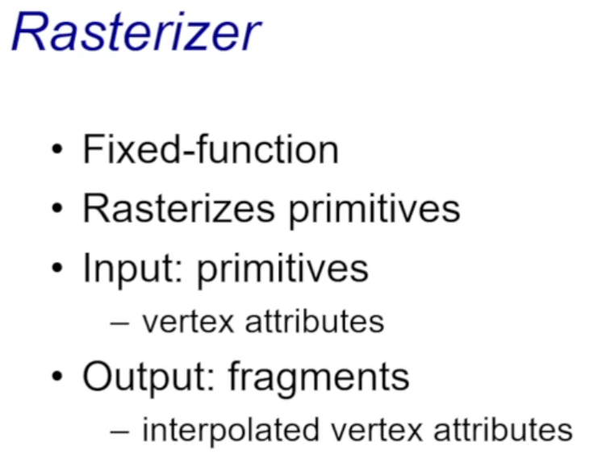

# What is OpenGL


### **What is OpenGL?**

1. **Low-Level Graphics API**:
   - OpenGL is not a library but a specification that defines how to render graphics.
2. **Platform-Independent Interface**:
   - The interface works on all platforms.
   - However, its implementation depends on the specific platform (e.g., Windows, Linux).
3. **Definition**:
   - It provides an **abstract rendering device** for developers.
   - Includes a set of functions for operating the graphics rendering pipeline.
4. **Immediate Mode API**:
   - OpenGL traditionally follows an **immediate mode** approach.
   - Characteristics:
     - Issues drawing commands directly for each frame.
     - Does not retain or store objects (no permanent concept of objects).
   - This is contrasted with modern **retained mode APIs** like Vulkan or DirectX.


### **OpenGL Overview**

1. **Platform-Specific Implementation**:
   - OpenGL is not a standalone tool; instead, its implementation is provided by the platform:
     - It can be part of the **graphics driver**.
     - Or, it may be a **runtime library** built on top of the driver for interfacing with hardware.
2. **Initialization via Platform-Specific APIs**:
   - OpenGL relies on different APIs for initialization, depending on the operating system:
     - **WGL**: Windows OpenGL (specific to Windows platforms).
     - **GLX**: Graphics Library Extension for Unix/Linux systems.
     - **EGL**: Used in mobile platforms and embedded systems.
     - Other platform-specific APIs exist for various environments.
3. **State Machine Model**:
   - OpenGL functions as a state machine:
     - All settings and commands operate based on a defined state.
     - This ensures high efficiency during rendering tasks.

# OpenGL Architecture


### **Pipeline Components**:

1. **CPU**:
   - Sends commands and data to the graphics pipeline.
   - Manages display lists and interacts with other components.
2. **Display List**:
   - Stores precompiled rendering commands for efficient reuse.
   - Reduces CPU overhead during repeated rendering tasks.
3. **Polynomial Evaluator**:
   - Computes mathematical operations for curves and surfaces.
   - Converts higher-order primitives into simpler vertex data.
4. **Per Vertex Operations & Primitive Assembly**:
   - Applies transformations (model, view, and projection) to vertices.
   - Assembles vertices into primitives like triangles or lines.
5. **Rasterization**:
   - Converts vector primitives (like triangles) into fragments (potential pixels).
   - Assigns screen space coordinates to each fragment.
6. **Texture Memory**:
   - Provides texture data for fragments during rasterization or fragment operations.
   - Stores image data used for mapping textures onto primitives.
7. **Per Fragment Operations**:
   - Processes each fragment:
     - Calculates color using lighting models.
     - Applies textures and shading.
8. **Pixel Operations**:
   - Handles operations like blending, dithering, and depth testing.
   - Combines fragments into a final pixel value.
9. **Frame Buffer**:
   - Stores the final rendered image before display.
   - Can contain multiple buffers (e.g., color buffer, depth buffer).

# Writing OpenGL programs


1. **Render Window**
   - *Context-Providing Libraries (GLUT, Qt, Browser SDKs, etc.)* These libraries offer an environment (or “context”) in which OpenGL can draw. In other words, they manage the actual window or canvas needed for rendering graphics on-screen.
2. **Setup and Initialization Functions**
   - **Viewport**
      Defines the rectangular area of the window where OpenGL will draw. You typically specify its dimensions to match your rendering window.
   - **Model Transformation**
      Determines how your object(s) will be placed, oriented, and scaled in the 3D scene before being projected onto the screen.
   - **File I/O (Shaders, Textures, etc.)**
      Loads the resources needed for rendering (e.g., shader programs, texture images) from files. This process is usually done once at the beginning of the program.
3. **Frame Generation (Update/Rendering) Functions**
   - **Define What Happens in Every Frame**
      Contains the main loop of your graphics application, responsible for updating the scene (e.g., moving objects, checking input) and then rendering the current frame. This loop typically runs repeatedly until you close the program.

# OpenGL and Related APIs


1. **Application Program (Top Layer)**
   - This is your code—the logic and instructions that describe what you want to draw or compute.
2. **Platform-Specific or Toolkit Layers**
   - OpenGL Motif Widget / Similar:
     - A GUI widget toolkit (e.g., Motif or similar frameworks) that supports OpenGL rendering.
     - Relies on platform-specific libraries like **GLX**, **AGL**, or **WGL** for managing OpenGL contexts on Unix (GLX), macOS (AGL), or Windows (WGL).
   - GLUT / Qt / …
     - Cross-platform toolkits/libraries (e.g., GLUT, Qt) that help create windows, handle user input, and manage rendering loops, while hiding much of the platform-specific details.
3. **Core Libraries**
   - GLU (OpenGL Utility Library):
     - A collection of convenience functions that sit on top of core OpenGL. Often handles tasks like setting up projection matrices, creating quadrics (e.g., spheres, cylinders), and more.
   - GL (OpenGL):
     - The heart of it all—OpenGL’s core API for rendering 2D/3D graphics. This is where you issue commands to draw shapes, apply transformations, use shaders, etc.
4. **Operating System Layer (X, Win32, Mac O/S)**
   - The foundation that provides the graphics context, windowing services, and access to system resources. Different OSs have different APIs (GLX on Linux/Unix, WGL on Windows, AGL on older macOS) for creating and managing OpenGL contexts.
5. **Software and/or Hardware (Bottom Layer)**
   - Actual GPU (hardware acceleration) or software rendering (if a GPU is not available or for certain fallback modes).
   - Carries out the instructions from OpenGL, performing low-level drawing operations and final output to the display.

### Key Takeaways

- **Top (Application Program)**: Your code + instructions.
- **Middle Layers (Toolkits & OS)**: Wrappers/toolkits to manage window creation, input, and OS specifics.
- **Core (OpenGL & GLU)**: The actual graphics API.
- **Bottom (Hardware/Software)**: Execution of drawing commands on the real machine or software renderer.

This structure helps keep OpenGL code portable: you can write a single OpenGL-based program that runs on different operating systems and hardware without changing your core rendering logic.

# Preliminaries


------

### 1. Header Files

- **`#include <GL/gl.h>`**
   Includes the core OpenGL function declarations (e.g., the basic commands to draw and transform graphics).
- **`#include <GL/glu.h>`**
   Includes the OpenGL Utility Library (GLU) functions (e.g., higher-level drawing utilities, quadrics).
- **`#include <GL/glut.h>`**
   Brings in the GLUT toolkit for handling window creation, input events, and simple menus in a platform-independent way.
- **(Qt Application) `#include <QtOpenGL>`**
   If you use Qt, this header integrates OpenGL functionality within Qt’s GUI framework.

------

### 2. Link to Documentation

- **[GLUT Specification](https://www.opengl.org/resources/libraries/glut/spec3/spec3.html)**
   Official documentation that describes GLUT’s API, usage, and various functions in detail.

------

### 3. Enumerated Types

- OpenGL defines several type aliases (e.g., 

  ```
  GLfloat, GLint, GLenum
  ```

  ) to ensure consistency across platforms.

  - **`GLfloat`** is typically a float type.
  - **`GLint`** is typically an integer type.
  - **`GLenum`** is used for OpenGL-specific enumerations (e.g., specifying texture or buffer targets).

These predefined types help you write portable code by ensuring the same data sizes and formats on different hardware/operating systems.

------

**Key Takeaway**:
 You generally need to include the appropriate OpenGL headers before you can use any OpenGL, GLU, or GLUT functions. Additionally, OpenGL’s custom data types (`GLfloat`, `GLint`, `GLenum`, etc.) keep your code platform-independent and consistent.


------

### 1. Using Qt for OpenGL

- **“Easier with Qt but more overhead”**
   Qt offers built-in classes for OpenGL (e.g., QOpenGLWidget, QOpenGLFunctions) that simplify setup and event handling. However, Qt also brings additional overhead (larger libraries, event system, build process).

### 2. Header Files

- **`#include <QOpenGLWidget>`**
   Provides an OpenGL-capable widget you can subclass to implement your own drawing routines, handling paint events, resizing, etc.
- **`#include <QOpenGLFunctions>`**
   Offers an easy way to access modern OpenGL functions in a cross-platform manner (e.g., loading function pointers automatically).

### 3. Documentation Link

- **[Qt OpenGL Module Documentation](https://doc.qt.io/qt-5/qtopengl-index.html)**
   The official reference for Qt’s OpenGL classes and how to integrate them into your Qt application.

------

**Key Takeaway:**
 Using Qt’s OpenGL features can streamline development (handling windows, context creation, and event loops for you), at the expense of pulling in a larger framework.

# OpenGL Basic Concepts


------

### **1. Context**

- An **OpenGL context** is essentially the container for all of OpenGL’s state and operations. It manages the configuration of rendering (e.g., current buffers, textures, shaders) and keeps track of any commands sent to the GPU.

### **2. Resources**

- These are the various data “building blocks” that OpenGL uses, such as:
  - **Textures** (images/surfaces)
  - **Buffers** (vertex data, index data, etc.)
  - **Shaders** (programs that run on the GPU)
  - **Renderbuffers**, **Framebuffers**, and more
     Any asset that the GPU handles can be considered an OpenGL resource.

### **3. Object Model**

1. **Objects**
   - In OpenGL, “objects” are allocations of GPU resources (e.g., a texture object, a buffer object). Each object represents a resource or a group of resources on the GPU.
2. **Object Names**
   - OpenGL identifies objects by **names** (unique integer IDs). For example, calling `glGenTextures()` creates a texture name (an integer) that represents the newly allocated texture object.
3. **Bind Points (Targets)**
   - To operate on an object, you “bind” its name to a specific **target**. For instance, binding a texture object to `GL_TEXTURE_2D` tells OpenGL that all subsequent texture operations apply to that texture object.
   - Common targets include `GL_ARRAY_BUFFER`, `GL_ELEMENT_ARRAY_BUFFER`, `GL_TEXTURE_2D`, etc.

------

**Key Takeaway**:
 OpenGL manages state via a **context**, stores data in various **resources**, and accesses them using an **object model** that relies on integer “names” and specific “bind points.” This design makes it flexible and allows multiple resources to be tracked and switched easily.

# Context


------

### **Context**

1. **Represents an instance of OpenGL**
   - Each **OpenGL context** is like a “snapshot” or container for all OpenGL state: what textures, buffers, and shaders are currently bound, what parameters are set, etc.
2. **A process can have multiple contexts**
   - **Shared Resources**: It’s possible for different contexts to share certain GPU objects (like textures and buffers), which allows data to be reused across multiple contexts.
3. **A context can be “current” for a given thread**
   - **One-to-One Mapping**: At any moment, you can associate only one OpenGL context with a particular thread, and a context can be current in only one thread at a time.
   - **All OpenGL Commands Affect the Current Context**: Any OpenGL calls you make apply to whichever context is marked as current.

------

**Key Takeaway**:
 OpenGL commands always act on the **current** context (one context per thread at a time). Multiple contexts can exist within a single application for different windows or rendering surfaces, and they can optionally share GPU resources to avoid unnecessary duplication.

# Resources


------

### **Resources**

- **Act As**
  - **Sources of Input:** Provide data to the rendering pipeline (e.g., vertex positions, textures).
  - **Sinks for Output:** Receive results or hold outcomes of rendering (e.g., render targets or framebuffer attachments).
- **Examples**
  - **Buffers:** Store vertex data, indices, uniforms, etc.
  - **Images:** Store texture data that can be sampled or updated during rendering.
  - **State Objects:** Contain configuration or parameters (e.g., pipelines, sampler objects) that guide how data is processed.
  - **…** (other GPU-based data containers)

------

**Key Takeaway**:
 In OpenGL, “resources” encompass all the data containers and objects on the GPU that feed into the rendering process or capture its output, making them central to how graphics data flows through your program.


------

### **Resources**

1. **Buffer Objects**
   - Linear Chunks of Memory
     - Essentially arrays of bytes on the GPU used to store data (e.g., vertices, normals, indices, etc.).
   - Common Examples:
     - `GL_ARRAY_BUFFER` for vertex data
     - `GL_ELEMENT_ARRAY_BUFFER` for index data
2. **Texture Images**
   - 1D, 2D, or 3D Arrays of Texels
     - “Texels” are the individual picture elements in textures (think pixels, but for texture space).
   - Used as Input for Texture Sampling
     - During rendering, shaders can sample (read) these images for colors, patterns, or other data to apply to fragments/pixels.

------

**Key Takeaway**:
 **Buffer objects** and **texture images** are fundamental GPU resources in OpenGL. Buffers store raw data (like geometry), while textures store images (which can be used for surface detail or other sampling operations in shaders).

# Object Model


------

### **Object Model**

1. **“OpenGL is object oriented … in its own, strange way”**
   - Although OpenGL describes resources (textures, buffers, etc.) as “objects,” it doesn’t use traditional class-based OOP. Instead, it associates resources with integer IDs and bind points, which serve as a more “procedural” form of object orientation.
2. **Object Instances Identified by a “Name”**
   - An **unsigned integer handle** (created via functions like `glGenTextures`, `glGenBuffers`) serves as the “name” or ID of an object.
   - There’s no direct pointer or reference like in C++ OOP; rather, you pass this integer handle to OpenGL when you want to work with the corresponding resource.
3. **Commands Work on Targets**
   - A “target” is essentially a **bind point** (e.g., `GL_TEXTURE_2D`, `GL_ARRAY_BUFFER`).
   - When you **bind** a named object (say, a texture) to a target, subsequent OpenGL commands operate on that specific bound object—until you bind a different one.
4. **Object Oriented, You Said?**
   - You can think of **targets** as “types” (e.g., textures, buffers) and **commands** as “methods.”
   - Calling `glBindBuffer(GL_ARRAY_BUFFER, bufferID)` is akin to selecting which “object” you’re going to work on, and subsequent function calls act like methods on that object.

------

**Key Takeaway**:
 OpenGL’s approach to “object orientation” uses integer handles (names) and bind points (targets) rather than class instances and member functions. You **bind** a specific object to a target, and then **all commands** on that target affect whichever object is currently bound.

# Object Model


------

### **Object Model Details**

1. **Binding a Name to a Target**
   - When you bind an **object name** (an unsigned int handle) to an **OpenGL target** (e.g., `GL_TEXTURE_2D`, `GL_ARRAY_BUFFER`), that object becomes **current** for that target.
   - This is often referred to as a **“latched 锁定 state,”** meaning subsequent operations on that target will affect the bound object until you bind a different name.
2. **Changes in OpenGL 4.5 (EXT_direct_state_access)**
   - Earlier versions of OpenGL generally require you to bind an object to a target before modifying it.
   - With **Direct State Access (DSA)**, added in OpenGL 4.5, you can configure object state **without** binding it to a target, making the code more direct and reducing “bind/unbind” overhead.
3. **Object Creation**
   - In classic OpenGL usage, an object is **created** (or allocated on the GPU side) the **first time** you bind its name. For instance, if you call `glGenBuffers` to get an ID, the actual resource allocation may happen upon the first `glBindBuffer`.
4. **Notable Exceptions: Shader and Program Objects**
   - While most OpenGL objects require binding to a target, **shader objects** and **program objects** often use commands that act directly on their names (e.g., attaching a shader to a program or compiling a shader) rather than relying on a separate binding step.

------

**Key Takeaway**:
 By **binding** an unsigned integer handle to a recognized **target**, OpenGL knows which object you want to work with. Newer OpenGL (4.5+) offers **Direct State Access** functions to operate on objects without constant re-binding, simplifying code and improving clarity.

# Buffer Objects


------

### **Buffer Objects**

1. **Unformatted GPU Memory**
   - A buffer object represents a contiguous block of memory managed by the **OpenGL context** (i.e., on the GPU).
2. **Regular OpenGL Objects**
   - Like textures or framebuffers, buffers are “named” objects (identified by integer handles) that conform to the OpenGL object model.
3. **Possible Use Cases**
   - **Vertex Data:** Store vertex positions, normals, texture coordinates, etc.
   - **Pixel Data:** Can hold pixels copied from images or framebuffers.
   - **General-Purpose Data:** Anything else you might want to make available to shaders or other GPU processes.
4. **Binding to Set Internal State**
   - Before you can configure or use a buffer, you **bind** it to a specific target (e.g., `GL_ARRAY_BUFFER`). Once bound, any operations on that target apply to the bound buffer.
5. **Immutable or Mutable**
   - **Immutable Buffers (via `glBufferStorage`)**: Once allocated, they can’t be resized or reformatted, but might be more efficient.
   - **Mutable Buffers (via `glBufferData`)**: Allow changing their size and contents over time.

------

**Key Takeaway**:
 Buffer objects are fundamental containers for raw data on the GPU. By binding a buffer to a known target, you can configure its storage, upload data, and instruct OpenGL to use it for drawing or other operations.

# Example: Buffer Object


------

### 1. Declare a Buffer Handle

```cpp
GLuint my_buffer;
```

- **`my_buffer`** is an integer-like handle that will refer to a buffer object in OpenGL.

### 2. Generate a Buffer Name

```cpp
glGenBuffers(1, &my_buffer);
```

- Requests one unused buffer name from OpenGL and stores it in `my_buffer`.
- At this point, **no actual GPU resource** is allocated yet—only the name (ID).

### 3. Bind the Buffer (Creation Happens Here)

```cpp
glBindBuffer(GL_ARRAY_BUFFER, my_buffer);
```

- Associates the name `my_buffer` with the target `GL_ARRAY_BUFFER`.
- If this is the first time the name is bound, OpenGL **allocates** the buffer object internally.

### 4. Allocate / Specify Buffer Storage

```cpp
glBufferStorage(GL_ARRAY_BUFFER, …);
```

- Reserves memory on the GPU and (optionally) uploads data into `my_buffer`.
- **Immutable Allocation**: Using `glBufferStorage` locks the size, whereas `glBufferData` allows resizing later (mutable).

### 5. Unbind the Buffer

```cpp
glBindBuffer(GL_ARRAY_BUFFER, 0);
```

- Binds **0** (no buffer) to `GL_ARRAY_BUFFER`, effectively “unbinding” `my_buffer`.
- Good practice to unbind after setup to avoid accidental modifications.

### 6. Re-bind / Use the Buffer

```cpp
glBindBuffer(GL_ARRAY_BUFFER, my_buffer);
// use my_buffer…
glDrawArrays(GL_TRIANGLES, 0, 33);
```

- Binds `my_buffer` again to use it for drawing.
- `glDrawArrays` reads the currently bound `GL_ARRAY_BUFFER` (which is `my_buffer`) to pull vertex data (or whatever data you have stored).

### 7. Delete the Buffer (Cleanup)

```cpp
glDeleteBuffers(1, &my_buffer);
```

- Frees the GPU memory and invalidates the name `my_buffer`.
- After this call, `my_buffer` is no longer a valid buffer ID.

------

**Key Takeaways**

1. **Generate → Bind → Configure → Unbind → (Re-)Bind → Use** is the typical life cycle of an OpenGL buffer.
2. The **first bind** triggers **buffer creation** in the driver.
3. `glBufferStorage` or `glBufferData` uploads/allocates the underlying GPU memory.
4. You can **unbind** the buffer for safety, then **re-bind** when you want to draw.
5. **Deleting** the buffer frees GPU resources and makes the name invalid.

# Primitive types


------

1. **GL_POINTS**
   - Draws a separate point for each vertex.
   - Useful for particle systems or debugging vertex positions.
2. **GL_LINES**
   - Each pair of vertices is drawn as a line segment.
   - (Example: If you have 4 vertices, they form 2 separate lines.)
3. **GL_LINE_STRIP**
   - Connects consecutive vertices with line segments to form a continuous path.
   - (Example: A path with corners defined by each vertex in order.)
4. **GL_LINE_LOOP**
   - Same as **GL_LINE_STRIP**, but also connects the last vertex back to the first, forming a loop.
5. **GL_TRIANGLES**
   - Every group of 3 vertices forms an independent triangle.
   - (Example: 6 vertices = 2 separate triangles.)
6. **GL_TRIANGLE_STRIP**
   - After the first triangle (3 vertices), each new vertex forms a new triangle with the last two vertices.
   - Efficient for connected meshes because it reuses vertices.
7. **GL_TRIANGLE_FAN**
   - After the first triangle, each new vertex forms a triangle with the “center” (first vertex) and the last vertex.
   - Great for drawing “fan” shapes like circles or cones.
8. **GL_QUADS** (Legacy)
   - Every group of 4 vertices forms one quadrilateral.
   - Deprecated in modern (Core Profile) OpenGL; typically replaced by two triangles.
9. **GL_QUAD_STRIP** (Legacy)
   - Similar to **GL_TRIANGLE_STRIP** but for quads. Every new pair of vertices forms another connected quadrilateral.
   - Also deprecated in modern OpenGL.
10. **GL_POLYGON** (Legacy)
    - Renders a simple, convex polygon defined by N vertices.
    - Deprecated in favor of using triangles (or triangle fans/strips) for better hardware compatibility.

------

**Key Takeaway**:
 Modern OpenGL (Core Profile) mainly uses **GL_POINTS**, **GL_LINES**, **GL_LINE_STRIP**, **GL_LINE_LOOP**, and the **triangle** primitives (`GL_TRIANGLES`, `GL_TRIANGLE_STRIP`, `GL_TRIANGLE_FAN`). Older primitives like **GL_QUADS**, **GL_QUAD_STRIP**, and **GL_POLYGON** are considered deprecated and should be replaced with triangles in new applications.

# GL_TRIANGLES & GL_TRIANGLE_STRIP


------

### **Triangle Vertex Orientations in OpenGL**

1. **GL_TRIANGLES**
   - **Groups of 3 Vertices**: Every three vertices form an independent triangle.
   - **Each Triangle Has Its Own Orientation**: The order of the vertices (clockwise or counterclockwise) determines the **face orientation** (front-face vs. back-face in OpenGL).
   - **No Sharing of Edges**: Adjacent triangles do not automatically share edges; you specify each triangle’s vertices individually.
2. **GL_TRIANGLE_STRIP**
   - **Strip of Connected Triangles**: After the first triangle (vertices 0, 1, 2), each **new vertex** adds another triangle, reusing the last two vertices.
   - **Orientation Alternation**: Vertex ordering in triangle strips can alternate (e.g., triangles can flip orientation if you’re not careful). OpenGL automatically interprets every *odd* triangle differently to keep the winding consistent if the vertex data is arranged properly.
   - **Reduced Vertex Data**: Because edges are shared between consecutive triangles, you end up providing fewer total vertices for the same number of triangles.

------

**Key Takeaway**

- **Orientation (Winding)** matters because OpenGL can cull (skip rendering) faces that are oriented in a particular winding (usually back-face culling).
- **GL_TRIANGLES** is more flexible (each triangle is independent) but requires more vertex data.
- **GL_TRIANGLE_STRIP** is memory-efficient and faster for connected surfaces, but you must order vertices carefully to get the desired geometry and consistent face orientation.

# Draw Call


------

### **Draw Call (Old-Style “Immediate Mode”)**

1. **After Configuring the Pipeline, Issue a Draw Call**
   - Once you’ve set up your OpenGL state (shaders, textures, transforms, etc.), you call drawing commands to render geometry.
2. **`glBegin(GL_TRIANGLE_STRIP)`**
   - Specifies the **primitive type** (here, a triangle strip).
   - Opens an “immediate mode” block where subsequent commands define color, vertices, and other attributes.
3. **`glColor3f(0.0, 1.0, 0.0)`**
   - Sets the current **color state** to green (RGB = 0,1,0).
   - In legacy OpenGL, this color affects every vertex that follows until the color state changes again.
4. **`glVertex3f(1.0, 0.0, 0.0)`**
   - Defines a **vertex** in 3D space at (x=1.0, y=0.0, z=0.0).
   - Under immediate mode, each vertex (and its currently set attributes like color) is sent directly into the pipeline.
5. **… Additional Vertex/Color Calls**
   - Typically, you’d specify more vertices for the triangle strip (or any other primitive).
6. **`glEnd()`**
   - Closes the immediate mode block.
   - Tells OpenGL that you have finished specifying vertices and attributes for the current draw call.

------

**Key Takeaway**

- This **immediate mode** style (`glBegin/glEnd`) is **legacy** OpenGL. Modern OpenGL uses **vertex buffer objects** (VBOs) and **vertex arrays** for better performance and flexibility. However, the idea remains the same: once the pipeline is set up, you **issue a draw call** specifying a **primitive type** and the **vertex data** you want to render.

# Buffer Objects -- Drawing


------

1. **`glDrawArrays(GL_TRIANGLES, 0, num_vertices)`**
   - Instructs OpenGL to render a **continuous sequence of vertices** from the currently bound buffers.
   - The first parameter (`GL_TRIANGLES`) specifies the **primitive** (here, separate triangles).
   - The second parameter (`0`) is the **starting index** in the buffer.
   - The third parameter (`num_vertices`) is how many vertices to pull from the buffer.
2. **For Continuous Groups of Vertices**
   - `glDrawArrays` assumes that your vertex data is laid out consecutively (no gaps) for the specified primitive.
3. **Usually Invoked in a Display Callback**
   - Commonly called inside your **render loop** or “display” function so it executes every frame (or whenever you need to redraw).
4. **Initiates the Vertex Shader**
   - A draw call like `glDrawArrays` kicks off the **graphics pipeline**, starting with the **vertex shader** stage.
   - All subsequent stages (rasterization, fragment shader, etc.) occur automatically once the vertices begin processing.

------

**Key Takeaway**
 `glDrawArrays` is a **direct** way to tell OpenGL to read sequential vertex data from bound buffers and send it through the **pipeline** for rendering.

# OpenGL Command Formats


------

### **OpenGL Command Formats**

1. **Function Naming Convention: `glVertex3fv(v)`**
   - **`3`**: Indicates the number of components (x, y, z).
   - **`f`**: Indicates the data type is `float`.
   - **`v`**: Indicates the function expects a pointer (vector) rather than scalar parameters.
2. **Number of Components (2, 3, or 4)**
   - **2 Components**: (x, y)
   - **3 Components**: (x, y, z)
   - **4 Components**: (x, y, z, w)
   - Selecting how many components you provide depends on whether you’re specifying 2D, 3D, or 4D coordinates (e.g., including `w` for certain operations).
3. **Data Type**
   - **b** / **ub**: (unsigned) byte
   - **s** / **us**: (unsigned) short
   - **i** / **ui**: (unsigned) int
   - **f**: float
   - **d**: double
   - The letter following `glVertex` or other commands tells OpenGL what data type you’re passing.
4. **Vector vs. Scalar Form**
   - **Vector Form** (e.g., `glVertex3fv(v)`) expects a pointer to an array (`v`) with the correct number of components.
   - **Scalar Form** (e.g., `glVertex2f(x, y)`) passes each component separately as parameters.

------

**Key Takeaway**
 Older OpenGL “immediate mode” functions use **naming** conventions indicating the **number of components**, the **data type**, and whether **vector** or **scalar** parameters are used (e.g., `glVertex3f` vs. `glVertex3fv`). This helps OpenGL interpret your vertex data correctly.

# OpenGL4


1. **Enforces a New Programming Model**
   - Encourages (and sometimes requires) using **shaders**, **buffers**, and **modern pipeline** concepts.
   - More **efficient** use of the GPU because you directly control data flow (e.g., specifying vertex attributes, manually transforming data in shaders).
2. **No More Classic “Fixed-Function” Pipeline**
   - Older, built-in features like **fixed-function lighting**, matrix transformations (via `glMatrixMode`), and immediate-mode drawing (`glBegin/glEnd`) are **not supported** in the Core Profile.
   - You must handle **lighting, transformations**, etc. using **vertex** and **fragment shaders** (or other shader stages).
3. **All Applications Must Use Shaders and Buffers**
   - **Vertex/Fragment (and possibly Geometry/Tessellation/Compute) Shaders** do all the custom computation.
   - **Buffer Objects** (e.g., `VBOs`, `UBOs`) store geometry, uniform data, and other resources on the GPU.

------

**Key Takeaway**
 Modern OpenGL (4.x) is entirely **shader-based**, giving developers precise control over the rendering pipeline. The older style of using built-in lights, transformations, and immediate-mode commands is deprecated in favor of **programmable shaders** and **buffer-based** data management.


------

### **Modern OpenGL (Version 4.x) – Typical Steps**

1. **Create Shader Programs**
   - Write your vertex, fragment, (and optionally tessellation/geometry) shader source code.
   - Compile and link them into a program that runs on the GPU.
2. **Create Buffer Objects and Load Data**
   - Generate **VBOs** (Vertex Buffer Objects), **EBOs** (Element Buffer Objects), or other buffers to store your mesh data (vertices, indices, normals, etc.).
   - Upload your data from the CPU to the GPU.
3. **“Connect” Data Locations with Shader Variables**
   - Associate your buffer data (e.g., position attributes) with specific input variables in your vertex shader.
   - This often involves setting up a **Vertex Array Object (VAO)** and calling functions like `glVertexAttribPointer` and `glEnableVertexAttribArray`.
4. **Render**
   - Use a draw call (e.g., `glDrawArrays` or `glDrawElements`) to tell OpenGL to process the buffers through the shader pipeline and produce final pixels on-screen.
   - This initiates the entire pipeline: vertex shading → optional tessellation → optional geometry shading → rasterization → fragment shading → output.

------

**Key Takeaway**
 Modern OpenGL applications follow a **shader-based, buffer-driven** approach: you **load** all necessary data into GPU buffers, **configure** how that data is fed into shaders, and **issue draw calls** to render—eliminating the older “immediate mode” and fixed-function pipeline.

# Shader


------

### **Shader Objects**

- **Parts of the Pipeline**:
   Examples include **vertex shaders**, **fragment shaders**, (optionally **geometry**, **tessellation**, etc.).
- Compiled at Runtime
  - Written in **GLSL** (OpenGL Shading Language), which is C-like.
  - Compiled (and possibly optimized) by the graphics driver when your program starts or when you explicitly compile them.

### **Program Object**

- **Represents the Full Pipeline**:
   A **program** links multiple shader objects together (e.g., a vertex shader + fragment shader).
- **Linked at Runtime**:
   Once all shader objects are compiled, they are linked into a single executable “program” that runs on the GPU.

### **OpenGL Shader Language (GLSL)**

- The high-level shading language used to write your shaders.
- Resembles C/C++ in syntax but includes built-in types and functions for graphics (e.g., `vec2`, `mat4`, `texture()`).

------

**Key Takeaway**
 Modern OpenGL uses **shader objects** (written in GLSL) that you **compile** and **link** into a **program object**. This program object is then bound and executed on the GPU to perform all your custom vertex, fragment, and optional tessellation/geometry processing.


1. **Create a Shader Object**
   - Call `glCreateShader(GL_VERTEX_SHADER)` or `glCreateShader(GL_FRAGMENT_SHADER)` (or another shader stage) to create an empty shader object of the specified type.
   - Returns a handle (an integer ID) used to identify that shader object.
2. **Provide Shader Source**
   - `glShaderSource(shaderHandle, …)` supplies the GLSL code (as strings) to the shader object.
   - This stage just stores the source inside the shader object; it does not yet compile.
3. **Compile the Shader**
   - `glCompileShader(shaderHandle)` instructs the OpenGL driver to parse and compile the GLSL code.
   - You can retrieve any errors or warnings by calling `glGetShaderiv(shaderHandle, GL_COMPILE_STATUS, …)` and `glGetShaderInfoLog(…)`.
4. **Create a Program Object**
   - `glCreateProgram()` creates a new program object, which will link together multiple compiled shader objects (e.g., vertex + fragment).
5. **Attach the Compiled Shaders to the Program**
   - `glAttachShader(programHandle, shaderHandle)` associates each successfully compiled shader (vertex, fragment, etc.) with the program.
   - You typically attach at least one vertex shader and one fragment shader.
6. **Link the Program**
   - `glLinkProgram(programHandle)` combines all attached shaders into a single executable “pipeline” on the GPU.
   - You can check the link status with `glGetProgramiv(programHandle, GL_LINK_STATUS, …)` and get detailed logs with `glGetProgramInfoLog(…)`.
7. **Use the Program**
   - `glUseProgram(programHandle)` makes the linked program active.
   - All subsequent rendering commands will use the shaders’ logic (e.g., transformations in the vertex shader, shading in the fragment shader).

------

**Key Takeaway**

1. **Compile each shader** (vertex, fragment, etc.) from GLSL source.
2. **Create a program** and **attach** those compiled shaders.
3. **Link** the program to finalize it.
4. **Use** the program in your render loop.

This pipeline ensures that your custom shaders (written in GLSL) get correctly compiled, linked, and applied to your rendering operations.

# GLGS Data Types


1. **Scalar Types**
   - **float**: A single-precision floating-point number.
   - **int**: A 32-bit integer (depending on the GLSL version and GPU).
   - **bool**: A Boolean type (true/false).
2. **Vector Types**
   - **vec2, vec3, vec4**: Float-based vectors with 2, 3, or 4 components (e.g., `vec3(1.0, 2.0, 3.0)`).
   - **ivec2, ivec3, ivec4**: Integer-based vectors with 2, 3, or 4 components.
   - **bvec2, bvec3, bvec4**: Boolean-based vectors with 2, 3, or 4 components.
   - Vectors in GLSL often represent things like positions, directions, or colors (RGBA) when stored in floats, but they can also be used for integer or boolean logic.
3. **Matrix Types**
   - **mat2, mat3, mat4**: Square matrices of size 2×2, 3×3, or 4×4, each typically holding floating-point elements.
   - Commonly used for transformations (e.g., rotation, translation, projection) in 2D or 3D space.
4. **Texture Sampling Types**
   - **sampler1D, sampler2D, sampler3D, samplerCube**: Special types for accessing texture data in 1D, 2D, 3D, or cube-map textures inside a shader.
   - Provide functions like `texture(sampler, coords)` to fetch texels.
5. **C++-Style Constructors**
   - **`vec3 a = vec3(1.0, 2.0, 3.0);`** shows how to initialize vectors or matrices with multiple values in a constructor-like syntax.
   - You can also mix and match component types (e.g., `vec3(a, b, c)`) or do “swizzling” (e.g., `vec4.xyz`).

------

**Key Takeaway**
 GLSL (OpenGL Shading Language) offers a rich set of types—scalars, vectors, matrices, and samplers—for writing flexible, powerful shaders. Vectors and matrices streamline mathematical operations (e.g., dot products, transformations), while sampler types provide easy access to texture data.

# Operator


# Qualifiers


1. **`in`, `out`**
   - Used to pass data **into** and **out of** shader stages.
   - **Example**: In a vertex shader, `in vec2 tex_coord;` reads texture coordinates from the vertex data, while `out vec4 color;` sends a color (or other data) to the next shader stage (e.g., fragment shader).
2. **`uniform`**
   - Used for **global variables** that do not change per-vertex or per-fragment but can be updated by the application (CPU) at any time.
   - **Example**: `uniform float time;` might represent the current time or an animation parameter, while `uniform vec4 rotation;` could hold rotation angles or axis information.
   - Uniforms are set with functions like `glUniform1f`, `glUniform4fv`, etc. in your application code.

------

**Key Takeaway**

- **`in`/`out`** qualifiers move data **between** the GPU pipeline stages (vertex → fragment, etc.).
- **`uniform`** qualifiers allow your application to **inject** data (matrices, floats, vectors) that remains constant across many vertices or fragments.

# Flow Control


# Functions


# Built-in Variables


------

### **Built-in Variables in GLSL**

1. **`gl_Position`**
   - **Purpose**: This is a built-in variable used in the **vertex shader** to specify the output position of a vertex in **clip space**.
   - **Example**: After applying transformations (e.g., model, view, and projection matrices), the final vertex position is assigned to `gl_Position`.
2. **`gl_FragColor`**
   - **Purpose**: This is a built-in variable used in the **fragment shader** to specify the output color of the current fragment (pixel).
   - Usage Notes:
     - Still used in **OpenGL ES** and **WebGL** (and older GLSL versions).
     - In modern GLSL versions, **explicit `out` variables** are used instead (e.g., `out vec4 FragColor;`).

------

**Key Takeaway**

- **`gl_Position`** remains essential for outputting vertex positions from the vertex shader to the GPU pipeline.
- **`gl_FragColor`** has been replaced in newer versions of GLSL with explicitly declared output variables, promoting better flexibility and control in multi-render target setups.

# Anatomy of a GLSL Shader


1. **`#version 400`**
   - Specifies the GLSL version (here, 4.00).
   - Ensures the shader complies with the correct language syntax and feature set.
2. **Uniforms: `uniform mat4 some_uniform;`**
   - **Purpose**: A **uniform** is a global variable set by the application, constant during a draw call.
   - Common use: Pass data like **model-view-projection matrices**, lighting parameters, or time to the shader.
   - Example: `some_uniform` could represent a transformation matrix.
3. **Input Layouts:**
   - `layout(location = 0) in vec3 some_input;`
     - Specifies **vertex attributes** (e.g., positions, normals, or texture coordinates).
     - **`layout(location = X)`** binds the input to a specific location, matching the vertex buffer attribute configuration in your OpenGL application.
   - `layout(location = 1) in vec4 another_input;`
     - Another vertex attribute, possibly representing colors or other per-vertex data.
   - The `layout(location = X)` provides explicit control over attribute bindings.
4. **Output: `out vec4 some_output;`**
   - **Purpose**: Specifies an output variable from the current shader stage.
   - Example: In a **vertex shader**, this might pass transformed vertex positions to the next stage. In a **fragment shader**, this could define the pixel color.
   - Connects to the next shader stage or the framebuffer.
5. **Main Function: `void main()`**
   - The **entry point** of the shader program.
   - All shader logic (e.g., transformations, calculations) is written inside this function.

------

**Key Takeaway**
 This GLSL shader demonstrates the essential components:

- **Uniforms** for global, application-controlled inputs.
- **Inputs** (`in`) and **outputs** (`out`) for passing data between pipeline stages.
- Explicit **layouts** for precise control of attribute bindings.
- A **main function** where the actual shader logic is implemented.

This structure provides a modular and flexible way to handle programmable GPU pipelines in OpenGL.

# Vertex Shader


1. **Processes Each Vertex**

   - The vertex shader operates on a **per-vertex** basis.
   - It performs tasks like:
     - Transforming vertex positions (e.g., applying model-view-projection matrices).
     - Calculating per-vertex data (e.g., normals, texture coordinates, or colors).

2. **Input: Vertex Attributes**

   - The vertex shader receives vertex attributes as inputs from buffers, such as:
     - Positions (e.g., `vec3 position`).
     - Normals, texture coordinates, or colors.
   - Attributes are defined using the `in` qualifier (e.g., `in vec3 position;`).

3. **Output: Vertex Attributes**

   - Outputs processed vertex data for the next pipeline stage (e.g., the fragment shader).

   - Key output: 

     `gl_Position`

     - Specifies the final position of the vertex in **clip space**.
     - Mandatory output in every vertex shader, used by the GPU for rendering.

------

**Key Takeaway**
 The vertex shader is the **first programmable stage** of the graphics pipeline, where each vertex’s position and attributes are transformed and prepared for rasterization or further processing in subsequent shader stages.

# Rasterizer



1. **Fixed-Function**
   - Unlike shaders, the rasterizer is **not programmable**.
   - It is a **fixed-function stage** in the graphics pipeline that converts geometric primitives into **fragments**.
2. **Rasterizes Primitives**
   - Takes input primitives (e.g., triangles, lines, or points) and **rasterizes** them into a grid of **fragments** (potential pixels).
   - Each fragment corresponds to a potential pixel on the screen.
3. **Input: Primitives**
   - Receives geometric **primitives** from earlier pipeline stages (e.g., vertex shader).
   - These primitives include:
     - **Vertex attributes** like positions, colors, texture coordinates, etc.
4. **Output: Fragments**
   - Produces **fragments** for each pixel covered by the primitive.
   - Each fragment contains:
     - **Interpolated vertex attributes** (e.g., interpolated color or texture coordinates across the surface of a triangle).
     - Additional metadata for further processing in the fragment shader.

------

**Key Takeaway**
 The rasterizer acts as the **bridge** between vertex processing and fragment processing. It transforms high-level geometric primitives into pixel-level fragments and interpolates vertex attributes for use in subsequent stages, ensuring smooth gradients and consistent attribute mapping across a rendered surface.

# Fragment Shader


1. **Processes Each Fragment**
   - The fragment shader operates on a **per-fragment** (or potential pixel) basis.
   - It determines the final color and other properties (e.g., depth, transparency) of each pixel.
2. **Input: Interpolated Vertex Attributes**
   - The fragment shader receives interpolated data from the rasterizer, such as:
     - Colors
     - Texture coordinates
     - Normals
   - These attributes are interpolated based on the primitive’s vertices.
3. **Output: Fragment Color**
   - The main output of the fragment shader is the **final pixel color**.
   - Example: You might output an RGBA value representing the pixel’s color and transparency.
   - Can also output multiple values when using advanced techniques like multiple render targets (MRT).

------

**Key Takeaway**
 The fragment shader is responsible for **pixel-level shading** and effects. It uses interpolated attributes from the vertex shader and rasterizer to compute **visual properties** like color, texture blending, and lighting, directly influencing the final appearance of the rendered image.


------

### **Fragment Shader - Interface to Fixed-Function Pipeline**

1. Interface to Fixed-Function Parts of the Pipeline
   - For shader models greater than 4 (OpenGL 4+), it is mandatory to explicitly define interfaces for both vertex and fragment shaders.

------

#### **Vertex Shader Examples**

- `in int gl_VertexID;`
  - Represents the ID of the vertex being processed.
  - Used to access specific vertex data, often in indexed rendering.
- `out vec4 gl_Position;`
  - Specifies the position of the vertex in **clip space**.
  - This is passed to the rasterizer.

------

#### **Fragment Shader Examples**

- `in vec4 gl_FragCoord;`
  - Contains the window-space coordinates of the fragment.
  - Often used for screen-space effects like post-processing or depth-based operations.
- `out float gl_FragDepth;`
  - Allows manual control of the depth value for a fragment.
  - Useful for advanced depth testing or custom rendering techniques.

------

**Key Takeaway**
 The shader explicitly defines inputs (`in`) and outputs (`out`) for better flexibility and control over the rendering pipeline. These predefined variables help shaders interact seamlessly with the fixed-function parts of OpenGL, such as the rasterizer and framebuffer operations.

# Fragment Merging


------

### **Fragment Merging Pipeline**

1. Shaded Fragment
   - The process starts with a shaded fragment produced by the fragment shader.
   - This fragment contains attributes such as color, depth, and transparency.

------

1. Pixel Ownership Test
   - Determines if the fragment corresponds to a pixel that is owned by the OpenGL context.
   - Fragments that fail this test are discarded.

------

1. Scissor Test
   - Filters fragments based on a **scissor box**, a rectangular region defined in the framebuffer.
   - Only fragments within the scissor box proceed; others are discarded.

------

1. Stencil Test
   - Uses the **stencil 模版 buffer** to decide whether a fragment passes or fails.
   - Often used for effects like masking or multi-pass rendering.

------

1. Depth Test
   - Compares the fragment’s depth value against the **depth buffer**.
   - Ensures only the closest (visible) fragments contribute to the final image.

------

1. Blending
   - Combines the fragment’s color with the existing color in the framebuffer.
   - Used for transparency and other visual effects.

------

1. Frame Buffer
   - Fragments that pass all tests are written to the **framebuffer**, which stores the final image to be displayed.

------

### **Key Takeaway**

The fragment merging pipeline is responsible for validating and combining fragments, ensuring that only those that meet specific criteria (ownership, visibility, etc.) contribute to the final image. This process is critical for effects like transparency, depth-based rendering, and masking.