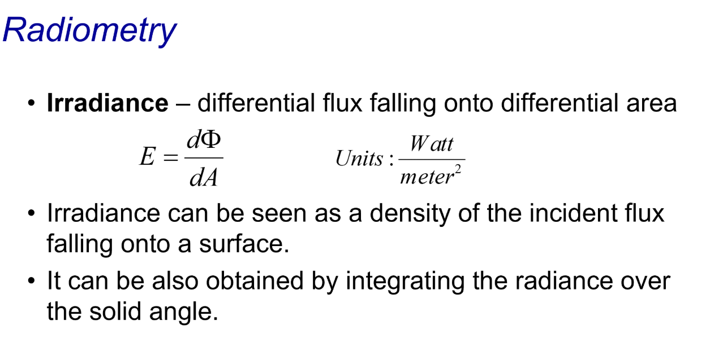
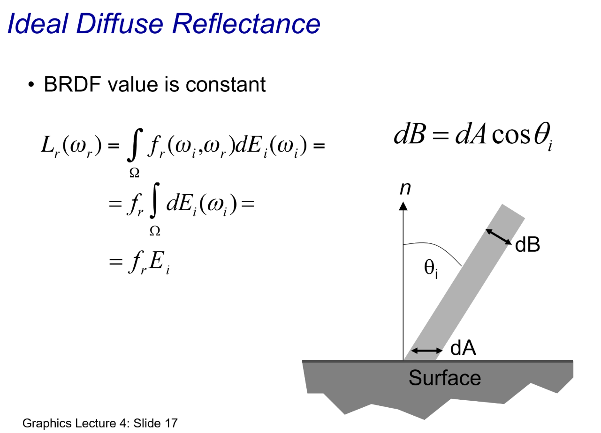
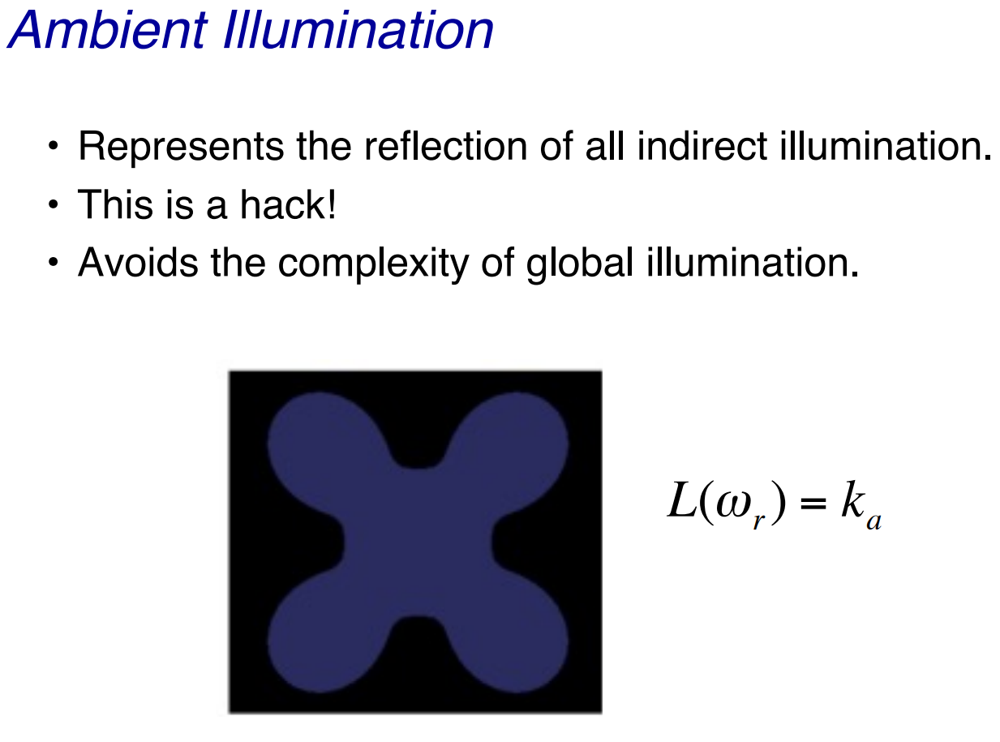

# The Graphics Pipeline

1. **Modeling Transformations**
   - Converts object coordinates to world coordinates.
   - Defines object positions, rotations, and scales in the world.
2. **Illumination (Shading)** *(Highlighted Step)*
   - **Purpose:** Determines how light interacts with the object.
   - **Input:** Vertices with material properties, surface properties, and light sources.
   - **Output:** Lit (shaded) vertices, resulting in realistic rendering.
   - **Model Used:** Local lighting model (e.g., Phong or Gouraud shading).
   - Example Result: Adds highlights, shadows, and color variations based on light sources and surface orientation.
3. **Viewing Transformation**
   - Transforms world coordinates to camera (view) coordinates.
   - Can use perspective or orthographic projection.
4. **Clipping**
   - Removes parts of primitives (geometry) outside the viewable area.
   - Optimizes rendering by discarding unnecessary fragments.
5. **Projection (to Screen Space)**
   - Maps 3D coordinates to 2D screen space.
   - Involves perspective division to simulate depth.
6. **Scan Conversion (Rasterization)**
   - Converts primitives (triangles, lines) into pixel data.
   - Each pixel gets attributes like color and depth.
7. **Visibility/Display**
   - Final step where the framebuffer is displayed.
   - Handles visibility (e.g., depth testing) and writes the final image.

------

### **Key Takeaway for Illumination**

The **Illumination (Shading)** stage is critical for achieving realism in 3D graphics. It uses mathematical models to simulate lighting effects, giving objects their perceived depth, shine, and shadow. For example, a simple triangle can appear 3D and more visually engaging after shading.

# The Physics of shading

1. **Perception of Shading:**
   - When observing a point on an object, we perceive:
     - **Color**: The actual hue at that point.
     - Shading Intensity: How light or dark the point appears, influenced by:
       - **Object Properties**: Surface characteristics, such as smoothness, roughness, or reflectivity.
       - **Light Sources**: Position, intensity, and type of light illuminating the object (e.g., ambient, diffuse, or specular lighting).
2. **Current Focus:**
   - The slide emphasizes considering **only brightness** at each point, deferring the discussion of color to a later lecture.
   - Brightness refers to the intensity of light reflected or emitted from the surface, contributing to its luminance.
3. **Visual Example:**
   - The diagram shows a sphere and a cone with varying shading:
     - The sphere demonstrates smooth shading with a highlight (indicating a specular light reflection).
     - The cone showcases gradations in brightness due to light interaction with its sloping surface.

### Application in Graphics:

- This is the foundation of illumination models like:
  - **Phong Shading**: Simulates light reflection with ambient, diffuse, and specular components.
  - **Gouraud Shading**: Interpolates vertex brightness across the surface.
- Shading is essential for creating realism in 3D rendering, giving objects depth and dimension.

Future lectures will likely delve into **color handling** in shading, incorporating how different wavelengths of light interact with surfaces.

# The Physics of shading

#### **Object Properties:**

1. Position of the Object Relative to Light Sources:
   - Determines the angle and intensity of light that strikes the object.
   - Affects the visibility of shadows and highlights.
2. Surface Normal Vector:
   - A crucial factor for calculating light reflection and refraction.
   - Used in shading algorithms to simulate realistic lighting.
3. Albedo or Reflectivity of the Surface:
   - Governs the amount of light absorbed versus reflected.
   - Affects the brightness and color appearance of the surface.

#### **Light Source Properties:**

1. Intensity of the Emitted Light:
   - Determines the brightness of the light source.
   - A higher intensity results in stronger illumination and more distinct shadows.
2. Distance to the Point on the Surface:
   - Affects the amount of light reaching the surface due to the inverse square law.
   - Closer light sources produce more intense illumination.

### Applications in Graphics:

- These properties form the foundation of realistic rendering in computer graphics.
- Combined with lighting models such as:
  - **Phong Lighting Model** (calculates diffuse and specular lighting).
  - **Blinn-Phong Model** (an enhancement for specular highlights).
- Modern shading techniques leverage these factors for creating visually accurate 3D environments.

This combination of object and light source attributes is pivotal for understanding and simulating real-world lighting in 3D rendering systems.

# Radiometry 辐射测量

This slide introduces key concepts in **Radiometry**, focusing on the energy of photons and radiative processes:

### Key Points:

#### 1. **Energy of a Photon ($e_{\lambda}$):**

- The energy of a single photon is given by:$e_{\lambda} = \frac{hc}{\lambda}$

  where:

  - $h$ is **Planck's constant** ($6.63 \times 10^{-34} \, \text{J·s}$),
  - $c$ is the **speed of light** ($3 \times 10^8 \, \text{m/s}$),
  - $\lambda$ is the **wavelength** of the photon.

#### 2. **Radiant Energy of $n$ Photons ($Q$):**

- The total radiant energy of $n$ photons is calculated by summing up their individual energies: $Q = \sum_{i=1}^n \frac{hc}{\lambda_i}$ where $\lambda_i$ is the wavelength of each photon in the set.

#### 3. **Radiation Flux ($\Phi$):**

- Also known as **electromagnetic flux** or **radiant flux**, it represents the rate of energy transfer.

- Defined as:

  $\Phi = \frac{dQ}{dt}$

  where:

  - $Q$ is the radiant energy,
  - $t$ is time.

- Units: **Watts ($W$)**.

### Applications in Computer Graphics:

- **Photon Energy** is relevant for simulating light-matter interaction, especially in rendering realistic lighting.
- **Radiant Energy and Flux** are key in modeling **light sources** and understanding their intensity distribution.
- Used in **global illumination algorithms** and **radiance transfer computations** for realistic rendering.

This understanding bridges physics and computer graphics, enabling accurate and efficient light simulations.

# Radiance

#### **Radiance Definition**:

- **Radiance** ($L(\omega)$) measures the radiant flux per unit solid angle ($\omega$) per unit projected area ($dA$).
- It represents the amount of light traveling in a specific direction, through a given surface, within a small solid angle.

#### **Formula**:

$L(\omega) = \frac{d^2 \Phi}{\cos \theta \, dA \, d\omega}$

where:

- $d^2 \Phi$: Differential radiant flux (amount of light energy).
- $\cos \theta$: Accounts for the projection of the area in the direction of interest.
- $dA$: Differential area of the surface.
- $d\omega$: Differential solid angle (directional cone).

#### **Units**:

- steradian 球面度

- Radiance is measured in: $\text{Watts} \cdot \text{meter}^{-2} \cdot \text{steradian}^{-1}$

This quantifies energy flow per unit area, per unit direction.

#### **Illustration**:

The diagram shows:

1. A surface element ($dA$) with a normal direction.
2. A solid angle ($d\omega$) through which the light is measured.
3. The angle ($\theta$) between the surface normal and the light direction.

### Applications in Computer Graphics:

- **Radiance** is crucial for:
  - Simulating how light interacts with objects (reflection, refraction).
  - Computing realistic shading and rendering.
  - Techniques like **ray tracing** and **global illumination** rely on accurate radiance calculations.
- Radiance helps in understanding **lighting models** and integrating physical properties into rendering algorithms.

# Irradiance (Illumination of surface)

#### **Irradiance Definition**:

- **Irradiance** ($E$) is defined as the radiant flux ($\Phi$) incident per unit area ($dA$) on a surface.

$E = \frac{d\Phi}{dA}$

- It quantifies the density of light energy falling on a small surface element.

#### **Units**:

- The units of irradiance are:

  $\text{Watts per meter squared (W/m}^2\text{)}$

#### **Physical Interpretation**:

- **Irradiance** describes the intensity of light energy arriving at a surface. It can be thought of as the "brightness" of the light impacting a surface, depending on the light's flux density.

#### **Relationship to Radiance**:

- Irradiance can also be computed by integrating the radiance ($L(\omega)$) over a solid angle ($\omega$):

$E = \int_{\omega} L(\omega) \, \cos \theta \, d\omega$

Here:

- $L(\omega)$: Radiance from a direction within the solid angle.
- $\cos \theta$: Accounts for the angle between the surface normal and incoming light direction.

### Applications in Computer Graphics:

- Irradiance is critical for:
  - Lighting computations on surfaces.
  - Realistic shading models, especially in global illumination techniques.
  - Determining the diffuse reflection on a surface using **Lambertian reflection models**.

By understanding irradiance, graphics developers can simulate how light interacts with surfaces, such as creating realistic shadows, highlights, and global illumination effects.

# Reflection & Reflectance

#### **Reflection 反射**:

- The process by which electromagnetic flux (light energy) incident on a surface bounces off the surface without a change in its frequency (color).
- This is the fundamental phenomenon that determines how we perceive the appearance of objects.

#### **Reflectance 反射率**:

- A measure of the fraction of incident light (electromagnetic flux) that is reflected off the surface.
- Reflectance is often expressed as a ratio or percentage and depends on the surface material and its properties (e.g., smoothness, texture).

### Simplifications:

- The analysis in this context excludes:
  - **Absorption**: Where light energy is taken in by the material.
  - **Transmission**: Where light passes through the material.
  - **Fluorescence 荧光**: Where absorbed light is emitted at a different frequency.
  - **Diffraction 衍射**: The bending of light waves around obstacles or edges.

### Applications in Graphics:

- **Reflection** and **Reflectance** are used in rendering techniques to simulate realistic surfaces.
- These concepts underpin models like **Phong reflection model**, **Blinn-Phong**, and **Bidirectional Reflectance Distribution Function (BRDF)**.
- Understanding reflectance helps determine the amount of light bouncing off surfaces, which is critical for shading, lighting, and material design in computer graphics.

# Reflectance

#### **Definition:**

The BRDF, $f_r(\theta_i, \phi_i, \theta_r, \phi_r)$, describes how light is reflected at an opaque 不透明 surface. It is defined as the ratio of reflected radiance ($L_r$) in a given direction to the incident irradiance ($E_i$) from another direction:

$f_r(\theta_i, \phi_i, \theta_r, \phi_r) = \frac{dL_r(\theta_r, \phi_r)}{dE_i(\theta_i, \phi_i)}$

#### **Parameters:**

- $\theta_i, \phi_i$: Angles specifying the incoming light direction.
- $\theta_r, \phi_r$: Angles specifying the outgoing reflected light direction.
- $\mathbf{n}$: The surface normal, which influences the reflection.

#### **Units:**

- The units of BRDF are **1/steradian** because it measures the distribution of reflected light energy over a hemisphere.

### Diagram Explanation:

- **$E_i$ (blue arrow):** Represents the incident light's energy and direction.
- **$L_r$ (red arrow):** Represents the radiance of reflected light.
- **$\theta_i$ and $\phi_i$:** Define the incoming light's direction relative to the surface.
- **$\theta_r$ and $\phi_r$:** Define the reflected light's direction.
- **$\mathbf{n}$ (gray arrow):** Surface normal vector, a reference for the angles.

### Applications:

- **Rendering**: BRDF is used to calculate the appearance of materials under different lighting conditions.
- **Material Modeling**: Real-world materials have unique BRDFs that define their visual properties (e.g., shiny vs. matte surfaces).
- **Lighting**: Enables simulation of realistic lighting by accounting for how surfaces scatter light.

### Examples:

- Lambertian Reflection: A diffuse surface reflects light equally in all directions ($f_r$ is constant).
- Specular Reflection: A mirror-like surface reflects light in a specific direction (sharp peaks in $f_r$).

BRDF is an essential tool for photorealistic rendering and understanding the interaction between light and materials.

# Isotropic BRDFs

#### **Isotropic BRDF Definition:**

An isotropic BRDF is invariant under rotations about the surface normal ($\mathbf{n}$). This means that if you rotate the incoming ($E_i$) or outgoing ($L_r$) light directions around the surface normal, the reflectance does not change.

#### **Mathematical Property:**

$f_r(\theta_i, \theta_r, \phi_r - \phi_i) = f_r(\theta_i, \theta_r, \phi_d)$

- $\theta_i, \phi_i$: Polar and azimuthal angles of the incident light.
- $\theta_r, \phi_r$: Polar and azimuthal angles of the reflected light.
- $\phi_d = \phi_r - \phi_i$: Difference between azimuthal angles (relative rotation about $\mathbf{n}$).

#### **Implication:**

- Reflectance depends only on the relative angles, not the absolute orientation of the surface about its normal.
- This simplifies the BRDF model for surfaces that do not exhibit anisotropy (e.g., brushed metal).

------

### Diagram Explanation:

- **$\mathbf{n}$:** Surface normal, serving as the axis of symmetry.
- **$E_i$ (blue arrow):** Incoming light with angles θi\theta_i and ϕi\phi_i.
- **$L_r$ (red arrow):** Reflected light with angles θr\theta_r and ϕr\phi_r.
- **$\phi_d$:** Difference between the azimuthal angles of incoming and outgoing light.

------

### Applications:

- Isotropic BRDFs are commonly used for materials like:
  - Matte surfaces (Lambertian reflection).
  - Glossy finishes with uniform properties in all directions.

For materials with directional dependence (e.g., brushed metals or fabrics), **anisotropic BRDFs** are required.

Isotropic BRDFs simplify rendering calculations while adequately modeling many real-world materials.

# Anisotropic BRDFs

#### **Anisotropic BRDF Definition:**

An anisotropic BRDF describes materials where reflectance changes based on rotation about the surface normal ($\mathbf{n}$). This behavior is due to the material's microgeometry being strongly oriented, such as parallel grooves or aligned fibers.

#### **Mathematical Property:**

$f_r(\theta_i, \phi_i, \theta_r, \phi_r) = \frac{dL_r(\theta_r, \phi_r)}{dE_i(\theta_i, \phi_i)}$

This equation accounts for the detailed angular dependencies of incident ($E_i$) and reflected ($L_r$) light, including both polar ($\theta$) and azimuthal ($\phi$) angles.

------

### Examples of Anisotropic Materials:

1. Brushed Metals:
   - Reflectance depends on the orientation of micro-grooves.
   - Example: Stainless steel with visible striations.
2. Hair and Fur:
   - Reflectance varies with the direction of individual fibers.
3. Cloth and Velvet:
   - Fibers reflect light differently depending on their weave and orientation.

------

### Diagram Explanation:

- Left Image:
  - Visualization of reflectance changing based on microgeometry.
  - Top: Strong directional reflection (aligned grooves).
  - Bottom: Diffuse or isotropic reflection (no alignment).
- Right Image:
  - Anisotropic effects visible on a brushed metal wheel. The highlights elongate along the grooves, showcasing directional dependence.

------

### Applications:

Anisotropic BRDFs are critical for realistic rendering of materials in:

- Industrial design (e.g., car parts, polished surfaces).
- CGI for movies and video games (e.g., hair, clothing, shiny metals).
- Simulations requiring high-fidelity surface detail.

Understanding anisotropy enhances realism by accurately modeling surface interactions with light.

# Property of BRDFs

#### **1. Non-Negativity:**

$f_r(\theta_i, \phi_i, \theta_r, \phi_r) \geq 0$

- The BRDF is always non-negative, meaning the reflected radiance cannot be less than zero. This ensures physical validity as negative energy reflection is impossible.

#### **2. Energy Conservation:**

$\int_\Omega f_r(\theta_i, \phi_i, \theta_r, \phi_r) d\mu(\theta_r, \phi_r) \leq 1 \quad \text{for all } (\theta_i, \phi_i)$

- The total reflected energy cannot exceed the incoming energy.
- This property enforces that the BRDF models physically plausible reflections and adheres to the principle of energy conservation.

#### **3. Reciprocity 互惠:**

$f_r(\theta_i, \phi_i, \theta_r, \phi_r) = f_r(\theta_r, \phi_r, \theta_i, \phi_i)$

- The BRDF is symmetric when the directions of incident and reflected light are swapped. This ensures that the reflection behaves the same in both directions, as required by physical laws like time reversibility.

------

### Practical Implications:

These properties are critical for:

- Ensuring that the rendered materials in computer graphics are physically plausible.
- Developing realistic and efficient lighting models in simulations, games, and visual effects.
- Guaranteeing mathematical and physical consistency in light reflection computations.

By adhering to these principles, BRDFs provide a foundation for realistic rendering of surfaces and materials.

# BSSRDF

# How to compute reflected radiance?

------

### **1. Continuous Version**

- Reflected radiance, $L_r(\omega_r)$, is computed as: $L_r(\omega_r) = \int_{\Omega} f_r(\omega_i, \omega_r) \, dE_i(\omega_i)$

- $f_r(\omega_i, \omega_r)$: The Bidirectional Reflectance Distribution Function (BRDF).

- $dE_i(\omega_i)$: Differential irradiance from direction $\omega_i$.

- In expanded form:

  $L_r(\omega_r) = \int_{\Omega} f_r(\omega_i, \omega_r) \, dL_i(\omega_i) \cos(\omega_i \cdot n) \, d\omega_i$

  - $dL_i(\omega_i)$: Incident radiance.
  - $\cos(\omega_i \cdot n)$: Accounts for the angle of incidence ($\theta_i$) between the surface normal and incoming light direction.

------

### **2. Discrete Version**

- Used when there are $n$ point light sources.

- The summation form:

  $L_r(\omega_r) = \sum_{j=1}^n f_r(\omega_{ij}, \omega_r) E_j$

  - $E_j$: Irradiance contribution from the $j$-th light source.

- Alternatively:

  $L_r(\omega_r) = \sum_{j=1}^n f_r(\omega_{ij}, \omega_r) \cos \theta_j \frac{\Phi_{sj}}{4\pi d_j^2}$

  - $\Phi_{sj}$: Flux emitted by the $j$-th light source.
  - $d_j$: Distance from the $j$-th light source to the surface point.
  - $\cos \theta_j$: Adjusts for the angle between the light direction and surface normal.

------

### **Key Concepts:**

- **Continuous version** integrates over all incoming light directions.
- **Discrete version** approximates reflected radiance as a sum of contributions from point light sources.
- Both methods depend on the BRDF $f_r$, which models how light reflects at a surface.

This framework is widely used in computer graphics for rendering scenes with realistic lighting.

# Ideal Diffuse Reflectance

1. **Uniform Reflection**:
   - An **ideal diffuse surface** reflects light **equally in all directions**, regardless of the angle of incidence.
   - This results in a **matte appearance**.
2. **Microscopic Roughness**:
   - At the microscopic level, the surface is **very rough**, causing light to scatter uniformly.
   - Examples:
     - **Chalk**
     - **Clay**
     - **Matte paints**
3. **Applications**:
   - **Lambertian Model**: Ideal diffuse surfaces are often modeled using Lambert's cosine law, which states that the observed brightness of such a surface is proportional to the cosine of the angle between the surface normal and the direction of the light source.
4. **Illustrations**:
   - The diagram shows:
     - Light incident on a surface.
     - Scattering in multiple directions uniformly.
   - The images of the spheres represent real-world approximations of ideal diffuse reflectance.

------

### **Significance in Graphics**:

- Ideal diffuse reflection is widely used in rendering engines for simulating materials like walls, plaster, or unpolished objects.
- It simplifies calculations and provides a realistic appearance for matte surfaces.

# Ideal Diffuse Reflectance - Equation

1. **BRDF Value is Constant**:

   - For ideal diffuse surfaces, the BRDF value $f_r$ is constant.
   - This simplifies the computation of reflected radiance since the reflection is uniform in all directions.

2. **Equation for Reflected Radiance**:

   - $L_r(\omega_r)$ (reflected radiance in direction ωr\omega_r) is computed as: $L_r(\omega_r) = \int_\Omega f_r(\omega_i, \omega_r) dE_i(\omega_i)$
   - Since $f_r$ is constant: $L_r(\omega_r) = f_r \int_\Omega dE_i(\omega_i) = f_r E_i$ Here, $E_i$ is the irradiance incident on the surface.

3. **Geometric Factor**:

   - The diagram introduces the differential area $dB$ as:

     $dB = dA \cos\theta_i$

     Where:

     - $dA$: Surface area.
     - $\theta_i$: Angle between the incident light and the surface normal $n$.

4. **Illustration**:

   - The diagram shows:
     - $dA$: Horizontal area element.
     - $dB$: Projected area in the direction of light, accounting for $\cos\theta_i$.

------

### **Applications**:

- These equations are widely used in **global illumination** and **rendering engines** to simulate diffuse lighting, especially under ambient light or soft lighting conditions.

# Ideal Diffuse Reflectance Lambert's Cosine Law

1. **Ideal Diffuse Reflectors**:

   - Reflect light uniformly in all directions, irrespective of the angle of incident light.
   - Surface appears evenly lit when viewed from any angle, as illustrated by the yellow sphere in the image.

2. **Lambert's Cosine Law**:

   - States that the intensity of reflected light is directly proportional to the cosine of the angle between the incident light direction and the surface normal.

   - Mathematical expression:

     $I = I_0 \cos\theta$

     Where:

     - $I$: Intensity of reflected light.
     - $I_0$: Intensity of incident light.
     - $\theta$: Angle between the incident light and the surface normal.

3. **Illustration**:

   - Diagram on the right visualizes the principle:
     - Incident light (yellow arrows) hits the surface.
     - Reflected light is distributed evenly but diminishes in intensity as the angle $\theta$ increases (moving away from the surface normal).

------

### **Applications**:

- Lambert's Cosine Law is fundamental in computer graphics and rendering for simulating **diffuse lighting** effects on surfaces like walls, fabric, or unpolished materials.
- Used in global illumination models, including **Phong shading** and **Blinn-Phong reflection models**.

# Ideal Diffuse Reflectance Single Point Light Source

1. **Diffuse Reflection Coefficient ($k_d$)**:

   - Represents the material's ability to diffuse light.
   - Ranges between 0 and 1, where 1 indicates maximum diffusivity.

2. **Vectors and Parameters**:

   - $\mathbf{n}$: Surface normal vector, perpendicular to the surface.
   - $\mathbf{l}$: Direction vector pointing toward the light source.
   - $\theta$: Angle between $\mathbf{n}$ and $\mathbf{l}$.

3. **Point Light Source**:

   - Emits light equally in all directions.
   - Intensity decreases with the square of the distance ($d^2$) from the light source.

4. **Equation for Reflected Radiance**:

   $L(\omega_r) = k_d (\mathbf{n} \cdot \mathbf{l}) \frac{\Phi_s}{4\pi d^2}$

   Where:

   - $L(\omega_r)$: Radiance in the reflected direction.
   - $\mathbf{n} \cdot \mathbf{l}$: Dot product of the surface normal and light direction, representing how aligned they are.
   - $\Phi_s$: Radiant flux from the light source (energy emitted per unit time).
   - $4\pi d^2$: Represents the spherical distribution of light energy.

------

### **Visual Illustration**:

- The diagram shows:
  - **Light source** emitting rays.
  - Surface normal ($\mathbf{n}$) and light direction ($\mathbf{l}$) forming an angle θ\theta.
  - The reflection depends on $\cos\theta$, which is $\mathbf{n} \cdot \mathbf{l}$.

------

### **Application**:

This formula is commonly used in rendering techniques, such as **Phong illumination models**, to calculate **diffuse lighting** for realistic shading of 3D objects.

# Ideal Diffuse Reflectance - More Details

1. **Handling Negative Dot Products**:
   - When the surface normal ($\mathbf{n}$) and light direction ($\mathbf{l}$) face away from each other, the dot product ($\mathbf{n} \cdot \mathbf{l}$) becomes **negative**.
   - Physically, a negative value means the light is incident on the opposite side of the surface and does not contribute to illumination.
2. **Clamping to Zero**:
   - To ensure non-negative values, use: $\text{max}(\mathbf{n} \cdot \mathbf{l}, 0)$ This makes sure the value is zero if $\mathbf{n} \cdot \mathbf{l}$ is negative.
3. **Standardization**:
   - From now on, when the dot product ($\mathbf{n} \cdot \mathbf{l}$) is written, it is assumed to include this **clamping behavior**.

------

### **Normalization Reminder**:

- Always normalize vectors before computing the dot product.
  - Surface normal ($\mathbf{n}$) and light direction ($\mathbf{l}$) should both have a magnitude of 1.
  - This ensures correct calculations for angles and intensities.

------

### **Application**:

These steps are critical for realistic lighting calculations in graphics, particularly in **shading models** like **Lambertian reflectance** or **Phong shading**.

# Ideal Specular Reflectance

1. **Reflection at Mirror Angle**:
   - Ideal specular reflectance means the reflection is **perfectly directional**.
   - The reflection occurs only at the **mirror angle**, following the law of reflection: Angle of Incidence $\text{Angle of Incidence (}\theta_i\text{) = Angle of Reflection (}\theta_r\text{)}$.
2. **View Dependency**:
   - Specular reflection depends on the **viewing angle**. The reflected light is only visible to an observer located along the reflected ray.
3. **Microscopic Surface Elements**:
   - In ideal cases, the microscopic surface elements are aligned with the **macroscopic surface orientation**.
   - This alignment ensures perfect mirror-like reflection.
4. **Examples**:
   - **Mirrors** and **highly polished metals** are common examples of surfaces exhibiting ideal specular reflectance.

------

### **Diagram Explanation**:

- Vectors:
  - $\mathbf{n}$: Surface normal vector.
  - $\mathbf{l}$: Light direction (incident ray).
  - $\mathbf{r}$: Reflection direction.
- Angles:
  - The incident and reflected rays make equal angles (θ\theta) with the surface normal.

------

### **Applications**:

- Used in rendering highly reflective objects, such as:
  - Mirrors
  - Polished metal surfaces
  - Shiny objects in scenes requiring realistic lighting models.

# Ideal Specular Reflectance - Equation

1. **Specular Reflection and Snell's Law**:
   - **Snell's Law** governs the refraction of light at the interface of two media: $n_l \sin \theta_l = n_r \sin \theta_r$
   - In the case of ideal specular reflection:
     - $n_l = n_r$, as there is no change in medium.
     - This simplifies to: $\theta_l = \theta_r$
     - The incident angle equals the reflection angle, following the **law of reflection**.
2. **Planar Geometry**:
   - The **incoming ray**, the **surface normal**, and the **reflected ray** lie in the same plane.
   - This property ensures the predictability of specular reflection.

------

### **Diagram Explanation**:

- Vectors:
  - $\mathbf{n}$: Surface normal vector.
  - $\mathbf{l}$: Light direction (incident ray).
  - $\mathbf{r}$: Reflected direction.
- Angles:
  - $\theta_l$: Incident angle.
  - $\theta_r$: Reflection angle.
  - By definition, $\theta_l = \theta_r$.

------

### **Applications**:

- Ideal specular reflection is used in:
  - **Rendering reflective surfaces** (e.g., mirrors, polished metals).
  - **Simulating optical phenomena** where light behaves predictably at boundaries.

# Non-ideal Reflectors

1. **Limitations of Snell's Law**:
   - **Snell's Law** applies strictly to **ideal mirror reflectors**.
   - It assumes perfectly smooth surfaces and ideal conditions for specular reflection.
2. **Real-World Deviation**:
   - Real materials deviate significantly from **ideal mirror reflectors**.
   - Surface imperfections and microgeometry result in more complex reflection behavior.
3. **Not Diffuse Either**:
   - These surfaces are not **ideal diffuse surfaces** either.
   - They often exhibit a combination of **specular** and **diffuse reflection** properties.

------

### **Examples (Images)**:

- **Left Ball**: Matte surface with more diffuse reflection (e.g., painted or powdered material).
- **Middle Ball**: Semi-glossy or colored surface reflecting both diffusely and specularly.
- **Right Ball**: Polished metal with near-specular reflection, yet not perfectly ideal.

------

### **Applications**:

Understanding **non-ideal reflectors** is crucial in:

- Physically-based rendering (PBR) techniques.
- Simulating realistic material properties in computer graphics.
- Visualizing surfaces such as brushed metals, plastics, or glossy ceramics.

These concepts bridge the gap between theoretical reflection models and practical, real-world materials.

# Simple Empirical Model

1. **Directionality of Reflected Light**:
   - **Ideal Reflectors**: Most of the reflected light travels in the direction predicted by Snell's Law (ideal ray).
   - **Non-Ideal Reflectors**: Due to microscopic surface variations, light is scattered slightly **offset** from the ideal reflected ray.
2. **Angular Reflection**:
   - As the viewing angle moves further from the **ideal reflection direction**, the **intensity** of reflected light diminishes.
   - This reflects the natural **falloff** of reflection caused by surface roughness.
3. **Practical Implications**:
   - Realistic reflections require accounting for **scattering effects** and the **falloff in intensity**.
   - This model is foundational in **physically-based rendering (PBR)**, helping simulate reflections for materials like brushed metals, rough plastics, and other non-ideal surfaces.

------

### **Applications**:

- Used in shading algorithms for real-world materials.
- Helps achieve **photo-realistic rendering** by simulating the gradual angular scattering of reflected light.
- Essential for creating believable textures in 3D models and scenes.

# Non-ideal Reflectors: Surface Characteristics

# Phong Model

------

### **Key Concept**:

- The reflection of light in the Phong Model depends on the angle (α) between:
  - **Ideal Reflection Direction (r)**: The direction in which light would reflect perfectly off a surface.
  - **Viewer Direction (v)**: The direction from the surface to the camera or eye observing the scene.

------

### **Components**:

1. **n**: Surface **normal** vector, perpendicular to the surface.
2. **l**: Direction of incoming light (light vector).
3. **r**: Reflected light direction, calculated based on the light vector and the surface normal.
4. **v**: Viewing direction, pointing from the surface toward the camera or observer.
5. **α (alpha)**: The **angle** between the ideal reflection direction (**r**) and the viewer direction (**v**).

------

### **Implications**:

- The **smaller the angle (α)**, the more light is reflected toward the viewer, creating a strong **specular highlight**.
- This relationship is often modeled using a power function (e.g., $(\cos \alpha)^n$) to control the sharpness of the specular reflection:
  - A higher exponent $n$ results in a sharper, more focused highlight.
  - A lower $n$ results in a broader, softer highlight.

------

### **Applications**:

The Phong Model is commonly used in:

- **Graphics rendering** to simulate shiny or glossy surfaces.
- **Lighting calculations** for objects that exhibit both diffuse and specular reflection properties.

# Phong Model - Equation

------

### **Key Formula**:

$L(\omega_r) = k_s (\cos \alpha)^q \frac{\Phi_s}{4\pi d^2} = k_s (\mathbf{v} \cdot \mathbf{r})^q \frac{\Phi_s}{4\pi d^2}$

------

### **Parameters Explained**:

1. **$k_s$**:
   - The **specular reflection coefficient**, representing how shiny or reflective the surface is.
   - Higher values of $k_s$ indicate stronger specular highlights.
2. **$q$**:
   - The **specular reflection exponent**, controlling the sharpness of the specular highlight.
   - A higher $q$ results in a smaller, sharper highlight.
   - A lower $q$ produces a broader, less focused highlight.
3. **$\Phi_s$**:
   - The **intensity of the light source**.
4. **$\cos \alpha$** or $(\mathbf{v} \cdot \mathbf{r})$:
   - The **cosine of the angle ($\alpha$)** between the reflected light direction ($r$) and the viewer's direction ($v$).
   - $\mathbf{v} \cdot \mathbf{r}$ represents the **dot product** of the viewer direction and the ideal reflection direction.
5. **$d$**:
   - The **distance** between the surface and the light source.

------

### **Components in the Diagram**:

- **$n$**: The surface normal.
- **$l$**: The light vector, indicating the direction of incoming light.
- **$r$**: The ideal reflection direction, calculated based on $n$ and $l$.
- **$v$**: The viewer direction or the vector pointing towards the camera.
- **$\alpha$**: The angle between the ideal reflection direction ($r$) and the viewer direction ($v$).

------

### **Key Observations**:

- The reflection intensity diminishes as the angle $\alpha$ increases, due to the term $(\cos \alpha)^q$.
- The power exponent $q$ helps control the rate at which this intensity decreases.
- This formula is widely used in rendering **shiny surfaces** and is a cornerstone of **real-time graphics**.

------

# Phong Model - • Effect of the q coefficient

# The Phong Model - Calculation Without Reflectance Direction

------

### **Reflected Vector Derivation**:

1. **Reflection formula**:

   $\mathbf{r} + \mathbf{l} = 2 \cos \theta \mathbf{n}$

   - Here, $\mathbf{l}$ is the light direction vector.
   - $\mathbf{n}$ is the surface normal.
   - $\theta$ is the angle between $\mathbf{l}$ and $\mathbf{n}$.

2. **Rearranging for r\mathbf{r}**:

   $mathbf{r} = 2 (\mathbf{n} \cdot \mathbf{l}) \mathbf{n} - \mathbf{l}$

   - $\mathbf{n} \cdot \mathbf{l}$ computes the cosine of the angle ($\cos \theta$) between $\mathbf{n}$ and $\mathbf{l}$.

------

### **Phong Reflection Model**:

The radiance due to specular reflection is given by:

$L(\omega_r) = k_s (\mathbf{v} \cdot \mathbf{r})^q \frac{\Phi_s}{4\pi d^2}$

- **Substituting $\mathbf{r}$**: $L(\omega_r) = k_s (\mathbf{v} \cdot (2 (\mathbf{n} \cdot \mathbf{l}) \mathbf{n} - \mathbf{l}))^q \frac{\Phi_s}{4\pi d^2}$

------

### **Key Terms**:

- $\mathbf{v}$: Viewer direction vector.
- $\mathbf{r}$: Reflection vector, derived above.
- $\Phi_s$: Light source intensity.
- $k_s$: Specular reflection coefficient.
- $q$: Specular reflection exponent (sharpness of highlight).
- $d$: Distance between light source and surface.
- $\mathbf{n}$: Surface normal.
- $\mathbf{l}$: Light direction.

------

### **Diagram Explanation**:

- $\mathbf{n}$: Surface normal.
- $\mathbf{l}$: Incident light vector.
- $\mathbf{r}$: Reflected light vector.
- $\theta$: Angle between the light and the normal.
- The reflection is computed based on the surface normal and incident light vector using the above formula.

------

# Blinn-Phong Variation

------

### **Key Concepts**:

1. **Halfway Vector**:

   $\mathbf{h} = \frac{\mathbf{l} + \mathbf{v}}{\|\mathbf{l} + \mathbf{v}\|}$

   - $\mathbf{h}$: Halfway vector.
   - $\mathbf{l}$: Light direction vector.
   - $\mathbf{v}$: View (camera) direction vector.
   - The halfway vector points in the direction halfway between the light direction and the view direction.

2. **Radiance Calculation**:

   $L(\omega_r) = k_s (\cos \beta)^q \frac{\Phi_s}{4\pi d^2}$

   - $\cos \beta = \mathbf{n} \cdot \mathbf{h}$, where $\beta$ is the angle between the normal vector $\mathbf{n}$ and the halfway vector $\mathbf{h}$.

   - This can also be written as:

     $L(\omega_r) = k_s (\mathbf{n} \cdot \mathbf{h})^q \frac{\Phi_s}{4\pi d^2}$

   - $k_s$: Specular reflection coefficient.

   - $q$: Specular reflection exponent (controls sharpness of the highlight).

   - $\Phi_s$: Light source intensity.

   - $d$: Distance between the light source and the surface.

3. **Advantages**:

   - The halfway vector provides a more computationally efficient alternative to explicitly calculating the reflected vector $\mathbf{r}$.
   - It is particularly effective in real-time rendering, as it avoids calculating the reflection direction and directly relates to the camera and light directions.

------

### **Diagram Explanation**:

- $\mathbf{n}$: Surface normal.
- $\mathbf{l}$: Light direction vector.
- $\mathbf{v}$: Viewer (camera) direction.
- $\mathbf{h}$: Halfway vector.
- $\beta$: Angle between $\mathbf{n}$ and $\mathbf{h}$.
- The radiance is computed based on the alignment of $\mathbf{n}$ and $\mathbf{h}$, which simplifies specular highlight calculations.

------

# Phong vs Blinn-Phong

# Typical Shading Model

# Ambient Illumination

------

### **Key Points**:

1. **Purpose**:

   - Represents the effect of indirect light that bounces off multiple surfaces in the environment.
   - Simplifies the complex computation of global illumination, where light is traced as it interacts with various surfaces.

2. **Characteristics**:

   - **Hack/Approximation**: It does not compute real light interactions. Instead, it assumes a uniform light intensity across all surfaces, irrespective of their position or orientation.
   - **Uniform Brightness**: All objects in the scene receive the same amount of ambient light, avoiding shadows or directional effects.

3. **Mathematical Representation**:

   $L(\omega_r) = k_a$

   - $k_a$: Ambient reflection coefficient, which determines how much ambient light is reflected by the surface.
   - $L(\omega_r)$: Radiance in the direction $\omega_r$, representing the perceived brightness.

4. **Advantages**:

   - Simplifies the rendering process by providing a base level of illumination.
   - Ensures that objects in shadowed regions are not completely dark, adding realism to scenes without the computational cost of global illumination.

5. **Limitations**:

   - Does not account for the actual environment's lighting conditions or variations in reflected light intensity.
   - Results in flat shading and can make scenes appear less realistic if used excessively.

------

### **Visual Explanation**:

The diagram shows an object with uniform ambient lighting applied, demonstrating that it avoids the complexity of calculating detailed light interactions. This technique is a foundation for combining with other lighting models (like diffuse or specular reflection) to create more realistic effects.

# Phong Illumination Model

# Inverse Square Law

### **Key Points**

1. **Physical Accuracy vs. Practicality**

   - The **Inverse Square Law** models light falloff physically accurately, with intensity decreasing as $\frac{1}{d^2}$ (where $d$ is the distance).
   - However, in computer graphics, this often does not produce visually appealing results for certain scenes.

2. **Heuristic Alternative**

   - To achieve better visual results, a heuristic approach is used:

     $L(\omega_r) = k_a + \left( k_d (\mathbf{n} \cdot \mathbf{l}) + k_s (\mathbf{v} \cdot \mathbf{r})^q \right) \frac{\Phi_s}{4\pi (d + s)}$

     - $s$: A **heuristic constant** that helps adjust the rate of attenuation.
     - This modification ensures smoother and more visually pleasing light falloff, particularly in scenes where the strict inverse square behavior creates overly dark regions.

3. **Misconceptions About Light and Viewpoint**

   - It’s tempting to think light intensity diminishes with the distance to the viewpoint (camera).
   - This is **incorrect** because light attenuation is determined by the distance between the **light source** and the **surface**, not the camera.

### **Why Doesn’t Light Intensity Depend on Viewpoint Distance?**

- Light's interaction with a surface (e.g., reflection, scattering) happens at the surface itself.
- The camera only captures the reflected or emitted light; its distance does not influence the surface illumination.

# Using Shading

# Flat Shading

### **Flat Shading**:

- Description:
  - Applies a single shade uniformly across the polygon's surface.
  - The shade is calculated based on the surface normal and a single point on the polygon (usually its center).
  - Assumes a light source at infinity (a constant lighting direction).
- Key Characteristics:
  - Only the **diffuse** and **ambient lighting components** are used, excluding specular highlights.
  - Results in a faceted appearance as each polygon has a single color.
- Advantages:
  - Computationally simple and efficient.
- Disadvantages:
  - Not ideal for curved surfaces as it fails to capture smooth lighting transitions.

------

### **Interpolation Shading**:

- Description:
  - A more realistic method to render polygons by calculating shades at vertices and interpolating values across the surface.
- Steps:
  1. **Vertex Calculation**: Compute shade values for each vertex using lighting equations.
  2. **Boundary Interpolation**: Interpolate between vertex shade values along the edges of the polygon.
  3. **Surface Interpolation**: Interpolate shade values for interior points based on the edges.
- Advantages:
  - Produces smoother transitions between polygons.
  - Captures more accurate lighting, including diffuse and ambient components.
- Disadvantages:
  - Requires more computations compared to flat shading but is faster than per-pixel shading.

# Calculating the shades at the edges

### Formula Explanation:

To determine the shade LL at a specific point along the edge of the triangle:

$L = \frac{d_1 L_3 + d_2 L_1}{d_1 + d_2} $

Where:

- $L_1$ and $L_3$ are the light intensity (shade) values at the two endpoints of the edge.
- $d_1$ is the distance from the calculated point to endpoint $L_3$.
- $d_2$ is the distance from the calculated point to endpoint $L_1$.

------

### Steps:

1. Identify the **shade values** at the endpoints of the edge ($L_1$ and $L_3$).
2. Measure the distances $d_1$ and $d_2$ from the target point to the endpoints.
3. Plug these values into the formula to compute $L$, the interpolated shade.

------

### Key Insights:

- **Linear Interpolation**: This method ensures that the shade smoothly transitions between the two endpoints.
- **Distance Weighting**: The weights for each endpoint's shade are inversely proportional to their respective distances from the target point.

# Calculating the internal shades

### Formula for Internal Shades

To compute the shade LL at an internal point:

$L = \frac{d_1 L_B + d_2 L_A}{d_1 + d_2}$

Where:

- $L_A$ and $L_B$ are the shades (light intensities) at two points along the edges of the triangle.
- $d_1$ and $d_2$ are the distances from the internal point to $L_B$ and $L_A$, respectively.

------

### Steps to Calculate Internal Shades:

1. **Interpolate along edges**:
   - Use linear interpolation along two edges of the triangle to determine the shades at points $L_A$ and $L_B$.
   - For example:
     - Along the edge between $L_1$ and $L_2$, compute $L_A$.
     - Along the edge between $L_1$ and $L_3$, compute $L_B$.
   - Use the distances between the endpoints and the desired point for these interpolations.
2. **Interpolate between edge points**:
   - Using $L_A$ and $L_B$, interpolate across the line connecting them to compute the shade $L$ at the desired internal point.

------

### Key Insights:

- This process uses **bilinear interpolation** (a two-step interpolation process) to compute internal shades.
- It ensures a **smooth gradient of shading** inside the polygon, crucial for realistic rendering in computer graphics.

# Interpolating over polygons

### Key Concepts:

1. **Vertex Intensity Averaging**:
   - At each vertex, the shading intensity is averaged from all the polygons that share the vertex.
   - This blending ensures a smoother transition of shades across adjacent polygons.
2. **Effect**:
   - Without interpolation (left image): The object appears faceted, with clear edges between polygons.
   - With interpolation (right image): The object appears smooth, as if it has a continuous surface, resembling a true cylinder.
3. **Application**:
   - This technique is common in **Gouraud shading** and **Phong shading** models, where the goal is to achieve realism in rendering by smoothing transitions.

# Computing an average normal vector at a vertex

### Key Points:

1. **Per-Vertex Normal Calculation**:
   - For a vertex shared by multiple polygons, the normal vector ($n_{\text{ave}}$) is calculated as the average of the normal vectors ($n_1, n_2, n_3, n_4$) of the adjacent polygons.
   - Formula: $n_{\text{ave}} = \frac{n_1 + n_2 + n_3 + n_4}{4}$ This ensures a smooth transition of shading across polygons.
2. **Result**:
   - The averaged normal vector is used to determine the shading intensity at the vertex.
   - This approach helps in achieving a **smooth appearance** for the object, as opposed to a faceted look.
3. **Applications**:
   - Commonly used in rendering techniques like Gouraud and Phong shading, where smooth gradients between polygons enhance visual realism.

# Smooth Shading

### Key Points:

1. **Per-Vertex Normals**:
   - Smooth shading requires a normal vector at each vertex, typically computed as the average of the normals of adjacent polygons.
2. **Gouraud Shading**:
   - **How It Works**: Colors are computed at each vertex using the lighting model, and these colors are interpolated across the surface of each triangle.
   - Advantages:
     - Very fast.
     - Supported by most graphics hardware.
   - Limitations:
     - Cannot accurately model specular highlights because the color interpolation can miss the sharp reflections that occur between vertices.
3. **Phong Shading**:
   - **How It Works**: Normal vectors are interpolated across the triangle, and the lighting equation is computed at each pixel using the interpolated normal.
   - Advantages:
     - Produces more accurate results, especially for specular highlights.
   - Disadvantages:
     - Computationally more expensive compared to Gouraud shading.

# Interpolation of the 3D normals

### Key Concepts:

1. **Point Interpolation**:
   - Any point $P$ on the facet can be expressed in parametric form: $P = V_1 + \mu_1 (V_2 - V_1) + \mu_2 (V_3 - V_1)$
   - Here, $V_1, V_2$, and $V_3$ are the vertices of the triangle, and $\mu_1$ and $\mu_2$ are weights (barycentric coordinates).
2. **Normal Vector Interpolation**:
   - The average normal vector $\mathbf{a}$ at the same point $P$ is calculated using the normals of the vertices: $\mathbf{a} = \mathbf{n}_1 + \mu_1 (\mathbf{n}_2 - \mathbf{n}_1) + \mu_2 (\mathbf{n}_3 - \mathbf{n}_1)$
   - Here, $\mathbf{n}_1$, $\mathbf{n}_2$, and $\mathbf{n}_3$ are the normal vectors at the vertices $V_1, V_2$, and $V3$.
3. **Normalization**:
   - The interpolated normal vector is normalized to obtain $\mathbf{n}_{\text{average}}$: $\mathbf{n}_{\text{average}} = \frac{\mathbf{a}}{|\mathbf{a}|}$
   - This step ensures the interpolated normal has a unit length, which is essential for accurate lighting calculations.

This interpolation method is critical for techniques like **Phong Shading**, where accurate per-pixel normals are required for realistic rendering.

# Barycentric coordinates

### Key Concepts:

1. **Equation Breakdown**:

   - The point $\mathbf{p}$ can be written as:

     $\mathbf{p} = \mathbf{a} + \beta (\mathbf{b} - \mathbf{a}) + \gamma (\mathbf{c} - \mathbf{a})$

     Here:

     - $\mathbf{a}, \mathbf{b}, \mathbf{c}$: Vertices of the triangle.
     - $\beta$ and $\gamma$: Weights indicating the contribution of $\mathbf{b}$ and $\mathbf{c}$ relative to $\mathbf{a}$.

2. **Reordering Terms**:

   - By factoring terms and rearranging: $\mathbf{p} = (1 - \beta - \gamma) \mathbf{a} + \beta \mathbf{b} + \gamma \mathbf{c}$
   - Let $\alpha = 1 - \beta - \gamma$, so: $\mathbf{p}(\alpha, \beta, \gamma) = \alpha \mathbf{a} + \beta \mathbf{b} + \gamma \mathbf{c}$

3. **Barycentric Representation**:

   - The coordinates $\alpha, \beta, \gamma$ are the **barycentric weights**.
   - These weights satisfy: $\alpha + \beta + \gamma = 1$
   - Each weight corresponds to the contribution of the respective vertex to the point $\mathbf{p}$.

### Applications:

- Barycentric coordinates are widely used in computer graphics for:
  - **Point-in-triangle tests**: Checking if a point lies inside a triangle.
  - **Interpolation**: Calculating interpolated values (e.g., color, texture) within a triangle.
  - **Shading**: Smoothly interpolating normals or colors across a triangle.

# 2D or 3D

