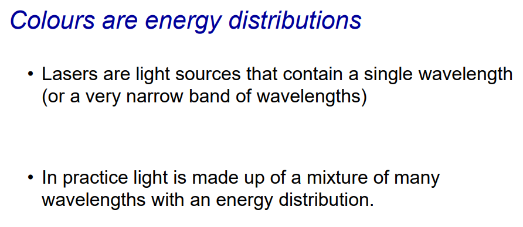
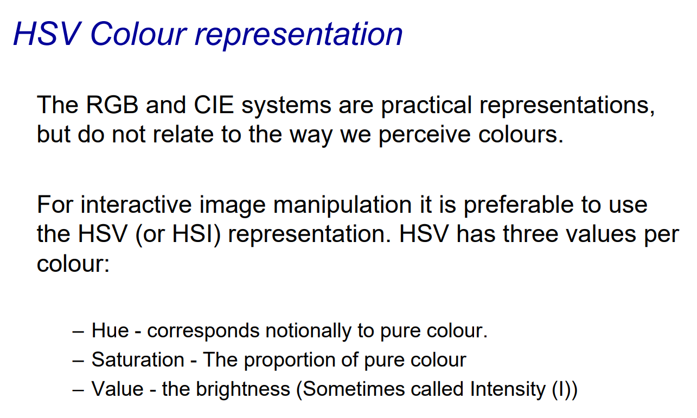
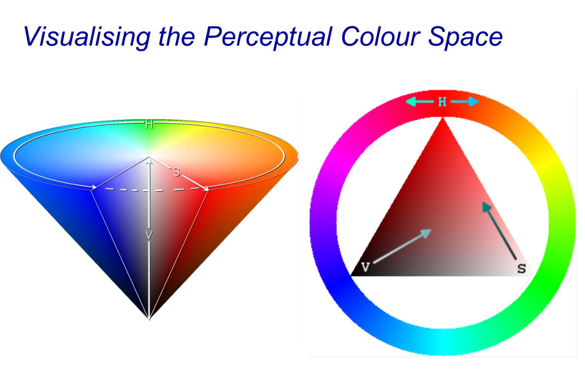
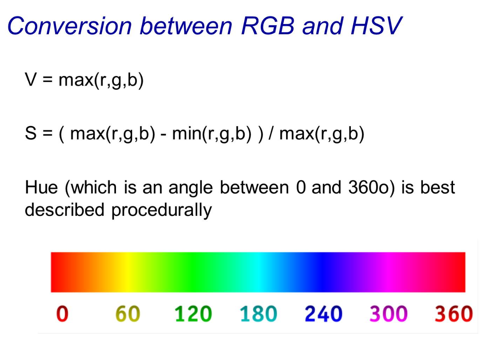

# Ways of looking at colour

# The physics of colour

# Colours are energy distributions

# Light distribution for red, (LED light source)

# Sunlight

# Human Colour Vision

# Human receptor response

1. **Color Sensitivity:**
   - The graph shows **relative sensitivity** (y-axis) of the human eye to **wavelengths** of light (x-axis, in nanometers).
   - Each curve corresponds to one type of cone receptor:
     - **Blue (S-cones):** Sensitive to shorter wavelengths (~400–500 nm).
     - **Green (M-cones):** Sensitive to medium wavelengths (~450–630 nm).
     - **Red (L-cones):** Sensitive to longer wavelengths (~500–700 nm).
2. **Overlap Between Curves:**
   - The sensitivity curves overlap significantly, allowing the human eye to perceive a wide spectrum of colors through **color mixing** and **differential cone activation**.
3. **Implications:**
   - These curves explain the basis of **trichromatic color vision** in humans.
   - Colors are perceived based on the relative stimulation of the three cone types.
   - For example:
     - Equal stimulation of all three cones results in the perception of white light.
     - Dominant stimulation of S-cones produces the perception of blue.
4. **Applications:**
   - This information is foundational in **color science** and is used in technologies like RGB displays, cameras, and color calibration.

------

# Tri-Stimulus Colour theory

# Colour Matching

# Subtractive matching

1. **Color Matching Limitation:**
   - **Problem:** Not all colors can be matched using a given set of light sources.
   - This is due to the constraints of the **gamut** of available light sources, which is the range of colors that can be represented by combining them.
2. **Solution - Subtractive Matching:**
   - To overcome this limitation, the technique of **subtractive matching** is used.
   - The equation illustrates:
     - $X + r = g + b$
     - **$X$:** The color we want to match.
     - **$r, g, b$:** Primary color lights (red, green, blue).
   - This means we can **add light** (in this case, red $r$) to the color $X$ to adjust it to match the combination of other lights (green $g$ and blue $b$).
3. **Outcome:**
   - By using this method, theoretically, all colors can be matched, expanding the range of colors beyond the limitations of the original light sources.
4. **Applications:**
   - Subtractive matching is used in:
     - **Color reproduction technologies** (e.g., printers and displays).
     - **Colorimetry** to study and measure colors.
5. **Connection to Additive Color Mixing:**
   - While **additive mixing** combines colors by adding lights (e.g., RGB), subtractive matching involves compensating or balancing colors through adjustments.

# The CIE diagram

------

### Key Points:

1. **Purpose of the CIE Diagram:**
   - The **CIE Diagram** is a standardized tool for representing colors.
   - It was created to provide a normalized framework for color measurement and communication.
2. **Color Matching with Three Light Sources:**
   - As mentioned earlier, any given color can be matched by mixing three light sources.
   - This is possible under the condition that **subtractive matching** is allowed (adding or subtracting specific light components to match colors).
3. **Normalization to [0, 1] Range:**
   - To eliminate **negative signs** in color representation (which arise in subtractive matching), the CIE system normalizes values to a range of **[0, 1]**.
   - This ensures:
     - A clean and consistent representation of all possible colors.
     - Avoidance of confusion or negative values in calculations.
4. **Applications of the CIE Diagram:**
   - Used in colorimetry to map all perceivable colors that humans can see.
   - Helps define the **gamut** (color range) of devices like monitors, projectors, and printers.
   - Forms the basis for systems like **sRGB** and **Adobe RGB**.
5. **Relation to Color Models:**
   - The CIE system operates independently of specific RGB or CMYK models, providing a universal standard.
   - It supports both **additive** and **subtractive** approaches.

------

# Normalised colours

1. **Normalization of Color Components:**
   - The RGB values (red, green, blue) are normalized such that their sum equals 1. This allows for consistent and comparable representation of colors.
   - Normalization formulas:
     - $x = \frac{r}{r + g + b}$
     - $y = \frac{g}{r + g + b}$
     - $z = \frac{b}{r + g + b} = 1 - x - y$
2. **Resulting Constraints:**
   - By normalizing, the color data can be reduced to two dimensions because $z$ is dependent on $x$ and $y$.
   - This simplifies color representation to a 2D chromaticity space.
3. **Representation in 2D Space:**
   - After normalization, all colors can be plotted in a **chromaticity diagram** (a 2D representation), which is a key feature of the **CIE color space**.
   - The chromaticity diagram highlights only the **hue** and **saturation**, ignoring luminance (brightness).
4. **Applications:**
   - Useful for comparing colors independently of their intensity.
   - Forms the basis for devices and systems that require precise color manipulation, such as monitors, cameras, and printers.

# Defining the normalised CIE diagram

1. **The CIE Chromaticity Diagram:**
   - On the left, the triangle shows the chromaticity coordinates for hypothetical RGB sources, normalized to a 2D space.
   - The axes $X$, $Y$, and $Z$ represent the **tristimulus values** derived from human color perception.
2. **Tristimulus Values (Right Graph):**
   - The graph represents the **response curves** of human cone cells (Red, Green, and Blue) normalized into the **CIE XYZ color space**.
   - The curves account for human vision sensitivity across wavelengths (400–700 nm):
     - $Z$: Blue (short wavelengths)
     - $Y$: Green (medium wavelengths)
     - $X$: Red (long wavelengths)
3. **Purpose of the CIE Diagram:**
   - The triangle on the left shows how all perceivable colors can be expressed as combinations of the hypothetical RGB sources.
   - By normalizing the $X$, $Y$, $Z$ axes, the range of visible colors is compressed into a triangular 2D space.
   - The 2D chromaticity representation eliminates intensity, focusing only on **hue** and **saturation**.
4. **Applications:**
   - This model is widely used in colorimetry and industries like display technology, printing, and lighting to standardize and reproduce colors accurately.

# Actual Visible Colours

# The CIE Diagram 1964 standard

# Convex Shape

1. **Pure Colors Around the Edge:**
   - The boundary of the CIE chromaticity diagram consists of **pure spectral colors** (coherent wavelengths, denoted by $\lambda$).
   - These are the most saturated colors visible to the human eye and correspond to single wavelengths of light.
2. **Convex Shape:**
   - The CIE diagram is convex because:
     - Any linear combination (blending or interpolation) of pure colors on the boundary results in a color **inside the visible spectrum region**.
     - For instance, blending green and red results in intermediate yellow-orange hues within the convex area.
3. **The Line Between Purple and Red:**
   - The line joining purple (near 380 nm) and red (near 780 nm) does not correspond to any pure wavelength.
   - Colors along this line, like magenta, are **non-spectral** and can only be produced by mixing (e.g., red and blue light).

------

### Importance:

- This property ensures that all visible colors can be represented within the CIE diagram through interpolation of spectral (pure) colors.
- It also highlights that certain colors, like magenta, exist only as blends, not as single-wavelength light.

# Intensities

1. **Normalization Removes Intensity:**
   - In color spaces like the CIE diagram, **colors are normalized**, meaning their representation is based solely on chromaticity (hue and saturation) and excludes **intensity** or brightness.
   - The diagram focuses on the color's composition, not how bright or dim it appears.
2. **Perceptual Impact of Intensity:**
   - By altering the **intensity** of a color (e.g., its luminance or brightness), it can appear as a **different color** to the human eye.
   - For instance, a low-intensity red may look like a dark maroon, while a high-intensity red appears bright and vibrant.

------

### Relevance:

- This slide emphasizes that **intensity and chromaticity** are separate attributes in color theory.
- While the CIE diagram provides a 2D representation of chromaticity, **intensity is a third dimension** that significantly influences how colors are perceived in practice.

# White Point

1. **Definition of White Point:**
   - The white point is the chromaticity point where **all three color components (R, G, and B)** contribute equally to the color. This results in the perception of "white."
   - In normalized chromaticity coordinates:
     - $x = 0.33$
     - $y = 0.33$
2. **Visibility on the CIE Diagram:**
   - The white point is located near the **center of the CIE diagram**, signifying the balance of all wavelengths contributing equally.
   - It acts as a reference point for color balancing in various applications, including displays and lighting systems.

------

### Relevance:

- The white point is critical in **color calibration** and **white balance adjustment** across different devices.
- It also serves as the anchor for defining **color temperature** in lighting.

# Saturation

1. **Definition of Fully Saturated Colors:**
   - **Pure colors** are referred to as **fully saturated.**
   - These colors correspond to the boundary of the **horseshoe-shaped curve** in the CIE diagram, where each wavelength is represented at its purest form.
2. **Saturation of Arbitrary Points:**
   - Saturation for any color is defined as the ratio: Saturation=Distance from the white point to the colorDistance from the white point to the edge of the horseshoe curve $\text{Saturation} = \frac{\text{Distance from the white point to the color}}{\text{Distance from the white point to the edge of the horseshoe curve}}$
   - This quantifies how vivid or pure a color is compared to the white point (neutral gray).

------

### Additional Context:

- **Fully saturated colors** contain no white light.
- **Less saturated colors** appear more muted or pastel-like due to the presence of white light.

# Complement Colour

1. **Definition of Complementary Colors:**
   - The **complement** of a fully saturated color is found by locating the point **diametrically opposite** to it on the CIE chromaticity diagram, passing through the **white point**.
2. **Combination of Complementary Colors:**
   - When a color is combined with its complement, the resulting mix gives **white light.**
   - This is due to the way complementary colors balance each other in terms of the full spectrum of visible light.

------

### Applications:

- Complementary colors

   are widely used in color theory for:

  - Designing contrasting visuals.
  - Creating color balance in photography, film, and design.
  - Enhancing color grading in displays or print.

# Subtractive Primaries

1. **Subtractive Color Representation:**
   - In subtractive color models, **inks or pigments absorb certain wavelengths of light** and reflect the rest.
   - The color we perceive is created by subtracting components of the light spectrum.
2. **Subtractive Primary Colors:**
   - The subtractive primary colors are:
     - **Magenta (purple)**
     - **Cyan (light blue)**
     - **Yellow**
3. **Usage:**
   - Subtractive colors are used in **printing** because they combine to create a full spectrum of colors by overlapping and mixing.
   - For example:
     - Cyan + Yellow = Green
     - Magenta + Yellow = Red
     - Cyan + Magenta = Blue

------

### Difference from Additive Colors:

- Unlike the **additive primaries** (Red, Green, Blue), which deal with light emitted by screens, subtractive primaries handle reflected light, commonly used in inks and pigments.

# Additive and Subtractive Primaries

# Colour Perception

1. **Human Perception of Color Dimensions:**
   - **Hues:** Humans can distinguish approximately **128 different hues** (variations in color, such as red, green, or blue).
   - **Saturation Levels:** For each hue, humans can differentiate about **30 levels of saturation** (intensity or purity of color).
   - **Brightness Levels:** Humans can perceive between **60 and 100 different brightness levels** (lightness or darkness of a color).
2. **Total Perceivable Colors:**
   - Multiplying these dimensions (128 hues × 30 saturation levels × 60–100 brightness levels) gives an approximation of about **350,000 perceivable colors**.
3. **Significance:**
   - This calculation gives insight into the **finite range** of colors the human eye can distinguish, which is significantly smaller than the total number of colors represented in digital systems (e.g., 16.7 million in 24-bit color).

------

### Implications:

- This understanding is crucial in fields like **color science**, **image compression**, and **display technology**, where the focus is on optimizing for human perception rather than representing every possible color.

# Colour Perception

1. **Caution with Perception Figures:**
   - Human sensitivity to color differentials can be much greater than general estimations suggest.
   - Perceived colors and their boundaries are not always easily quantifiable due to subjective variation in perception.
2. **24-Bit Color Representation:**
   - Digital systems often use 24 bits for color representation:
     - **8 bits for red**
     - **8 bits for green**
     - **8 bits for blue**
   - This provides **256 levels** of intensity per channel, resulting in approximately **16.7 million colors** (256³).
3. **Satisfactory Results:**
   - This representation is sufficient to satisfy most human visual needs, balancing computational efficiency and visual accuracy.
   - Despite theoretical gaps in perception, this standard covers a wide gamut 色域 of visible colors and minimizes perceptual discrepancies.

------

### Implications:

- While human perception is nuanced and complex, the 24-bit standard serves as a practical compromise, widely used in **graphics**, **displays**, and **digital media**.
- Understanding these limitations informs advancements in areas like **HDR imaging** and **color grading**.

# Reproducible colours

1. **Color Reproduction in Monitors:**
   - Monitors create colors by combining the light output from three primary color sources:
     - **Red**
     - **Green**
     - **Blue**
2. **CIE Diagram Representation:**
   - The CIE chromaticity diagram specifies the nominal positions of these primary colors in terms of their x, y, and z chromaticity coordinates:
     - Red:
       - x = 0.628
       - y = 0.346
       - z = 0.026
     - Green:
       - x = 0.268
       - y = 0.588
       - z = 0.144
     - Blue:
       - x = 0.150
       - y = 0.070
       - z = 0.780
3. **Purpose:**
   - These values define the **chromaticity of the light sources** (phosphors or diodes) used in monitors.
   - They enable **consistent color reproduction** across different devices by defining a standard range of reproducible colors.

------

### Implications:

- By combining these primary colors in varying intensities, monitors can reproduce a wide spectrum of colors, staying within the **gamut** defined by the positions on the CIE diagram.
- The **z** value is derived from $z = 1 - x - y$, ensuring the chromaticity coordinates sum to 1.

1. **Visible Spectrum**:
   - The brown curve represents the spectrum of all visible colors.
   - Points along the curve correspond to **pure wavelengths** (monochromatic light).
2. **Display Colors (Blue Triangle)**:
   - The blue triangle outlines the **gamut** of colors reproducible by a display device.
   - Its vertices represent the chromaticity coordinates of the Red, Green, and Blue primaries:
     - Red: [0.63, 0.35]
     - Green: [0.27, 0.59]
     - Blue: [0.15, 0.07]
3. **Limitations of Display Gamuts**:
   - The triangle lies entirely within the spectral locus but covers only a subset of visible colors.
   - The gamut does not include highly saturated colors near the edges of the visible spectrum, such as certain **greens** and **cyans**.

------

### Implications:

- Gamut Limitations:
  - Displays cannot reproduce all visible colors due to the finite range defined by their RGB primaries.
- Outside the Gamut:
  - Colors outside the triangle can only be **approximated** within the display's range.
- Color Mixing:
  - Colors inside the triangle are created by mixing the red, green, and blue primaries in varying intensities.

# RGB to CIE

This equation represents the transformation between **RGB color space** and **CIE XYZ color space**, which is used to standardize color representations.

------

### **Explanation of the Equation**:

1. **Matrix Representation**:

   $\begin{bmatrix} x \\ y \\ z \end{bmatrix} = \begin{bmatrix} 0.628 & 0.268 & 0.150 \\ 0.346 & 0.588 & 0.070 \\ 0.026 & 0.144 & 0.780 \end{bmatrix} \begin{bmatrix} R \\ G \\ B \end{bmatrix}$

   - **R, G, B**: The intensities of the red, green, and blue components in the monitor's RGB color space.
   - **x, y, z**: The corresponding values in the CIE XYZ color space.

2. **Matrix Components**:

   - Each row in the matrix corresponds to how much **R**, **G**, and **B** contribute to the respective CIE **X**, **Y**, and **Z** channels.
   - Example:
     - For $X$: $X = 0.628R + 0.268G + 0.150B$.

3. **Purpose**:

   - Converts monitor RGB values (specific to a display device) into a device-independent color space (CIE XYZ).
   - Enables standardized color representation across devices.

------

### **Applications**:

- Color Matching:
  - Ensures that colors appear consistent on different displays.
- Color Calibration:
  - Used in color profiling tools to calibrate displays and printers.
- Conversion to Other Color Spaces:
  - CIE XYZ serves as an intermediate step for converting to spaces like CIELAB, sRGB, etc.

# HSV Colour representation

This slide explains the **HSV (Hue, Saturation, Value)** color model, which is commonly used in **image manipulation** and **color perception** tasks.

------

### **Components of HSV**:

1. **Hue (H)**:
   - Represents the type of color (e.g., red, blue, green, etc.).
   - Measured as an angle on a color wheel (0°–360°).
     - Red = 0°, Green = 120°, Blue = 240°.
   - **Concept**: Defines the dominant wavelength of the color.
2. **Saturation (S)**:
   - Describes the intensity or purity of the color.
   - A value of 0 means the color is completely desaturated (grayscale).
   - A value of 1 (100%) means the color is pure.
3. **Value (V)** (Brightness or Intensity):
   - Refers to the brightness of the color.
   - A value of 0 corresponds to black (absence of light).
   - A value of 1 corresponds to the full brightness of the hue.

------

### **Why Use HSV Over RGB?**

- Human Perception:
  - HSV aligns more closely with how humans perceive colors.
  - It's easier to interpret the hue, intensity, and saturation separately.
- Interactive Adjustments:
  - More intuitive for tasks like adjusting brightness or changing colors in applications like Photoshop or image filters.
- Decouples Brightness:
  - Allows changes to brightness (V) without affecting hue or saturation.

------

# Conversion between RGB and HSV

------

### **Steps to Convert RGB to HSV**:

1. **Value (V)**:

   - The value component represents the brightness of the color.
   - Formula: $V = \text{max}(r, g, b)$
   - Where $r$, $g$, and $b$ are the red, green, and blue color components normalized to the range [0,1][0, 1].

2. **Saturation (S)**:

   - Saturation measures the purity or intensity of the color.
   - Formula: $S = \frac{\text{max}(r, g, b) - \text{min}(r, g, b)}{\text{max}(r, g, b)}$
   - If the maximum value $\text{max}(r, g, b))$ is $0$, then $S = 0$.

3. **Hue (H)**:

   

   - If $H < 0$, add $360^\circ$ to make it positive.

------

### **Key Points**:

- The **Hue** is determined procedurally since it depends on the relative proportions of the RGB components.
- The color wheel visualization at the bottom shows how Hue transitions across 0°–360° for different colors:
  - 0° = Red, 60° = Yellow, 120° = Green, 180° = Cyan, 240° = Blue, 300° = Magenta.

------

# Saturation in the RGB system

------

### Key Points:

1. **Definition in RGB**:
   - In the RGB system, **saturation** is considered as the level of purity of a color.
   - Any color can be viewed as a mixture of:
     - A **pure color** (red, green, blue, or any combination).
     - **White light**, which reduces the intensity of the pure color.
2. **Difference from the CIE Diagram**:
   - Unlike the CIE system, where pure colors correspond to **coherent wavelengths** of light, the RGB system's pure colors are not tied to actual physical wavelengths.
   - The RGB "pure colors" are specific combinations of light produced by monitors and other displays, and they don't directly map to the spectral colors in the CIE chromaticity diagram.

------

This highlights that while RGB is a practical system for digital displays, it doesn't perfectly align with human visual perception or natural spectral light. Let me know if you'd like to discuss the implications or comparisons further!

# The composition of a tri-stimulus colour

This slide explains the **composition of a tri-stimulus color** in the RGB color model. Here's a breakdown:

------

### Key Concepts:

1. **RGB Intensity Representation**:
   - The graph shows the intensities of **Red (R)**, **Green (G)**, and **Blue (B)** components.
   - The heights of the bars correspond to the intensity levels of each color channel.
2. **White Color**:
   - White is represented when **R = G = B**. This occurs along the horizontal line where all three intensities are equal.
   - This point illustrates the absence of any dominant color and the combination of all three primary components equally.
3. **Pure Color (Red and Blue)**:
   - The "pure color" is achieved by combining only **Red** and **Blue**, with **Green** having zero or minimal contribution.
   - The intensity difference (highlighted by the vertical line) shows how much Red and Blue contribute compared to Green.

------

### Implications:

- The diagram illustrates how adjusting the intensity of RGB components can produce a wide range of colors.
- The balance between the three components defines whether the resulting color is pure, tinted (with white), or shaded (darker).

# Alpha Channels

------

### Key Points:

1. **Four-Component Color Representation (RGBA)**:
   - **r**, **g**, **b** represent the red, green, and blue color channels, respectively.
   - **α (alpha)** is the fourth channel, which controls **opacity** or **intensity attenuation**.
2. **Purpose of the Alpha Channel**:
   - It provides an additional layer of **flexibility** for color representation in computer systems.
   - Practical uses of the alpha channel:
     - Transparency and Masking:
       - The alpha channel is widely used for blending images or masking specific areas (e.g., rendering semi-transparent or hidden objects).
     - Avoiding Truncation Errors:
       - Helps to retain accurate color representations, especially when the image's intensity is very low.
     - Special Effects:
       - Supports features like shadowing, fading, and smooth transitions in images.

------

### Applications:

- **Graphic Design**: Used in layered image editing software like Photoshop.
- **Game Development**: Implements transparency for realistic effects.
- **Web Design**: Enables PNGs with transparent backgrounds.
- **Video Compositing**: Assists in overlaying video frames with transparency.

# Alpha Channels

# Image Combination: Alpha channel blending

# Image Combination: Alpha channel blending

