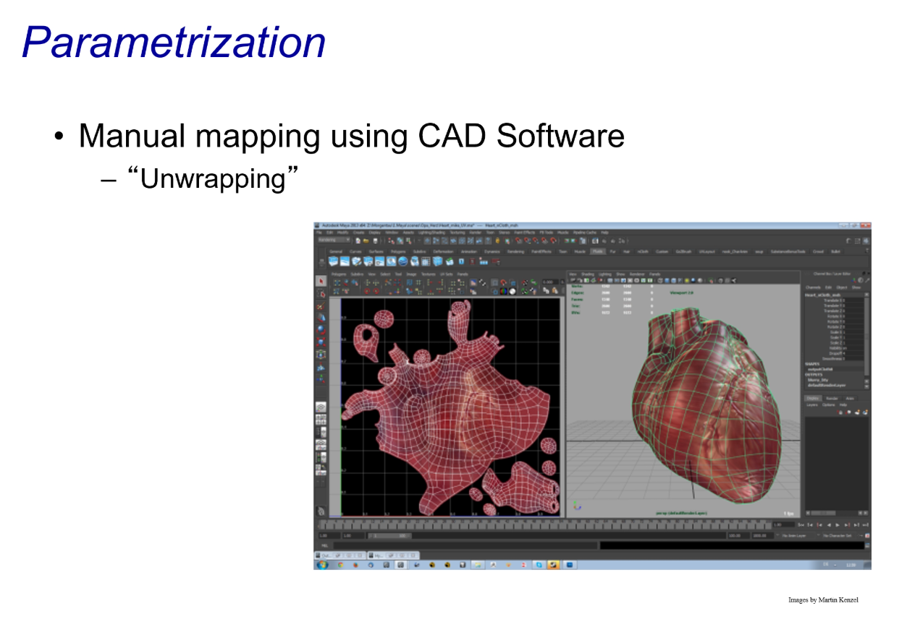
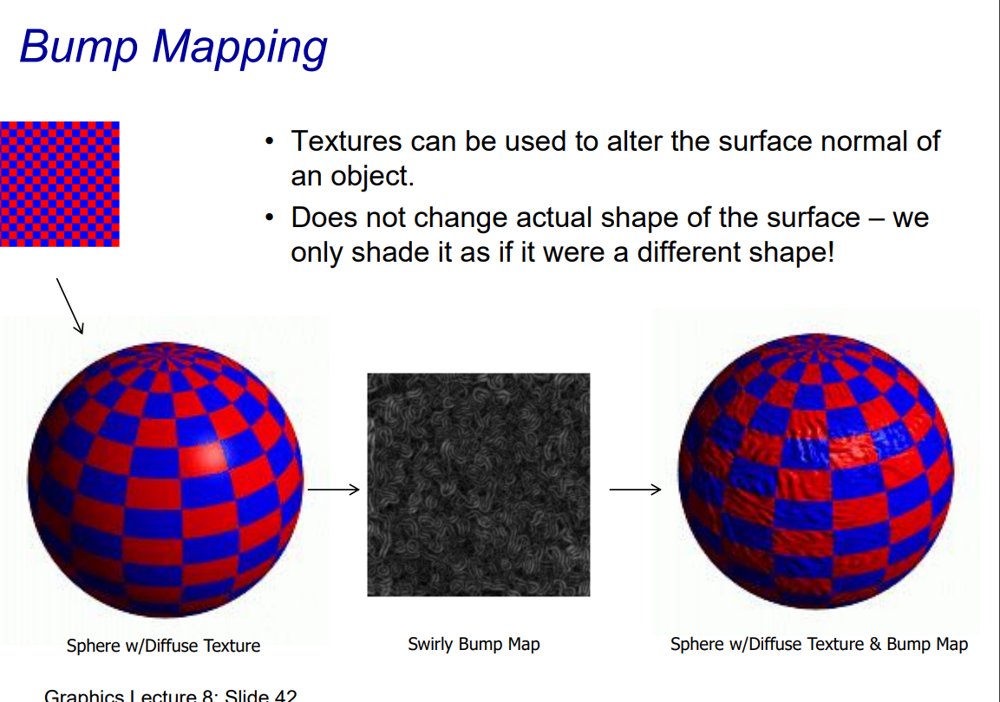

# Problem

# Solution: Textures

1. **Enhancement of Visual Appearance**: Textures significantly improve the visual appearance of a graphics scene.
2. **Efficiency in Scene Design**: Using individual polygons for every brick in a brick building requires substantial effort in scene design.
3. **Solution via Textures**: Instead of creating multiple polygons, a single polygon can be used with a repeating texture pattern (e.g., a brick texture) to achieve the desired visual effect more efficiently.

# The Quest for Visual Realism

****

# Texture Definition

This slide provides an overview of different types of textures and their definitions in computer graphics. Here's a breakdown:

### Types of Textures:

1. **One-Dimensional Functions**:
   - These textures depend on a single parameter, which can have an arbitrary domain.
   - Example: Incident angle used in shading or lighting calculations.
2. **Two-Dimensional Functions**:
   - Most common type in graphics for surface texturing.
   - Textures are defined in terms of uu and vv coordinates (parametric coordinates for surfaces).
   - Information is calculated or mapped for each (u,v)(u, v) pair.
3. **Raster Images ("Texels")**:
   - Texels (texture elements) are the pixels of a texture mapped onto 3D surfaces.
   - Raster textures are often derived from scanned images, photographs, or algorithmic calculations.
   - This is the most frequently used texture type in rendering.
4. **Three-Dimensional Functions**:
   - Represent volumetric textures, defined in terms of (u,v,w)(u, v, w) coordinates.
   - Useful for simulating properties like internal material structure (e.g., marble, wood grain).

### Procedural Texture vs. Raster Data:

- **Procedural Texture**:
  - Generated algorithmically at runtime, rather than being precomputed or stored as image data.
  - Offers flexibility and infinite resolution (e.g., fractals, mathematical patterns).
- **Raster Data**:
  - Precomputed textures stored as bitmap images.
  - Limited resolution and requires memory storage.

# Procedural textures

1. **Definition**:
   - Procedural textures are generated algorithmically rather than being stored as raster images.
   - A function $F(p)$ maps a point $p$ (typically a position in 3D space or 2D surface coordinates) to a color.
   - This function determines the texture appearance dynamically.
2. **Advantages**:
   - **Flexibility**: Since procedural textures are defined mathematically, they can be scaled to any resolution without losing detail (infinite resolution).
   - **Compact**: They do not require memory storage for texture images because they are computed on the fly.
3. **Challenges**:
   - **Non-intuitive**: Writing mathematical functions to generate specific textures can be complex and may require expertise in mathematics or computer graphics.
   - **Difficult to Match Real-world Textures**: It is challenging to replicate the look of real-world materials (like wood grain or cloth) precisely with a procedural approach, as real-world textures often have irregularities that are hard to model algorithmically.
4. **Example (Image)**:
   - The vase shown in the image appears to have a procedural texture applied. The texture patterns (e.g., stripes or gradients) are likely defined using a mathematical function.

### Summary:

Procedural textures are a powerful tool in computer graphics for generating textures algorithmically. While they offer scalability and efficiency, their non-intuitive nature and difficulty in mimicking real-world textures make them less suited for certain applications compared to raster-based textures.

# Photo textures

### Overview of Texture Mapping:

Texture mapping is the process of applying a 2D image (texture) onto the surface of a 3D object in a scene to enhance realism or add detail.

### Key Components:

1. **Texture Image (Left Diagram)**:
   - Represented as a 2D grid of "texels" (texture elements), with coordinates $s$ and $t$.
   - Texels are similar to pixels in a raster image but are used specifically for texture mapping.
2. **Object Surface (Middle Diagram)**:
   - The surface of the 3D object is parameterized using $u$ and $v$ coordinates, often called texture coordinates.
   - Each point on the object's surface is mapped to a corresponding $(u, v)$ pair, which in turn maps to a texel in the texture image.
3. **Screen Space (Right Diagram)**:
   - The final rendered output is a 2D projection of the 3D object on the screen, represented with $x$ and $y$ coordinates (pixels on the screen).

### Process of Texture Mapping:

1. **Texture-to-Surface Mapping**:
   - The texture image (defined in $s-t$ coordinates) is mapped onto the 3D object surface using $u$-$v$ coordinates.
   - Each $(u, v)$ coordinate on the object corresponds to a specific $(s, t)$ texel in the texture image.
2. **Surface-to-Screen Mapping**:
   - The 3D object, now with the texture applied, is rendered and projected into screen space (pixels on the display), defined by $x$-$y$ coordinates.

### Summary:

The diagram shows the workflow of texture mapping:

1. A texture image is sampled using $s, t$ coordinates.
2. These texels are mapped to the surface of a 3D object using $u, v$ coordinates.
3. The object with the texture is rendered into the 2D screen space $x, y.

Texture mapping is widely used in computer graphics to add details to 3D models without increasing geometric complexity.

# The concept of texture mapping

### Key Concepts of Texture Mapping:

1. **3D Model Representation**:
   - The 3D model is composed of a mesh, which consists of polygons (usually triangles).
   - Each triangle/polygon in the model corresponds to a region in the texture image.
2. **Texture Mapping**:
   - The texture image (e.g., a tiger skin) is "unwrapped" and mapped onto the 3D model's surface.
   - For each polygon in the model, a specific region of the texture is assigned. This region is defined by texture coordinates, often referred to as $(u, v)$ or $(s, t)$ coordinates.
   - These coordinates indicate how the 2D texture is aligned with the 3D surface.
3. **Coordinate Interpolation**:
   - During **rasterization** (the process of converting the 3D model into a 2D image for display), the texture coordinates for each vertex of a polygon are interpolated.
   - This interpolation determines the texture coordinates for every pixel (or fragment) within the polygon.
   - The interpolated coordinates are then used to fetch the corresponding texel (texture element) from the texture map.
4. **Example Illustration**:
   - The tiger texture is laid flat as a 2D image.
   - Different regions of the texture correspond to specific parts of the 3D model (e.g., stripes are mapped to parts of the tiger's body in the mesh).
   - The red lines in the diagram illustrate how regions of the texture image are mapped to specific polygons on the 3D model.

### Workflow:

1. **Modeling Phase**:
   - A UV map is created, which assigns $(u, v)$ coordinates to each vertex of the 3D model. This defines how the texture image is "wrapped" onto the model.
2. **Rendering Phase**:
   - As the model is rendered, texture coordinates are interpolated across each polygon, and the corresponding texel colors are applied to the pixels.

### Summary:

Texture mapping involves linking regions of a texture image to polygons on a 3D model. This is achieved by assigning UV coordinates to the model's vertices and interpolating them during rendering. The result is a visually realistic model that appears to have a detailed surface, like the tiger's skin in the example.

# Parametrization

### Key Concepts:

1. **Parametrization**:
   - Parametrization involves assigning **UV coordinates** to a 3D object's surface so that a 2D texture can be mapped onto it accurately.
   - This process defines how points on the 3D object's surface correspond to points (texels) on the 2D texture.
2. **How to Do the Mapping?**:
   - The slide provides an example of mapping a 2D texture (the stained-glass bird image) onto a cube.
   - Each face of the cube is assigned UV coordinates. For instance:
     - Bottom-left corner of the face corresponds to $(0,0)$ in texture space.
     - Top-right corner corresponds to $(1,1)$ in texture space.
   - These UV coordinates are then associated with the vertices of the cube in 3D space, such as $(1,1,1)$, $(−1,1,−1)$, etc.
3. **Mapping to a Cube (Example)**:
   - A texture is "wrapped" around the cube by mapping regions of the texture image to each face of the cube.
   - Each polygon (face) is linked to specific areas of the texture, resulting in the stained-glass image appearing correctly on the cube's surfaces.
4. **Challenges**:
   - **Simple Example**: The cube is a straightforward example because its surfaces are flat and rectangular, making UV mapping easier.
   - **Complex Objects**: For more complex shapes, such as organic or irregular objects (e.g., a human face or a car), parametrization becomes significantly more difficult. Specialized tools and algorithms (e.g., UV unwrapping) are required to handle these cases effectively.

### Summary:

Parametrization is essential for aligning a 2D texture to a 3D object. While simple objects like cubes allow straightforward mapping using planar UV coordinates, more complex objects require advanced techniques to ensure the texture is applied without distortion or misalignment. This process is a critical part of 3D modeling and rendering workflows.

# Parametrization: Planar

------

### **Planar Mapping**:

1. **Definition**:
   - Planar mapping is a simple texture-mapping technique where one of the 3D object’s coordinates (e.g., $x, y, z$) is "dropped" or ignored.
   - The 3D object's surface is essentially projected onto a 2D plane, and the texture is applied as if it is flat.
2. **How It Works**:
   - The remaining two coordinates after "dropping" one are used to define the mapping of the texture.
   - For example:
     - If you drop the $z$-coordinate, the $x$-$y$ plane becomes the texture plane.
     - Texture coordinates are then calculated as if the object lies flat on the $x$-$y$ plane.
3. **Applications**:
   - Planar mapping works well for objects with flat surfaces or when the texture only needs to be viewed from a particular angle.

------

### **Limitations**:

1. **Distortions**:
   - Since the technique ignores one axis, textures can become stretched or compressed on parts of the object that are not aligned with the projection plane.
2. **Front-facing Appearance**:
   - The slide notes that planar mapping "only looks good from the front."
   - This means that objects may appear correct when viewed straight-on but will show significant texture distortions or misalignments when viewed from the side or back.
3. **Unsuitability for Complex Shapes**:
   - For curved or irregular objects (e.g., spheres, teapots, or organic shapes), planar mapping often results in poorly aligned textures.

------

### **Example in the Slide**:

1. **Left Image**:
   - Shows a teapot being mapped with a grid-like texture on the $x$-$y$ plane.
   - From the front, the texture appears well-aligned.
2. **Right Image**:
   - Demonstrates multiple objects (e.g., teapot, cube, cylinder) with planar mapping applied.
   - While the mapping looks fine on simple or flat faces (like the cube or cylinder's top), it creates visible distortions on curved or non-planar surfaces (like the teapot’s spout or handle).

------

### **Summary**:

Planar mapping is a straightforward technique suitable for flat or front-facing objects. However, it has significant limitations for 3D models with curved or complex surfaces, as textures may appear distorted or misaligned when viewed from other angles. More advanced mapping techniques (e.g., cylindrical or spherical mapping) are often preferred for such objects.

# Parametrization

------

### **Cylindrical and Spherical Mapping**:

1. **Cylindrical Mapping**:
   - The texture is wrapped around the object in a cylindrical manner.
   - The mapping uses angles and heights relative to the cylinder’s axis.
   - Points on the object are assigned texture coordinates based on their cylindrical coordinates:
     - $\theta$: The angle around the central axis.
     - $h$: The height along the axis.
2. **Spherical Mapping**:
   - The texture is wrapped around the object like a sphere.
   - Points on the object are assigned texture coordinates using spherical coordinates:
     - $\phi$: The azimuthal angle (angle in the $x$-$y$ plane).
     - $\theta$: The polar angle (angle from the $z$-axis).
   - Coordinates are computed relative to the object’s center.
3. **Relation to Coordinate Systems**:
   - Both mappings rely on transformations from Cartesian coordinates ($x, y, z$) to cylindrical or spherical coordinates.
   - These transformations compute the required angles and distances:
     - For cylindrical: $\theta = \arctan(y/x)$, $h = z$.
     - For spherical: $r = \sqrt{x^2 + y^2 + z^2}$, $\theta$, and $\phi$.

------

### **Key Points in the Slide**:

1. **Left Image**:
   - Demonstrates cylindrical mapping applied to a teapot.
   - The texture appears to be wrapped around the teapot in a circular pattern.
   - The texture alignment looks better for curved objects compared to planar mapping, though distortions can still occur at the top and bottom edges.
2. **Right Diagram**:
   - Shows spherical coordinates: $(r, \theta, \phi)$.
   - This system is used to compute how a texture is applied in spherical mapping.

------

### **Advantages**:

1. Ideal for Curved Objects:
   - Cylindrical mapping works well for objects like cans or tubes.
   - Spherical mapping is suitable for globes, balls, or domes.
2. Natural Alignment:
   - These methods reduce distortions on curved surfaces compared to planar mapping.

------

### **Limitations**:

1. Distortion at Poles:
   - Spherical mapping often introduces distortions near the poles (top and bottom) because texels get compressed.
2. Object Fit:
   - Mapping works best for objects with shapes resembling cylinders or spheres. Irregular shapes still require more complex UV mapping.

------

### **Summary**:

Cylindrical and spherical mapping are effective methods for applying textures to curved surfaces. They leverage polar and spherical coordinate systems to calculate how the texture is wrapped around the object. While they offer better results than planar mapping for curved surfaces, they are not distortion-free, especially near edges or poles.

# Parametrization: Box

------

### **Box Mapping**:

1. **Definition**:
   - Box mapping (also called cube mapping) involves projecting a texture onto an object from six directions: front, back, left, right, top, and bottom.
   - Each face of the cube contains a part of the texture, and the object's surface is mapped to the corresponding cube face.
2. **Key Characteristics**:
   - Often used for **environment mapping**, where the texture represents the surrounding environment (like reflections or skyboxes).
   - Simple to implement and effective for objects that fit naturally within a cubic space.

------

### **Components of Box Mapping**:

1. **Texture Layout**:
   - As shown in the top-right image, the texture is divided into six sections: top, bottom, left, right, front, and back.
   - Each section corresponds to one face of the cube.
2. **Projection**:
   - For each point on the object's surface, its position is projected onto one of the six faces of the cube to determine the corresponding texture coordinates.
   - The texture is then sampled and applied to the object's surface.

------

### **Applications**:

- **Environment Mapping**:
  - Box mapping is commonly used to create reflective or refractive effects by applying an environment texture to an object.
  - For example, a metallic teapot reflecting a surrounding scene.
- **Simple Object Mapping**:
  - Suitable for objects like boxes, cubes, or objects that approximate cubic shapes.

------

### **Examples in the Slide**:

1. Top-Right Image:
   - Shows a typical cube map texture layout, with six square regions corresponding to the cube's six faces.
2. Bottom-Left Image:
   - Illustrates a teapot placed inside a virtual box where textures are projected from the cube's faces onto the teapot.
3. Bottom-Right Image:
   - Demonstrates multiple objects (teapot, cube, cylinder, sphere) with box mapping applied.
   - While it works well for the cube, it introduces visible artifacts or misalignments on curved or irregularly shaped objects (like the sphere or banana-shaped object).

------

### **Advantages**:

1. Easy to Implement:
   - Straightforward for objects that fit within cubic shapes or for environment mapping.
2. Efficient:
   - Requires a single texture map for all six sides, reducing complexity.

------

### **Limitations**:

1. Distortion on Curved Surfaces:
   - For objects like spheres or irregular shapes, the transitions between cube faces can cause visible seams or distortions.
2. Not Suitable for Complex Shapes:
   - More advanced techniques (e.g., UV unwrapping) are required for mapping textures on highly irregular shapes.

------

### **Summary**:

Box mapping is a simple and effective technique for applying textures to objects by projecting them from the faces of a virtual cube. While it is ideal for cubic or environment mapping scenarios, it may not produce seamless results for complex or curved objects.

# Parametrization

# Parameterization problems

# Texture Coordinates

------

### **Texture Coordinates**:

1. **Definition**:
   - Texture coordinates specify how a 2D texture image is mapped onto a 3D object.
   - These coordinates are assigned to each vertex of a 3D object's surface and determine which part of the texture corresponds to which point on the surface.
2. **Canonical Texture Coordinates**:
   - Typically, texture coordinates are normalized and fall within the range $(0, 0)$ to $(1, 1)$, which represents the bottom-left and top-right corners of the texture, respectively.
   - This convention makes it easier to work with textures regardless of their actual resolution or size.
3. **Power-of-2 Texture Sizes**:
   - In older hardware, textures were often required to have dimensions that are powers of 2 (e.g., $256 \times 256$, $512 \times 512$).
   - While modern hardware supports arbitrary sizes, power-of-2 sizes are still common due to their efficiency in memory usage and mipmapping.

------

### **Tiling Textures**:

- Question in the Slide: "How can we tile this texture?"
  - Tiling refers to repeating the texture across a surface.
  - For example:
    - If the texture coordinates go beyond the range $(0, 0)$ to $(1, 1)$, the texture can be repeated (or "wrapped") to fill the surface.
    - Tiling can be useful for creating repetitive patterns, like bricks, tiles, or fabric.

------

### **Example Illustration**:

- The image in the slide shows a texture (a sunset scene) with canonical texture coordinates $(0, 0)$, $(1, 0)$, $(0, 1)$, and $(1, 1)$ labeled at the corners.
- The red triangle indicates a specific region of the texture that might be mapped to a triangular face of a 3D model.

------

### **Key Considerations**:

1. **Manual Assignment**:
   - Artists or tools manually assign texture coordinates during the UV unwrapping process.
   - Proper alignment ensures the texture appears correctly on the object.
2. **Interpolation**:
   - During rendering, the texture coordinates at the vertices are interpolated across the surface of the polygon to determine the coordinates for each pixel.

------

### **Summary**:

Texture coordinates are a fundamental concept in 3D rendering, linking a 2D texture image to the vertices of a 3D object. The range $(0, 0)$ to $(1, 1)$ defines the canonical space of the texture. Techniques like tiling allow textures to repeat, which is useful for larger or repetitive surfaces. Proper texture mapping ensures the object appears realistic and visually appealing.

# Texture Adressing

------

### **Texture Addressing Modes**:

1. **What Happens Outside [0,1][0, 1]?**
   - When texture coordinates go beyond the range [0,1][0, 1], addressing modes specify how the texture is extended, repeated, or modified to cover the surface.
2. **Common Addressing Modes**:
   - **Static Color (Border)**:
     - A static color (e.g., red in the image) is used to fill areas where the texture coordinates fall outside the range.
     - Useful for defining a uniform background or border.
   - **Clamped**:
     - The texture is stretched and its edges are repeated in the out-of-bounds region.
     - This is achieved by "clamping" the texture coordinates to the nearest valid range value (0 or 1).
     - Produces a stretched edge effect.
   - **Repeated**:
     - The texture is tiled or repeated in both directions when coordinates exceed [0,1][0, 1].
     - Creates a pattern-like effect.
     - Commonly used for surfaces with repetitive designs (e.g., bricks, tiles).
   - **Mirrored**:
     - The texture is repeated, but every alternate repetition is flipped (mirrored).
     - This creates a seamless look by flipping the texture along one or both axes.

------

### **Examples in the Slide**:

1. **Static Color (Leftmost)**:
   - The area outside the texture range is filled with a red border.
2. **Clamped (Second from Left)**:
   - The edges of the texture (the black and white checkered stripes) are extended indefinitely.
3. **Repeated (Third from Left)**:
   - The yellow smiling face texture is repeated across the surface, creating a tiled pattern.
4. **Mirrored (Rightmost)**:
   - The smiling face texture alternates between its original and mirrored versions, producing a more natural transition between tiles.

------

### **Key Applications**:

- **Static Color**: Useful for defining backgrounds or borders in graphical applications.
- **Clamp**: Prevents tiling and avoids introducing patterns outside the main texture.
- **Repeat**: Commonly used for repetitive designs, like walls, floors, or fabrics.
- **Mirror**: Used to reduce visible seams or artifacts in textures, particularly on curved or irregular surfaces.

------

### **Summary**:

Texture addressing modes are essential for controlling how textures are extended or repeated when texture coordinates exceed their defined range. Each mode has unique applications, ranging from creating seamless patterns to defining uniform backgrounds. Understanding these modes helps achieve the desired visual effects in 3D rendering.

# Tiling Texture

# Texture Coordinates

# Mapping texture to individual pixels

------

### **Key Concepts**:

1. **Texture Coordinate Interpolation**:
   - Each vertex of a polygon (e.g., a triangle) is assigned texture coordinates $(u, v)$.
   - These coordinates correspond to positions on the 2D texture map.
   - During rasterization (rendering the polygon to a 2D screen), the texture coordinates at the vertices are **interpolated** across the surface of the polygon for each pixel.
2. **Analogy to Gouraud Shading**:
   - This interpolation process is similar to Gouraud shading, where color or lighting values are interpolated across the surface.
   - Here, instead of shading values, texture coordinates are interpolated.
3. **Scanline Interpolation**:
   - The interpolation is typically done along **scanlines**, which are rows of pixels in the rasterized triangle.
   - For each pixel on the scanline, its interpolated (u,v)(u, v) coordinates are used to fetch the corresponding texel (texture element) from the texture map.

------

### **Diagram Explanation**:

- The triangle is defined by three vertices with texture coordinates:
  - $(u_1, v_1)$ at the top vertex.
  - $(u_2, v_2)$ and $(u_3, v_3)$ at the bottom vertices.
- Pixels inside the triangle (e.g., the yellow point) have their $(u, v)$ coordinates interpolated based on the surrounding vertices.
- These interpolated coordinates are used to determine which part of the texture map corresponds to each pixel.

------

### **Advantages**:

1. Smooth Texture Mapping:
   - Interpolation ensures that the texture smoothly follows the surface of the polygon.
2. Efficient Rendering:
   - Interpolation is computationally efficient and ensures each pixel gets a mapped texture value.

------

### **Challenges**:

1. Perspective Correction:
   - Without proper correction, the interpolation can appear distorted on surfaces viewed at steep angles. This is addressed using **perspective-correct interpolation**.
2. Aliasing:
   - Textures may appear blocky or jagged without proper filtering (e.g., bilinear or trilinear filtering).

------

### **Summary**:

This process describes how texture coordinates are interpolated across a polygon during rendering, allowing each pixel to be mapped to the appropriate texel on the texture. This ensures that the texture appears seamlessly on the surface of 3D objects. Interpolation plays a critical role in creating visually realistic textures in computer graphics.

# Perspective projection

------

### **Key Concepts**:

1. **Perspective Projection**:
   - In 3D graphics, perspective projection maps 3D points onto a 2D plane (screen) to create a realistic sense of depth.
   - Objects farther from the camera appear smaller, and distances in 3D space are not preserved linearly in screen space.
2. **Problem with Perspective Projection**:
   - Non-linearity:
     - Equal distances in 3D space **do not** correspond to equal distances in screen space after perspective projection.
     - For example, points $P, Q, R$ (diagram on the right) appear equally spaced in 3D space, but their distances in screen space are not equal.
   - Interpolation Issue:
     - Linear interpolation in screen space (e.g., for texture coordinates) will not align with the actual distances in 3D space, leading to distortions in textures or other interpolated values.

------

### **Diagrams Explained**:

1. **Left Diagram**:
   - Shows the center of projection, the 3D points, and the projection onto the view plane (screen).
   - Highlights how 3D geometry is distorted when projected onto the 2D screen.
2. **Right Diagram**:
   - Depicts the points $P, Q, R$ along a line in 3D space and their projections onto the screen.
   - Demonstrates how perspective foreshortening affects distances, with $Q$ appearing closer to $P$ in screen space than to $R$, despite equal spacing in 3D.

------

### **Linear Interpolation Challenge**:

- In screen space, simple linear interpolation does not account for perspective distortion.
- For example:
  - If you interpolate texture coordinates linearly in screen space, the texture will appear stretched or compressed in perspective.

------

### **Solution**:

- Perspective-Correct Interpolation:
  - To resolve this, interpolation must be performed in **homogeneous clip space** (after dividing by the depth $z$-coordinate) rather than directly in screen space.
  - This approach ensures that the interpolated values (e.g., texture coordinates) are correct when viewed in perspective.

------

### **Summary**:

Perspective projection introduces non-linearity that affects how distances and interpolated values are represented in screen space. Linear interpolation in screen space is not sufficient for maintaining accuracy in 3D scenes, and perspective-correct interpolation is needed to address this distortion. This concept is critical for rendering realistic textures and maintaining visual fidelity in 3D graphics.

# How to fix?

------

### **Key Concepts**:

1. **Assigning Parameter $t$**:
   - $t$ is a parameter that represents the interpolation factor along a line between two vertices in 3D space.
   - It is used to linearly blend texture coordinates (or other interpolated values) from one vertex to another.
   - $t = 0$ at one endpoint (vertex $p$) and $t = 1$ at the other endpoint (vertex $r$).
2. **Purpose of $t$**:
   - $t$ controls the interpolation in 3D space, ensuring that the blending respects the non-linear effects of perspective projection.
3. **Image Plane at $z = 1$**:
   - For simplicity, the slide assumes that the projection is onto an image plane at $z = 1$, making the calculations straightforward.

------

### **Diagram Explanation**:

1. Vertices in 3D Space:
   - $p$ and $r$ are the two 3D vertices at the ends of the line.
   - $q$ is a point along the line in 3D space, whose interpolated values (e.g., texture coordinates) need to be calculated.
2. Projected Points:
   - $p'$, $r'$, and $q'$ are the corresponding points on the 2D image plane (after perspective projection).
   - The task is to correctly determine $t_q$, which governs the interpolation at $q$.

------

### **Steps to Fix the Issue**:

1. **Linear Blend with $t$**:
   - The interpolation is performed using the parameter $t$ in 3D space.
   - For a value of $t$ between 0 and 1, the texture coordinates (or other values) are interpolated proportionally.
2. **Perspective-Correct Interpolation**:
   - To ensure that the interpolation is correct after projection, the texture coordinates are adjusted using depth information (e.g., $z$-coordinate).
3. **Calculation of $t$**:
   - $t$ can be calculated for intermediate points ($q$) based on their relative position between $p$ and $r$ in 3D space.

------

### **Benefits of Perspective-Correct Interpolation**:

- Ensures accurate mapping of textures and other interpolated values in perspective-projected scenes.
- Avoids distortion caused by incorrect linear interpolation in screen space.

------

### **Summary**:

This approach introduces a parameter tt to control the interpolation of values between vertices in 3D space. By performing interpolation in 3D space and considering depth (or zz-coordinates), perspective-correct interpolation ensures accurate results, even after projection to the 2D image plane. This method is critical for realistic rendering in computer graphics.

------

### **Key Points**:

1. **Projection of Points**:
   - Points in 3D space ($p, q, r$) are projected onto a 2D image plane using their depth ($z$-coordinate):
     - $p' = \frac{\mathbf{p}}{z_p}$
     - $q' = \frac{\mathbf{q}}{z_q}$
     - $r' = \frac{\mathbf{r}}{z_r}$
   - The division by $z$ introduces perspective distortion, making objects farther from the camera appear smaller.
2. **Challenge**:
   - The question posed in the slide is: **What value should $t$ have at location $q'$?**
   - $t$ is the interpolation parameter, and its correct value is crucial for accurate perspective-correct interpolation.

------

### **Diagram Explanation**:

- The diagram shows:
  - **3D Points** $p, q, r$: These are the original points in 3D space.
  - **Projected Points** $p', q', r'$: These are the corresponding points in 2D screen space after perspective projection.
  - $z_p, z_q, z_r$: The depth values (distance from the camera) of $p, q, r$, respectively.
- The interpolation of $t$ needs to account for the non-linear effect caused by dividing by $z$.

------

### **Solution**:

1. **Perspective-Correct Interpolation**:
   - Instead of interpolating linearly in screen space, interpolation must account for depth ($z$):
     - Texture coordinates and other interpolated values are divided by the depth ($z$) before interpolation.
     - After interpolation, the result is multiplied by the interpolated depth to reconstruct the correct values.
2. **Calculation of $t$**:
   - The parameter $t$ is interpolated in 3D space, considering the $z$-coordinate at each vertex.
   - This ensures that the interpolation is proportional to the distances in 3D, not just in 2D screen space.

------

### **Why It Works**:

- Perspective projection is inherently non-linear due to the division by $z$.
- Perspective-correct interpolation ensures that values are interpolated in the correct space (homogeneous clip space) before being mapped to screen space.

------

### **Summary**:

To fix interpolation issues in perspective projection, values (like texture coordinates) are divided by the depth ($z$) before interpolation and recombined afterward. This process ensures accurate perspective-correct results and avoids distortions caused by linear interpolation in screen space.

# Perspective Correct Interpolation

------

### **Key Idea**:

1. **Problem**:
   - Linear interpolation in screen space does not account for the distortion caused by perspective projection.
   - To correct this, interpolation must involve the depth ($z$-coordinate) of each vertex.
2. **Solution**:
   - Instead of interpolating $t$ directly, interpolate $t / z$, where $t$ is the parameter to interpolate (e.g., texture coordinates or shading values).
   - This ensures the interpolation respects perspective distortion.

------

### **Steps for Perspective-Correct Interpolation**:

1. **Compute $t / z$ for Each Vertex**:
   - For vertices $p$ and $r$, compute:
     - $t_p' = t_p / z_p$
     - $t_r' = t_r / z_r$
2. **Linearly Interpolate $t / z$ in Screen Space**:
   - Use linear interpolation (lerp) between $t_p'$ and $t_r'$ to find $t_q'$ at the projected location $q'$:
     - $t_q' = \text{lerp}(t_p', t_r')$
3. **Recover the Unprojected $t$**:
   - Once $t_q'$ is computed, multiply it by the interpolated depth $z_q$ to recover the correct, unprojected value of $t$ at $q$:
     - $t_q = t_q' \cdot z_q$

------

### **Diagram Explanation**:

1. Points $p, q, r$:
   - Represent the 3D vertices with depth values $z_p, z_q, z_r$.
   - Each vertex has a corresponding parameter $t$ (e.g., texture coordinate) to interpolate.
2. Projected Points $p', q', r'$:
   - The 2D points after dividing by $z$ (projecting onto the screen).
3. Interpolation:
   - Linear interpolation is performed on $t / z$ between $t_p'$ and $t_r'$ to calculate $t_q'$.

------

### **Why This Works**:

- Perspective projection divides the 3D coordinates by $z$, causing non-linear distortions.
- Interpolating $t / z$ accounts for these distortions, ensuring that the interpolated $t_q$ is accurate in 3D space after being scaled back by $z_q$.

------

### **Summary**:

**Perspective-correct interpolation** involves interpolating $t / z$ in screen space and scaling the result by depth ($z$) to recover the correct value. This technique ensures accurate mapping of parameters like texture coordinates or shading values, preserving visual fidelity in perspective-projected scenes.

# Mapping texture to individual pixels

------

## 1.  Labeling the Quadrilateral

Let the four vertices of the quadrilateral be

$P_1,\; P_2,\; P_3,\; P_4$.

From the slides, the vectors are labeled:

- $\mathbf{a} = P_4 - P_1$,
- $\mathbf{b} = P_2 - P_1$,
- $\mathbf{c} = P_3 - P_2$.

Also notice that $\mathbf{e}$ (the top “edge” direction in the figure) is not just a simple vector; it depends on $\alpha$:

$\mathbf{e} \;=\; \mathbf{b} \;+\; \alpha\>\bigl(\mathbf{c} - \mathbf{b}\bigr)$.

------

## 2.  The Forward (Bilinear) Map

Given parameters $\alpha,\beta\in[0,1]$, the **forward** mapping to a point $\mathbf{p}$ in the interior is (from the slide):

$\mathbf{p}(\alpha,\beta)  \;=\; \alpha\,\mathbf{a} \;+\; \beta\,\mathbf{e}, \quad \text{where} \quad \mathbf{e} \;=\; \mathbf{b} \;+\;\alpha\>\bigl(\mathbf{c} - \mathbf{b}\bigr).$

If you substitute $\mathbf{e}$ into $\mathbf{p}$, you get

$\mathbf{p}(\alpha,\beta) \;=\; \alpha\,\mathbf{a} \;+\; \beta\Bigl[\mathbf{b} + \alpha(\mathbf{c} - \mathbf{b})\Bigr] \;=\; \alpha\,\mathbf{a} \;+\; \beta\,\mathbf{b} \;+\; \alpha\,\beta\,\bigl(\mathbf{c} - \mathbf{b}\bigr).$

This expression is **bilinear** in $\alpha$ and $\beta$ because of the $\alpha\,\beta$ term.

------

## 3.  Why “Quadratic in the Unknowns”?

When you want to do **texture mapping**, you typically know the pixel center $\mathbf{p}$ in (say) screen coordinates and want to find the corresponding $(\alpha, \beta)$ so that you can look up the correct place in texture space. In other words, you must solve

$\mathbf{p} \;=\; \underbrace{\alpha\,\mathbf{a} \;+\; \beta\,\mathbf{b} \;+\; \alpha\,\beta\,\bigl(\mathbf{c} - \mathbf{b}\bigr)}_{\text{depends on }\alpha,\beta}$.

for $\alpha$ and $\beta$.  Written component‐wise in 2D (or 3D), this becomes a **coupled** system:

$\begin{cases} p_x  =  \alpha\,a_x  \;+\;  \beta\,b_x  \;+\;  \alpha\,\beta\,(\,c_x - b_x\,), \\[6pt] p_y  =  \alpha\,a_y  \;+\;  \beta\,b_y  \;+\;  \alpha\,\beta\,(\,c_y - b_y\,). \end{cases}$

Each equation has the product $\alpha\,\beta$.  Hence, if you try to rearrange and isolate $\alpha$ and $\beta$, you get a **polynomial** system that is quadratic (order 2) in the unknowns $\alpha$ and $\beta$.  There is no simple linear matrix‐inverse solution as there is with triangles/barycentric coordinates; instead you must solve this bilinear system.

------

## 4.  How People Actually Solve It

Because the system is nonlinear, you typically do **one** of the following:

1. **Iterative/Numerical**
    Use Newton’s method or some root‐finding approach to solve for $\alpha$ and $\beta$. Given a $\mathbf{p}$, you set up

   $F(\alpha,\beta) \;=\; \mathbf{p}(\alpha,\beta)\;-\;\mathbf{p}_{\text{target}} \;=\; \mathbf{0}$,

   and iterate until you find the pair $(\alpha,\beta)$.

2. **Split into Triangles**
    If the quadrilateral isn’t “too curved” or if you do not need a perfect bilinear warp, an easier approach is to **triangulate** the quadrilateral into two triangles and do standard barycentric interpolation in whichever triangle $\mathbf{p}$ falls in. This avoids the bilinear equation but can introduce a seam along the diagonal.

3. **Closed‐Form** (Special Cases)
    If the quadrilateral is actually a **parallelogram** or if you have some special shape, there can be a direct closed‐form.  For a general convex quadrilateral, you can still attempt to solve the two quadratic equations in closed form, but it’s messy and typically not worth it when an iterative solver is easier to implement.

------

## 5.  Summary of the Key Idea

- A **bilinear map** from $(\alpha,\beta)$ to $\mathbf{p}$ always has a product $\alpha\,\beta$.
- Inverting that relationship means you get a **quadratic** system of equations in $\alpha,\beta$.
- Hence, the slide’s “Quadratic in the unknowns!” remark is just pointing out that to find $\alpha,\beta$ for a given $\mathbf{p}$, you **must** solve a nonlinear (quadratic) system—not a simple linear one like barycentric coordinates on a single triangle.

That is the essence of why bilinear quadrilaterals require more care than triangles for texture mapping.

# Non Linearities in texture mapping

# Texture Mapping & Illumination

- **Textures as Lookup Tables**: Texture mapping allows us to replace what would otherwise be constant material parameters (e.g., $k_d$) with per‐pixel or per‐texel values.
- **Diffuse Mapping**: Instead of a single $k_d$ diffuse color, a texture can provide varying diffuse colors across a surface.
- **Specular/Other Properties**: You can similarly apply textures to control specular intensity $(k_s)$, shininess $(q)$, or even normal directions (normal mapping).
- **Generalized Use**: Any parameter in the illumination equation $L(\omega_r)$ can be modified by a texture, enabling more detailed and realistic shading.

# 2D Texture Mapping

- **Apparent Complexity**: A 2D texture applied to simple geometry can give the illusion of much more detail than the underlying mesh actually has.
- **Perspective Correction**: Mapping a 2D image onto a 3D surface can cause distortion; proper texture coordinate interpolation (e.g., perspective‐correct) is needed to maintain visual fidelity.
- **Per‐Primitive Shading Variations**: Textures enable local control of lighting parameters (e.g., diffuse color, reflectance) across a single primitive, allowing for realistic variations in shading.

# What's Missing?

- **Lack of True Geometry**
   A photograph mapped onto a plane is still flat, so there are no real bumps, cracks, or mortar recesses that would catch light differently from various angles.
- **Fixed Lighting & Shadows**
   The photograph “bakes in” one set of lighting and shadows. In a real wall, lighting and shadows would change naturally if you move the light or camera.
- **No Perspective Variation**
   As the viewpoint changes, a real wall reveals subtle parallax and surface detail changes. A flat texture only re‐projects the same 2D image, so it looks less convincing from extreme angles.
- **No Genuine Surface Reflectance**
   In a real brick wall, the material properties (diffuse, specular) vary across the surface, producing dynamic highlights and reflections. A simple texture lacks these changing reflectance cues.

# Remember Normal Averaging for Shading?

- **Flat vs. Smooth**: Using a single normal per face yields a faceted (flat‐shaded) look, whereas averaging (and then interpolating) normals at shared vertices produces a smoothly shaded surface.
- **Vertex Normal Averaging**: Each vertex normal can be computed by averaging the normals of all faces that meet at that vertex, then normalizing. This captures the “smooth” curvature implied by the mesh.
- **Interpolated Shading**: During rendering, the per‐vertex normals are **interpolated** across triangles (Gouraud or Phong shading), ensuring gradual transitions instead of sharp edges between faces.
- **More Realistic Appearance**: Smoothly varying normals create the illusion of a higher‐resolution or curved surface, reducing visible polygon edges and enhancing visual quality.

# Bump Mapping

- **Illusory Geometry**: Bump mapping alters the *lighting* by perturbing the surface normals according to a height (bump) texture. It doesn’t actually modify the mesh geometry.
- **Normal Modification**: Each texel in the bump map corresponds to a small change in the surface normal, making the object appear to have small indentations or protrusions.
- **Same Underlying Shape**: The silhouette of the object remains unchanged, since the real geometry is still the same; only the shading is affected.
- **More Realistic Surfaces**: Bump mapping adds convincing texture detail—like grooves or wrinkles—without the computational cost of true geometric displacement.

- **Height Function**: We treat the bump map as a height field $h(u,v)$ over the texture coordinates. Each pixel (texel) in the bump map represents a small displacement (height) at that point.
- **Partial Derivatives**: By taking partial derivatives $\frac{\partial h}{\partial u}$ and $\frac{\partial h}{\partial v}$, we figure out how quickly the height changes in the $u$ and $v$ directions of the texture. These gradients tell us how to tilt the surface normal.
- **Normal Perturbation**: We start with the original (or interpolated) surface normal and then **perturb** it using the height gradients. Mathematically, we do this in the local “tangent space” so the displaced normal is consistent with the surface.
- **Illusion of Bumps**: This per‐pixel normal adjustment changes how light reflects off the surface, *simulating* bumps, grooves, or other small details—*without* actually changing the geometry or silhouette of the object.

# What's Missing?

- **Appearance While Moving**: From most angles, the surface lighting looks more detailed due to the bump map’s perturbed normals. However, because the underlying geometry is unchanged, the effect is only visible in shading—not in actual shape deformations.
- **Unchanged Silhouette** 轮廓: When viewed against a contrasting background, the outline (silhouette) of a bump‐mapped object remains perfectly smooth (e.g., the outline of a sphere stays round). The bump map doesn’t alter the true geometry, so the object’s outer contour does not reflect the bumps you see in the shading.

# Displacement Mapping

- **True Geometric Change**
   Unlike bump mapping—which only *perturbs* the normals—displacement mapping actually moves the vertex (or fragment) positions according to a height map. This means the mesh’s shape truly changes.
- **Silhouette & Shadows**
   Because the geometry itself is modified, objects can show new silhouettes, self‐occlusion, and correct self‐shadowing. Bump mapping, on the other hand, leaves the outline unchanged.
- **Pre‐Visibility Displacement**
   The displacements must be applied *before* the rendering pipeline’s visibility calculations (e.g., z‐buffer), so that the new geometry is accurately drawn and occluded. Bump mapping does everything at shading time, so it’s less computationally heavy but also less physically accurate.
- **More Detail at a Cost**
   Displacement mapping can yield extremely detailed surfaces and physically correct parallax, but requires more complex geometry tessellation 镶嵌 and increased rendering overhead compared to a simple bump map.

# Environment Maps

- **Reflections via Direction Lookups**
   We approximate reflection by computing the reflected ray $\mathbf{R}$ at the surface, then using its direction to look up a color in a pre‐captured environment texture.
- **Spherical (or Cubemap) Texture at Infinity**
   Conceptually, the environment is stored on a sphere (or cube) very far away—so all reflected rays appear to originate from a single reference point at the object.
- **Single‐Origin Assumption**
   Environment mapping assumes the scene is at an infinite distance. Thus, it doesn’t accurately handle nearby objects or correct parallax but does give a fast approximation of shiny reflections.
- **Trade‐Off**
   Environment maps are much cheaper than ray tracing but can be less realistic if foreground objects or large changes in viewing position are involved. Nonetheless, they’re widely used for real‐time reflective effects.