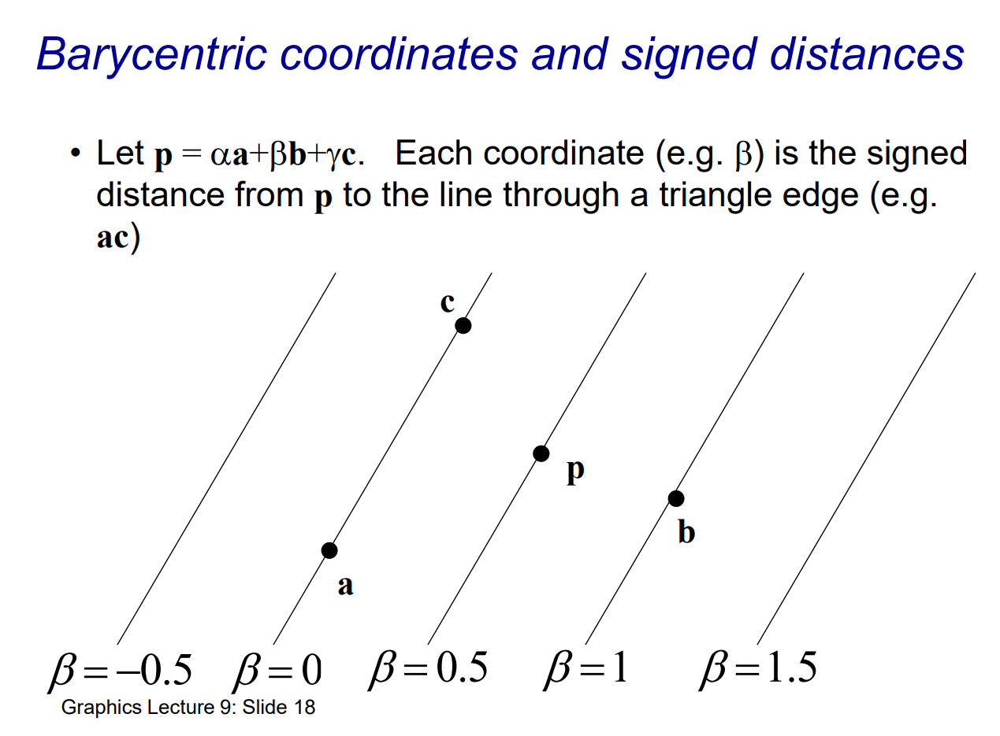
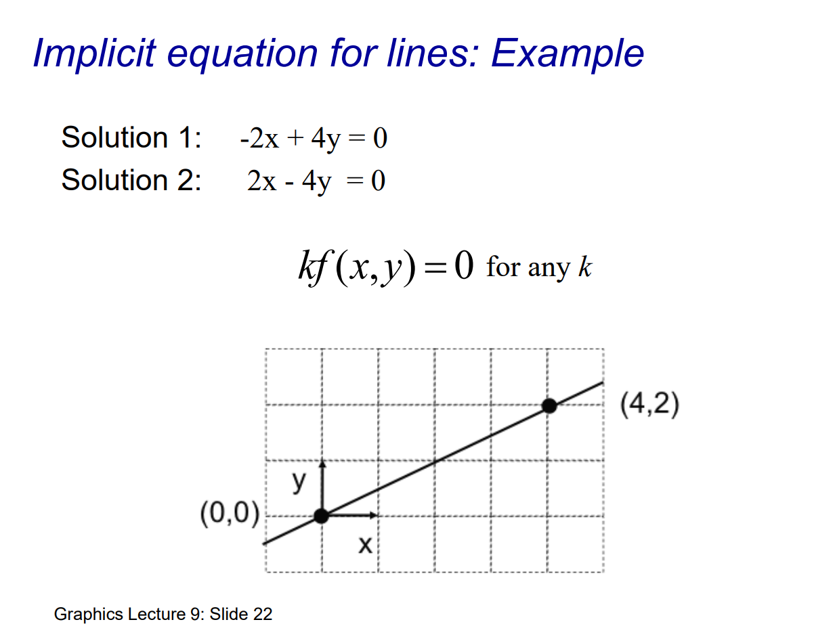

# The Graphics Pipeline

# Rasterization

# Coordinate intuition

## Trilinear coordinates

When interpolation how $a', b',c'$ define the how corresponding vertex weight. Calculating weights or contributions of the opposite vertex.

## barycentric coordinates

In centroid $c$ all three vertexes are equally important. centroid $c$ can be found by connect edges to it's corresponding vertex.

------

## 1. What are barycentric coordinates?

Given a triangle $ABC$, **barycentric coordinates** $(\alpha, \beta, \gamma)$ for a point $P$ satisfy:

1. $\alpha + \beta + \gamma = 1$.
2. $P = \alpha \, A + \beta \, B + \gamma \, C$.

where each of $\alpha,\beta,\gamma$ can be interpreted as a **weight** telling you how much “influence” each vertex $A,B,C$ has on the point $P$.

- If $P$ lies **exactly at** $A$, then the barycentric coordinates would be $(1,0,0)$.
- If $P$ is anywhere on **side $BC$**, then $\alpha = 0$, so the coordinates look like $(0,\beta,\gamma)$.
- If $P$ is **inside** the triangle, then all three weights $\alpha, \beta, \gamma$ are **positive** (but still sum to 1).

In the slides, the triangle’s corners are labeled with barycentric coordinates:

- $A$ at $(1,0,0)$,
- $B$ at $(0,1,0)$,
- $C$ at $(0,0,1)$.

That notation simply means:

- Vertex $A$ is 100% “A,” 0% “B,” 0% “C.”
- Vertex $B$ is 0% “A,” 100% “B,” 0% “C.”
- Vertex $C$ is 0% “A,” 0% “B,” 100% “C.”

Any point $P_1$ inside the triangle has $\alpha,\beta,\gamma$ such that $\alpha + \beta + \gamma = 1$, with each coordinate typically between 0 and 1.

------

## 2. Why they’re called “barycentric”

“Barycentric” comes from the idea of a **center of mass** (a “balance point”). If you imagine the triangle as a thin metal plate with densities proportional to $\alpha,\beta,\gamma$, the point $P_1$ is precisely where the plate would balance if $A,B,C$ were the only mass points with weights $\alpha,\beta,\gamma$.

------

## 3. Geometric intuition

1. **Areas**: One way to interpret $\alpha,\beta,\gamma$ is through **sub-triangle areas**. For instance,
   - $\alpha$ is proportional to the area of the triangle $P_1 B C$.
   - $\beta$ is proportional to the area of the triangle $P_1 A C$.
   - $\gamma$ is proportional to the area of the triangle $P_1 A B$.
2. **Lines**: If you fix one coordinate (say $\alpha$) and let the other two vary, you trace a line parallel to side $BC$ of the triangle.
3. **Interpolations**: Another viewpoint is that moving $P_1$ within the triangle changes $\alpha,\beta,\gamma$ continuously, reflecting how much “weight” each vertex contributes.

------

## 4. Putting coordinates on each vertex

In the slides, each vertex is assigned coordinates in 3D space in a special way:

- A = (1,0,0)
- B = (0,1,0)
- C = (0,0,1)

Then any point inside the triangle can be described as (α,β,γ) with $\alpha + \beta + \gamma = 1$. Visually, you might think of $\alpha,\beta,\gamma$ as the fraction you travel along each axis, but the key is that we’re working in a coordinate system specifically designed so that a “plain” triangle in 2D looks like a simplex in 3D with corners on the unit axes.

------

## 5. Summary

- **Barycentric coordinates** give a convenient way to write a point in a triangle as a combination of the triangle’s vertices.
- They always sum to 1.
- If $\alpha, \beta, \gamma \geq 0$, the point is inside (or on) the triangle.
- Each vertex “anchors” one axis of this barycentric space.

# A triangle in terms of vectors

- collinear : 共线

# Basis vectors

# Barycentric coordinates

# Barycentric coordinates and signed distances

- **Definition**: In **barycentric coordinates**, any point $p$ in the plane of triangle $ABC$ can be written as

  $p \;=\; \alpha\,a \;+\; \beta\,b \;+\; \gamma\,c$,

  where $\alpha + \beta + \gamma = 1$.

- **Signed Distance Interpretation**: Each coordinate (e.g., $\beta$) is proportional to the signed distance of $p$ from the line *opposite* the corresponding vertex. In the slide’s example, $\beta$ measures the signed distance from $p$ to line $AC$.

- **Edges as Zero-Level Sets**:

  - $\alpha = 0$ corresponds to the line BC.
  - $\beta$ = 0 corresponds to the line $AC$.
  - $\gamma = 0$ corresponds to the line $AB$.
     Points on each edge satisfy the condition that the associated barycentric coordinate is zero.

- **Normalization**: Barycentric coordinates are often normalized so that $\alpha + \beta + \gamma = 1$, ensuring they sum to unity. This also conveniently aligns with area ratios when the coordinates are nonnegative.

- **Geometric/Rendering Applications**:

  - **Interpolation**: Useful for interpolating attributes (color, texture coordinates) within a triangle in computer graphics (rasterization).
  - **Triangle Mesh**: Barycentric coordinates make it easy to determine whether a point lies inside (all coordinates $\geq 0$) or outside (at least one negative coordinate) the triangle.

# Implicit equation for lines

This equation represents the general line equation passing through two points (xa,ya)(x_a, y_a) and (xb,yb)(x_b, y_b).

### Breakdown of the Equation:

1. **Line Equation Format**:
    It is written in the form $Ax + By + C = 0$, where:
   - $A = y_a - y_b$
   - $B = x_b - x_a$
   - $C = x_a y_b - x_b y_a$
2. **Derivation**:
   - The slope of the line through points $(x_a, y_a)$ and $(x_b, y_b)$ is given by: $m = \frac{y_b - y_a}{x_b - x_a}$.
   - Using the point-slope form, we arrive at this general form for the line equation.
3. **Geometric Meaning**:
   - For any point $(x, y)$ on the line, this equation holds true.
   - The coefficients $A$, $B$, and $C$ are determined by the coordinates of the two points defining the line.
4. **Special Cases**:
   - If $x_a = x_b$, the line is vertical, and the equation simplifies to $x = x_a$.
   - If $y_a = y_b$, the line is horizontal, and the equation simplifies to $y = y_a$.

$$
\begin{align}
A &= (x_a,y_a) \\
B &= (x_b,y_b) \\
m &= \frac{y_b-y_a}{x_b-x_a}\\
mx+c &= y\\
\frac{y_b-y_a}{x_b-x_a} x_a+c &= y_a\\
c &= y_a - \frac{y_b-y_a}{x_b-x_a}x_a\\
y &= \frac{y_b-y_a}{x_b-x_a}x+y_a-\frac{y_b-y_a}{x_b-x_a}x_a\\
(x_b-x_a)y &= (y_b-y_a)x+ (x_b-x_a)y_a - (y_b-y_a)x_a\\
(y_a-y_b)x + (x_b-x_a)y &= (x_b-x_a)y_a - (y_b-y_a)x_a \\
(y_a-y_b)x + (x_b-x_a)y &= x_b y_a -x_a y_a - y_b x_a + y_a x_a\\
(y_a-y_b)x + (x_b-x_a)y &= x_b y_a -  y_b x_a \\
(y_a-y_b)x + (x_b-x_a)y - x_b y_a + y_b x_a &= 0
\end{align}
$$

# Edge equations

- $f_{ab}$ : $\gamma = 0$
- $f_{bc}$: $\alpha = 0$
- $f_{ca}$ : $\beta = 0$

# Triangle Rasterization

$c0, c1$ and $c2$ are vertex color

# Visibility: One triangle

# Hidden Surface Removal

# Visibility: Two triangles

# Visibility: Pixels vs Fragments

# Visibility: Which triangle should be drawn first?

# Painter’s Algorithm

# Painter’s Algorithm Problem

# Depth Buffer (z-Buffer)

# The Z-Buffer Algorithm

# Z-buffer Algorithm Properties

# Alias Effects

# Alias Effects at straight boundaries in raster images.

# Supersampling

- above the line $I_2$ below the line $I_1$

# Limitations of Supersampling

A visualization of the actual pixel intensities after averaging, where the line's intensity gets distributed unevenly, particularly challenging for thin lines.

# Convolution filtering

# Weighted averages

# Pros and Cons of Convolution filtering

# Anti-Aliasing textures

